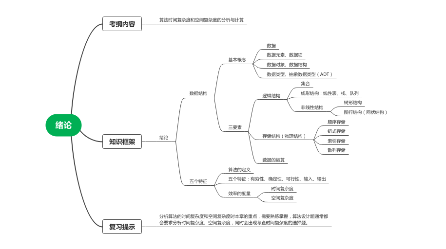

该文为学习笔记，仅作学习参考，如有错误，望指正！

<!--more-->

#	第一章.	绪论

本章内容索引：



数据结构在学什么？

​		<font color=red>如何用程序代码把现实世界的问题信息化</font>。

##	1.	数据结构的基本概念

数据：数据是<font color=red>信息的载体</font>，是描述客观事物属性的数、字符以及所有<font color=red>能输入到计算机中并被计算机程序识别</font>和处理的符号的集合。数据是计算机程序加工的原料。

数据元素、数据项：**数据元素**是数据的基本单位，通常作为一个整体进行考虑和处理。一个数据元素是由若干个数据项组成的，**数据项**是构成数据元素的不可分割的最小单位。

数据对象：是具有<font color=red>相同性质</font>的数据元素的集合，是数据的一个子集。

数据结构：是相互之间存在一种或多种特定<font color=red>关系</font>的数据元素的集合。

**数据的逻辑结构：**

集合：各个元素同属一个集合，别无其他关系；

线性结构：元素之间是一对一的关系，除了第一个元素，所有元素都有唯一前驱；除了最后一个元素，所有元素都有唯一后继；

树形结构：数据元素之间是一对多的关系；

图形结构：数据元素之间是多对多的关系；

**数据的物理结构（存储结构）：**

顺序存储：把<font color=red>逻辑上相邻的元素存储在物理位置上也相邻的存储单元中</font>，元素之间的关系由存储单元的邻接关系来体现。

链式存储：


###	1.	课程介绍

- 逻辑结构：数据与数据之间的关系；
- 存储结构：存储数据的方法；
- 算法：解决问题的方法；

【例1】图书目录文件：1 对 1（线性结构）


逻辑结构：例如理论力学前面是哪本书后面是哪本书，位于什么位置，即为数据与数据之间的关系。

存储结构：例如把该信息系统放到存储中去，给它分配什么样的空间，定义什么样的类型，存储进去后通过什么样的方式表达数据与数据之间的关系，能够确定的知道数据存储在哪个位置。

算法：存储进计算机后进行查找，需要进行什么样的操作。


【例二】计算机和人对弈：1 对 多（树型结构）


1 对多：当你下一步棋的时候，下一步是有很多种走法的。

这种关系如何存储进计算机里去，计算机又如何计算出下一步应该选取哪一步。


【例三】多岔路口交通灯的管理：多 对 多（图形结构）


A -> B 表示可以通行的方向，简写成 AB，用一个节点表示，连线表示不能同时行驶。

这种复杂的关系如何存储进计算机里去，并且把它能同时通行，不能同时通行的这种关系如何表示出来，如何通行，通行多长时间等都需要依托于算法。


###	2.	一些成功的算法

**FFT算法（快速傅里叶变换）**

- 把一个 N 中信号相叠加的波信号分解成最基本的周期函数
- 应用：DVD，JPEG，MRI，天体物理学，......
- 简单的实现：$O(n^2)$
- FFT 算法：$O(nlog_2^n)$


**N 体模拟算法**：十大著名算法之一

- 模拟 N 体相互引力作用
- 简单的实现：$O(n^2)$
- N 体模拟算法：$O(nlog_{2}^{n})$


###	3.	小结

数据，首先分析数据与数据之间的关系，然后将数据存储到计算机里面，并且能把数据与数据之间的关系在计算机中表示出来，然后依据存储这些数据，设计一些算法解决实际问题。


###	4.	为什么学习数据结构

- internet：Web 搜索，分组路由，分布式文件共享 ......
- 生物学：人类基因组计划，蛋白质折叠 ......
- 计算机：电路设计，文件系统，编译器 ......
- 计算机图形：电影，电子游戏，虚拟现实 ......
- 信息安全：手机，电子商务，投票机 ......
- 多媒体：MP3，JPG，DivX，高清电视，人脸识别 ......
- 社交网络：推荐系统，新闻推广，广告 ......
- 物理学：多体模拟，粒子碰撞模拟 ......
- ......


<font color=red>古老，又蕴含着新的机会</font>。

- 至少要追溯到欧几里德算法研究。
- 1930s正式使用。
- 1968年开始独立设计数据结构课程。
- 一些重要算法就是在大学的课程里被发现的。


<font color=red>解决用其他方法无法解决的问题</font>。

EX：网络的连通性（最优路径）


<font color=red>激发智力</font>。

算法是非常有趣的研究对象。

伟大的算法是计算的诗歌。

看得见的算法才是信得过的。

算法可以使你成为一名优秀的程序员。

算法 + 数据结构 = 程序。


<font color=red>能解开生命和宇宙的秘密</font>。

科学研究中计算模型正在取代数学模型。


<font color=red>好的工作和收益</font>。


##	2.	基本概念

1. 按某种逻辑关系组织起来的一批数据，例如：线性表、树、图；
2. 以一定的方式存于计算机中，例如：数组，链表等；
3. 在这组数据上定义了运算的集合，例如：插入、删除、查找、排序；


###	1.	数据与数据元素

数据（data）：能够输入到计算机中并被计算机程序处理的信息，包括文字，表格，图像等，都称为数据。

数据元素（data element）：数据的基本单位，在计算机程序中通常作为一个整体进行考虑和处理。一个数据元素包含若干个数据项（data item）。

数据元素、数据项和数据的逻辑结构在计算机中的表示又称为结点（顶点），数据域和存储（物理）结构。


###	2.	数据的逻辑结构

——数据元素之间的逻辑关系。

1. 线形结构：元素之间的关系是一对一的。
2. 树形结构：元素之间的关系是一对多的。
3. 图状结构：元素之间的关系是多对多的。


###	3.	数据的存储结构

——数据在计算机中的存储表示。

1. 顺序存储（数组）
2. 非顺序存储
3. 索引存储
4. 散列存储：利用散列函数获取散列地址进行存储


###	4.	数据的运算

插入，删除，查找，排序等。


##	3.	算法分析

算法（Algorithm）：是解决问题的一种方法（策略）或一个过程。

程序：用计算机语言实现算法。


###	1.	算法设计的要求

1. 正确性（correctness）
2. 可读性（readability）
3. 健壮性（robustness）
4. 高效率与底存储量


###	2.	算法分析

1. 时间复杂性（time complexity）
2. 空间复杂性（space complexity）

问题：我的程序是否足以解决一个现实中的大型问题

1. 为什么我的程序运行得如此的慢？
2. 为什么我的程序导致内存溢出？


####	1.	时间复杂性

——指算法中各语句执行时间的总和

为了分析的方便，算法的执行时间通常表示成数量级的形式：$T(n)=O(f(n))$

其含义为：当问题规模 n 足够大时，算法的执行时间 $T(n)$ 与函数 $f(n)$ 成正比。

大 O 记法：$O(1)，O(n)，O(n^2)，O(n^3)，O(log_{2}^{{n}})，O(nlog_{2}^{n})，O(2^n)$。

$O(1)<O(log_{2}^{{n}})<O(n)<O(nlog_{2}^{n})<O(n^2)<O(n^3)<O(2^n)$。

【例】

```c
for(i=1; i<=n; ++i)			// 执行 n+1 次
    for(j=1; j<=n; ++j)			// 执行 n(n+1)次
        x=x+1;				// 执行 n*n 次
```

该语句执行次数：$f(n)=2n^2+2n+1$

算法的执行时间：$T(n)=O(n^2)$（表达的是一种趋势）

解释：随着问题规模 n 的增大，算法的执行时间 $T(n)$ 与 $n^2$ 成正比。


####	2.	空间复杂度

——算法中所需占用的空间

【例一】

```c
for(i=1; i<=n; ++i)
    for(j=1; j<=n; ++j)
        x=x+1;
```

$T(n)=O(n^2)，S(n)=O(1)$


【例二】

```c
f[0]=0; f[1]=1;
for(j=2; j<=n; ++j)
    f[j]=f[j-1]+f[j-2];
```

$T(n)=O(n)，S(n)=O(n)$


#	第二章	线性表

##	1.	线性表的定义

###	1.	定义

$n(n>=0)$ 个数据元素的有限序列，可表示为：$(a_1，a_2，a_3， ...， a_n)$

- $a_1 \sim a_n$ 是 n 个数据元素
- n 为线性表长度，$n=0$ 时为空表


###	2.	表示形式

可表示为：$(a_1，a_2，a_3，...， a_n)$

还可以表示为二元数组形式：(D，S)

- D 表示元素的集合：$D={(a_1，a_2，a_3，...， a_n)}$
- S 表示关系集合（前驱后继）：$S={(a_1，a_2)，(a_2，a_3)，...，(a_{n-1}，a_n)}$


###	3.	元素关系

对于非空线性表：$a_1，a_2，a_3， ...， a_{n-1}，a_n)$$

- 有且仅有一个开始结点 $a_1$，它没有前驱，而仅有一个后继 $a_2$
- 有且仅有一个终端结点 $a_n$，它没有后继，而仅有一个前驱 $a_{n-1}$
- 其余的内部结点 $a_i（2\leq i\leq n-1）都有且仅有一个前驱$$a_{i-1}$和一个后继 $a_{i+1}$

$(a_1，a_2，a_3，...， a_n)$ 一个数据元素可以是简单的一个数据，一个符号，也可以是复杂的若干个数据项组合。


【例一】26 个英文字母组成的字母表

可以表示为：$(A,B,C,...,Z)$


【例二】一副扑克牌的点数

可以表示为：$(2,3,...,10,J,Q,K,A)$


【例三】学生信息表

| 学号   | 姓名 | 性别 | 年龄 | 成绩 |
| ------ | ---- | ---- | ---- | ---- |
| 204101 | 王力 | 男   | 19   | 93   |
| 204102 | 李民 | 男   | 19   | 88   |
| 204103 | 马文 | 女   | 19   | 96   |
| 204104 | 李晓 | 男   | 20   | 99   |
| 204105 | 夏侬 | 女   | 20   | 76   |

可以表示为：$(stu_1，stu_2，stu_3，stu_4，stu_5)$


##	2.	顺序存储结构

###	1.	存储结构

数据结构在计算机中的表示，包括数据元素的表示和关系表示。

数据元素之间的关系在计算机中有两种不同的表示方法：

- 顺序存储结构——顺序表
- 链式存储结构——链表


###	2.	顺序存储结构

$(a_1，a_2，a_3，...，a_n)$

按逻辑依序依次存放在一组地址连续的存储单元组；

借助元素在存储器中的相对位置（物理关系）来表示数据元素之间的逻辑关系；

| 存储地址        | 内存状态 | 结点顺序 |
| --------------- | -------- | -------- |
| b               | $a_1$    | 1        |
| b + len         | $a_2$    | 2        |
| ......          | ......   | .        |
| b+( l - 1 )*len | $a_i$    | i        |
| ......          | ......   | .        |
| b+(n-1)*len     | a_n      | n        |
|                 | 空闲     |          |

C 语言实现：使用数组开辟一组连续的存储空间

```c
#define MAXSIZE 100				// 数组的最大下标
typedef struct{
    ElemType a[MAXSIZE+1];				// 线性表的存储空间，ElemType：表示数据元素类型，通用的表示方法
    int n;					// 线性表的长度；
}sqlist;						// 线性表类型
```


【例一】26 个英文字母组成的字母表

```c
#define MAXSIZE 100
typedef struct{
    char a[MAXSIZE+1];
    int n;  
}sqlist;
```

内存中的存储形式如下：

n = 26;

| A    | B    | C    | ...... | Z    |        |      |         |
| ---- | ---- | ---- | ------ | ---- | ------ | ---- | ------- |
| 1    | 2    | 3    | ...... | 26   | ...... |      | MAXSIZE |


【例二】学生信息表

| 学号   | 姓名 | 性别 | 年龄 | 成绩 |
| ------ | ---- | ---- | ---- | ---- |
| 204101 | 王力 | 男   | 19   | 93   |
| 204102 | 李民 | 男   | 19   | 88   |
| 204103 | 马文 | 女   | 19   | 96   |
| 204104 | 李晓 | 男   | 20   | 99   |
| 204105 | 夏侬 | 女   | 20   | 76   |

```c
#define MAXSIZE 100
struct student{
    int num;
    char name[20];
    char sex;
    int age;
    float score;
};
typedef struct{
    struct student a[MAXSIZE];
    int n;  
}sqlist;
```

内存中的存储形式如下：

| num   | 204101 | 204102 | 204103 | 204104 | 204105 |        |         |
| ----- | ------ | ------ | ------ | ------ | ------ | ------ | ------- |
| name  | 王力   | 李民   | 马文   | 李晓   | 夏侬   |        |         |
| sex   | 男     | 男     | 女     | 男     | 女     |        |         |
| age   | 19     | 19     | 19     | 20     | 20     |        |         |
| score | 93     | 88     | 96     | 99     | 76     |        |         |
|       | 1      | 2      | 3      | 4      | 5      | ...... | MAXSIZE |


**元素地址计算：**

$第i个元素地址：loc(a_i)=loc(a_1)+(i-1)*len$

【例三】学生信息表

| 学号   | 姓名 | 性别 | 年龄 | 成绩 |
| ------ | ---- | ---- | ---- | ---- |
| 204101 | 王力 | 男   | 19   | 93   |
| 204102 | 李民 | 男   | 19   | 88   |
| 204103 | 马文 | 女   | 19   | 96   |
| 204104 | 李晓 | 男   | 20   | 99   |
| 204105 | 夏侬 | 女   | 20   | 76   |

设：第一个元素的地址 $loc(1)=2000$，每一个元素所占的存储空间 $len=29$，则可以计算出：

$loc(3)=loc(1)+(3-1)*29=2058$


<font color=red>小结</font>：线性表的访问时随机的，可以访问任意位置。


####	1.	顺序表的算法 - 插入

**算法功能：**在线性表的第 i 处插入新元素 x。

【例一】设 $i=4，x=60$

| 23   | 41   | 12   | 54                       | 77   | 19   | 88   |      |      |
| ---- | ---- | ---- | ------------------------ | ---- | ---- | ---- | ---- | ---- |
|      |      |      | $\downarrow$（此处插入） |      |      |      |      |      |
| 23   | 41   | 12   | 60                       | 54   | 77   | 19   | 88   |      |

**算法思想：**

1. 入口判断：

   存储容量够吗？（n < MAXSIZE）

   插入的位置正确吗？（i>=1 && i<n+1）

   ```c
   if (L.n=MAXSIZE) error("溢出");
   	if(i<1 || i>L.n+1) error("插入位置错");
   ```

2. 元素 $a_i \sim a_n$ 位置后移：注意移动次序，<font color=red>从后往前移动</font>。

   ```c
   for(j=n; j>=i; j--){
       L.a[j+1]=L.a[j];
   }
   ```

3. 在线性表的第 i 处插入新元素 x

   ```c
   L.a[i]=x;
   ```

4. 表长加 1：n+1；

**算法设计：**

```C
#define MAXSIZE 100
typedef struct{
    ElemType a[MAXSIZE+1];	// 线性表的容量
    int n;
}sqlist;
void sq_ins(sqlist &L, int i, ElemType x){
    // 线性表 L 的第 i 处插入新元素 x
    int j;
    if(L.n=MAXSIZE) error("溢出");
    else if(i<1 || i>L.n+1) error("插入位置错误");
    else{
        for(j=L.n; j>=i; j--){
            L.a[j+1]=L.a[j];	// 元素后移
        }
    L.a[i]=x;	// 在第i处插入x
    L.n++;	// 表长加1
    }
}
```

**算法分析：**

插入算法的执行时间与元素的插入位置，即元素的移动次数有关。

| 插入位置 | 1    | 2    | ...  | i     | ...  | n-1  | n    | n+1  |
| -------- | ---- | ---- | ---- | ----- | ---- | ---- | ---- | ---- |
| 移动次数 | n    | n-1  | ...  | n-i+1 | ...  | 2    | 1    | 0    |

如果在任意处插入一个元素都是等概率的，则：$\sum_is(n)=\sum\limits_{i=1}^{n+1}\frac{n-i+1}{n+1}=\frac{n}{2}$

所以，在顺序表上做插入运算，平均要移动表长的一半结点，因此，算法的平均时间复杂度 $T(n)=O(n)$。

<font color=red>建议</font>：线性表无序时，最好在表尾（n+1）处插入。


####	2.	顺序表的算法 - 有序插入

算法功能：设线性表存于整型数组 $a[1..MAXSIZE]$ 的前 n 个分量中且递增有序，将 x 插入到线性表的适当位置。

【例一】插入 $x=49$

| a[0] | a[1] | a[2] | a[3] | a[4] | a[5] | a[6] |
| ---- | ---- | ---- | ---- | ---- | ---- | ---- |
| 13   | 27   | 38   | 76   | 76   | 85   | 97   |

查找：

```c
i=1;
while(i<=L.n && i>L.a[i]) i++
```

插入：

```c
sq_ins(L,i,x);
```

逻辑：

```c
j=L.n;
while(j>=1 && x<L.a[j]){
    L.a[j+1]=L.a[j];		// 找到插入位置，并后移
    j--;
}
L.a[j+1]=x;
```

**算法设计：**

```c
#define MAXSIZE 100
typedef struct{
    ElemType a[MAXSIZE+1];	// 线性表的容量
    int n;
}sqlist;
void insert(sqlist &L, int x){
    if(L.n<MAXSIZE){	// 当顺序表不满时
        int j=L.n;
        while(j>=1 && x<L.a[j]){
            L.a[j+1]=L.a[j];
            j--;
        }
    L.a[j+1]=x;
    L.n++;
    }
}
```


####	3.	顺序表的算法 - 删除

算法功能：删除线性表中的第 i 个元素，并用 x 返回其值。

**算法思想：**

1. 入口函数

   线性表是空的吗？删除位置正确吗？

   ```c
   if(i<1 && i>L.n) error("删除位置错误");
   else if(L.n=0) error("表空");
   ```

2. 将第 i 个元素的值放入 x

   ```c
   x=L.a[i];
   ```

3. 元素 $a_{i+1} \sim a_n$ 前移，注意移动次序

   | 23   | 41   | 12   | 60              | 54   | 77   | 19   | 88   |      |
   | ---- | ---- | ---- | --------------- | ---- | ---- | ---- | ---- | ---- |
   |      |      |      | $\uparrow$ 删除 |      |      |      |      |      |
   | 23   | 41   | 12   | 54              | 77   | 19   | 88   |      |      |

   ```c
   for(int j=i+1; j<L.n; j++)
       L.a[j-1]=L.a[j];
   ```

4. 表长 -1：L.n--；

**算法设计：**

 ```c
 #define MAXSIZE 100
 typedef struct{
     ElemType a[MAXSIZE+1];	// 线性表的容量
     int n;
 }sqlist;
 void sq_del(sqlist &L, int i, ElemType x){
     // 删除线性表 L 中的第 i 个元素;
     if(i<1 || i>L.n) error("删除位置错误");
     else if(L.n==0) error("空表");
     else {
         for(int j=i+1; j<=L.n; j++){
             L.a[j-1]=L.a[j];
             L.n--;
         }
     }
 }
 ```

同删除算法一样，删除一个元素时，平均移动约表长的一半。$\sum De(n)=\sum\limits_{i=1}^{n}\frac{n-i}{n}=\frac{n-1}{2}$

算法的时间复杂度：$T(n)=O(n)$。


####	4.	顺序表的算法 - 删除从i开始的K个元素

算法功能：已知线性表存于 $v[1...MAXSIZE]$ 中的前 n 个分量中，写一个算法删除从第 i 个元素开始的 k 个元素。

设 $i=3，k=3$

| 23   | 41   | 12   | 54   | 77   | 19   | 88   | 92   |      |
| ---- | ---- | ---- | ---- | ---- | ---- | ---- | ---- | ---- |
|      |      | i    |      |      | i+k  |      |      |      |

**算法思想：**

从第 i+k 个元素开始往前移动 k 个元素。

```c
j=i+k-n;
a[j-k]=a[j];
```

**算法设计：**

```c
#define MAXSIZE 100
typedef struct{
    ElemType a[MAXSIZE+1];	// 线性表的容量
    int n;
}sqlist;
void del(sqlist &L, int k, int i){
    // 本算法删除从第 i 个元素开始的 k 个元素；
    if(K>0 && 1<=i && i+k<=L.n){
        for(int j=i+k; j<=L.n; ++j){
            L.a[j-k]=L.a[j];
        }
    L.n -= k;
    }
}
```


###	3.	链式存储结构


