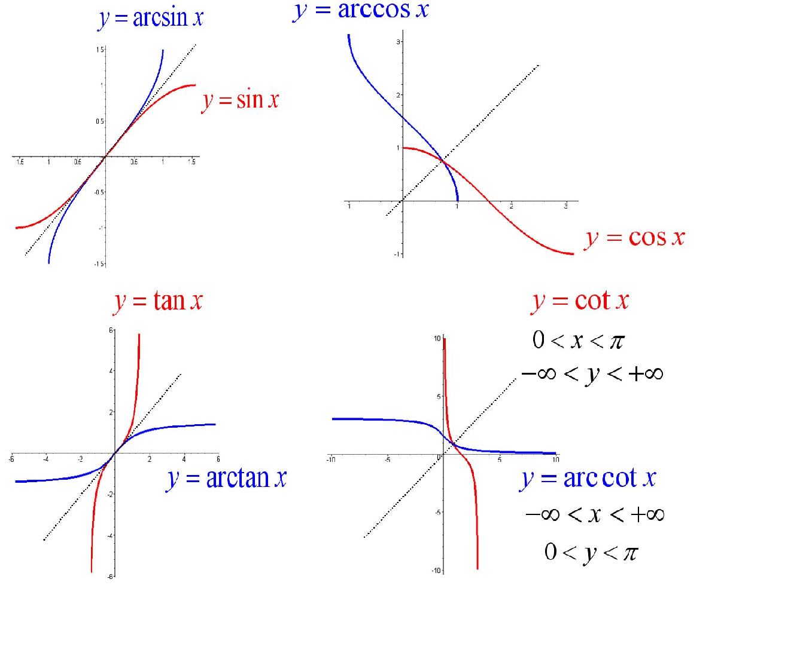
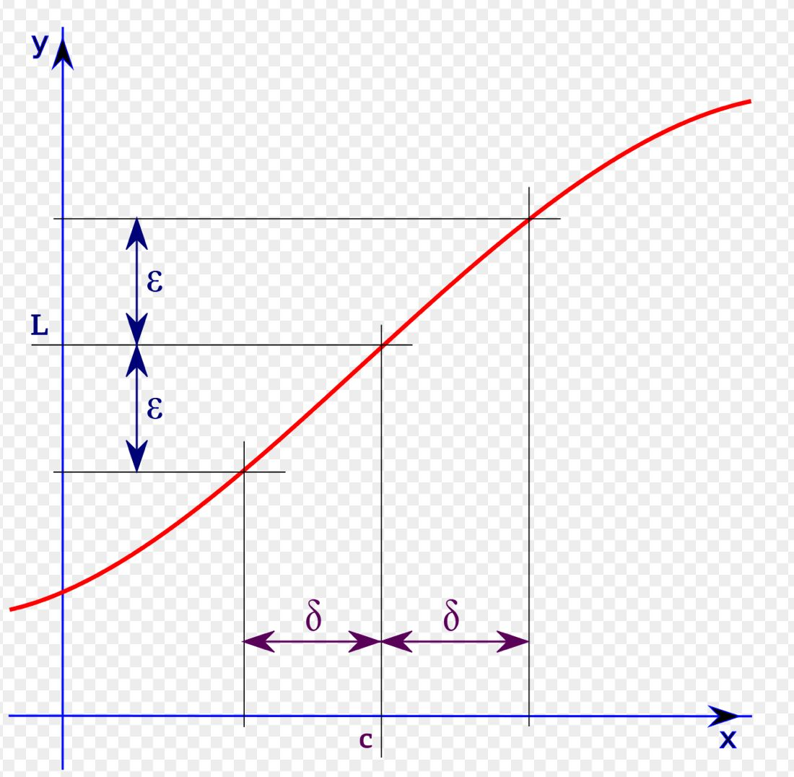
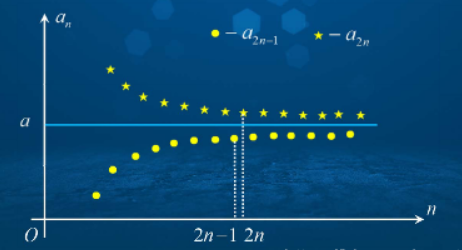
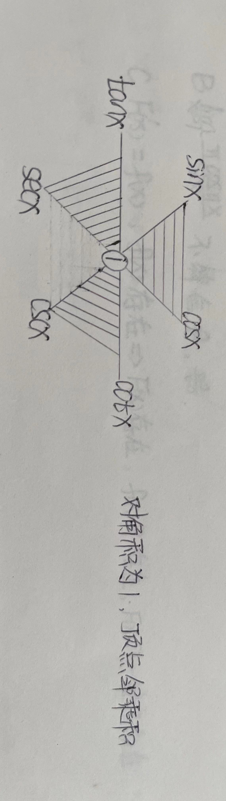
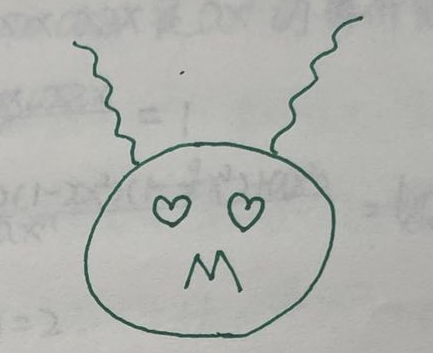
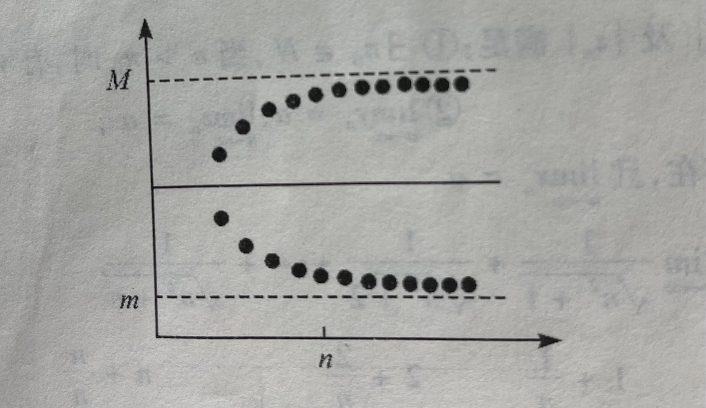
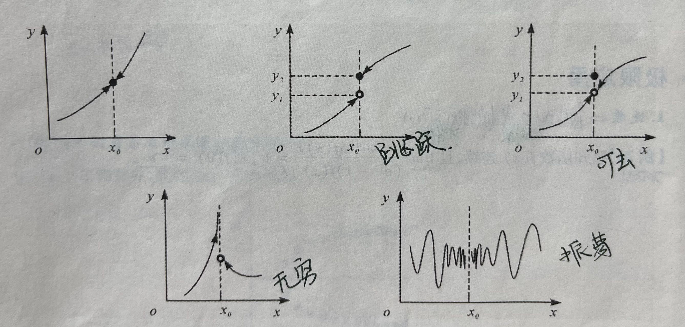

该文为学习笔记，仅作学习参考，如有错误，望指正！

<!--more-->

笔记说明：

红色：表示重点，口诀，结论；

黄色：表示注意点；

绿色：表示解题思路，或方案；

粉色：真题考试时间；

###	0.	预备知识

####	1.	函数定义

设数集 $D \subset R$ , 则映射 $f：D \rightarrow R$ 为定义在 $D$ 上的函数，记为 $y=f(x)，x \in R$，$x$ 称为自变量，$y$ 称为因变量，$D$ 称为定义域；特别的，对每个 $x \in D$，按对应法则 $f$，总有唯一确定的值 $y$ 与之对应。

【自练】设函数$f(x)=\begin{cases}1，& |x| \leq 1 \\0， & |x| > 1\end{cases}$，则函数 $f{f[f(x)]}$等于（	B	）

(A) 0

(B) 1

(C) $\begin{cases}1，& |x| \leq 1 \hspace{25cm}\\0， & |x| > 1\end{cases}$

(D) $\begin{cases}0，& |x| \leq 1 \hspace{25cm}\\1， & |x| > 1\end{cases}$

解题思路：从内到外，f(x) 的结果作为 f[x] 的 X 值域。

####	2.	基本初等函数

幂函数：$y=x^u，(u∈R)$。

指数函数：$y=a^x，(a > 0，a \neq 1)$。

对数函数：$y=\log_a{x}，(a > 0，a \neq 1)$。

三角函数：$y=sinx，y=cosx，y=tanx，y=secx,y=cscx$ 等。

反三角函数：$y=arcsinx，y=arccosx，y=arctanx，y=arccos\frac{1}{x}，y=$ 等。

####	3.	函数性质

1. 有界性：

   $f(x)\leq m_1，x \in X \subset D \Rightarrow f(x)$ 在数集 X 上有上界；

   $f(x) \geq m_2，x \in X \subset D \Rightarrow f(x)$ 在数集 X 上有下界；

   $|f(x)| \leq M (M > 0)，x \in X \subset D \Rightarrow f(x)$ 在数集 X 上有界；

2. 单调性：

   $f(x_1) < f(x_2)，x_1 < x_2，x_1,x_2 \in I \subset D \Rightarrow f(x)$ 在区间 $I$ 上有单调增加；

   $f(x_1) > f(x_2)，x_1 < x_2，x_1,x_2 \in I \subset D \Rightarrow f(x)$ 在区间 $I$ 上有单调减少；

3. 奇偶性：

   $f(-x) = f(x)，x \in D (D关于 Y 轴对称) \Rightarrow f(x)$ 为偶函数；

   $-f(-x) = f(x)，x \in D (D关于原点对称) \Rightarrow f(x)$ 为奇函数；

4. 周期性：

   $f(x+l)=f(x)，(x+l) \in D \Rightarrow f(x)$ 为周期函数，$l$ 为周期；

【自练】$f(x)=|xsinx|e^{cosx}，(-\infty < x < +\infty)$ 是（	D	）

（A）有界函数

（B）单调函数

（C）周期函数

（D）偶函数

解题思路：参考如下

1. $x$ ：单调递增函数；
2. $sinx$ ：振荡函数；
3. $s \cdot sinx$：单调递增型振荡函数；
4. $|x \cdot sinx|$：关于 Y 轴对称函数，即偶函数；
5. $cosx$：振荡函数；
6. $e^{cosx}$：关于 Y 轴对称的分段函数；
7. 偶函数 * 偶函数 = 偶函数；奇函数  * 奇函数 = 偶函数；偶函数 * 奇函数 = 奇函数；偶函数 + 奇函数 = 非奇非偶函数；

###	1.	极限的概念与性质

####	1.	极限的定义

1. 数列极限：$\lim\limits_{n\to\infty}X_n=a \Leftrightarrow \forall \varepsilon > 0，存在 N > 0$ 总有 $$|x_n -a|<\varepsilon$$；
2. 函数极限：$\lim\limits_{x \to\ x_0}f(x)=A \Leftrightarrow \forall\varepsilon>0,存在 \delta>0$ 当 $0<|x-x_0|<\delta$ 时，总有 $|f(x)-A|<\varepsilon$；

注意：若左右极限存在且相等则极限存在，否则极限不存在。

1. $\varepsilon>0$​ 中的 $$\varepsilon$$ 要多小就多小，$$\varepsilon$$ 仅为一个尺度而已;

2. N 只要存在，不要求最小;

3. 凡是定义条件均为充要条件；

   

【例1】对任意给定的 $\varepsilon\in(0,1)$，总存在正整数 N，当 $n \geq N$ 时，恒有$|x_n-a| \leq 2\epsilon$ 是数列 ${x_n}$ 收敛于 $a$ 的（	C	）

（A）充分条件但非必要条件

（B）必要条件但非充分条件

（C）充分必要条件

（D）既非充分条件又非必要条件

解题思路：数列极限 $\lim\limits_{n\to\infty}x_n=a \Leftrightarrow \forall \varepsilon>0，存在 N>0，当n>N时，总有|x_n-a|<\varepsilon$

1. 题中对于任意给定的 $\varepsilon\in(0,1) \Rightarrow \forall\varepsilon>0$ ；
2. 存在正整数 $N \Rightarrow 存在 N>0$，；
3. 当 $n \geq N$ 时 $ (\geq：大于或等于)\Rightarrow n>N$；
4. 恒有 $|x_n-a| \leq 2\varepsilon  \Rightarrow |x_n -a|<\varepsilon$ ($\varepsilon$ 仅为尺度不分大小)；

【小结】：

1. $x \rightarrow x_0$：$x \neq x_0，x\begin{cases}x_0^+ \\x_0^-\end{cases}$ （去中间看两边）；

2. $\lim\limits_{x \to\ x_0}f(x)$ 存在与否与函数 $f(x)$ 在 $x=x_0$处有无定义无关；

3. $x \rightarrow □$ 表示：$x \rightarrow -\infty，x\rightarrow +\infty，x\rightarrow \infty，x\rightarrow x_0^+，x\rightarrow x_0^-，x\rightarrow x_0，n \rightarrow \infty$

4. 若 $A=0$，则称 $f(x)$ 在 $x \rightarrow □$ 时为无穷小量；

   若 $A=\infty$，则称 $f(x)$ 在 $x\rightarrow □$ 时为无穷大量；

####	2.	极限性质

1. 唯一性：若$\lim\limits_{x \to □}f(x)=A (存在)$，则 A 唯一。

   【小结】：

   1. $\lim\limits_{x \to \infty}e^x=\begin{cases}+\infty \\ 0\end{cases}$ ：左右极限不相等，极限不存在；

   2. $\lim\limits_{x \to 0}\frac{\sqrt{x^2}}{x}=\lim\limits_{x \to 0}\frac{|x|}{x}=\begin{cases} 1 \\ -1 \end{cases}$ ：极限不存在，出现 | | 时，需要讨论左右极限；

   3. $\lim\limits_{x \to \infty}arctanx=\begin{cases}\frac{Π}{2}\\ {-\frac{Π}{2}}\end{cases}$ ：极限不存在；

      $\lim\limits_{x \to +\infty}arccotx=\begin{cases}0 \\ Π \end{cases}$ ：极限不存在；

   4. $\lim\limits_{x \to 0}[x]=\begin{cases}-1 \\ 0 \end{cases}$ ：[x] 向左走，极限不存在；

   5. $\lim\limits_{x \to +\infty}sinx=\begin{cases}-1 \\ 1 \end{cases}$ ：震荡函数，极限不存在；

   6. $\lim\limits_{x \to 0}cos\frac{1}{x}=\begin{cases}1 \\ -1 \end{cases}$ ：极限不存在；

   结论：

   1. 存在 + 存在 = 存在；
   2. 存在 + 不存在 = 不存在；
   3. 不存在 + 不存在 = 不一定存在；
   4. 存在 * 存在 = 存在；
   5. 存在 * 不存在 = 不一定存在；
   6. 不存在 * 不存在 = 不一定存在； 

   【例2】（2000-1）求极限$\lim\limits_{x\to0}(\frac{2+e^{\frac{1}{x}}}{1+e^{\frac{4}{x}}}+\frac{sinx}{|x|})$

   解：$\lim\limits_{x\to0}(\frac{2+e^{\frac{1}{x}}}{1+e^{\frac{4}{x}}}+\frac{sinx}{|x|})=\lim\limits_{x\to0}\frac{2+e^{\frac{1}{x}}}{1+e^{\frac{4}{x}}}+\lim\limits_{x\to0}\frac{sinx}{|x|}$

   当 $x\rightarrow 0^+$ 时：

   $I_+=\lim\limits_{x\to0^+}\frac{2+e^{\frac{1}{x}}}{1+e^{\frac{4}{x}}}+\lim\limits_{x\to0^+}\frac{sinx}{|x|}=\lim\limits_{x\to0^+}e^{-\frac{3}{x}}+\lim\limits_{x\to0^+}\frac{sinx}{x}=0+1=1$

   当 $$x\rightarrow 0^-$$ 时：

   $I_-=\lim\limits_{x\to0^-}\frac{2+e^{\frac{1}{x}}}{1+e^{\frac{4}{x}}}+\lim\limits_{x\to0^-}\frac{sinx}{|x|}=2-\lim\limits_{x\to0^-}\frac{sinx}{x}=2-1=1$

   $\therefore I_+= I_- = 1$ 

2. 有界性：若$\lim\limits_{x\to□}f(x)=A (存在)$，则 $存在 M>0$，当$$x\rightarrow□$$ 时(局部)，有 $|f(x)|\leq M$，反之不成立，例如：$sinx$

3. 保号性：

   若$\lim\limits_{x \to □}f(x)=A>0 \Rightarrow x \rightarrow □，f(x)>0$(局部)；

   若$x \rightarrow □，f(x)>0 \Rightarrow \lim\limits_{x \to □}f(x)\geq 0$；

   扩展：

   若 $\lim\limits_{x \to x_0}f(x)>\lim\limits_{x \to x_0}g(x) \Rightarrow 存在 \delta>0，0<|x-x_0|< \delta$ (局部) 时，$f(x)>g(x)$；

   若 $存在\delta>0$，使得 $0<|x-x_0|<\delta$ 时，$f(x)>g(x)$，且 $\lim\limits_{x  \to x_0}f(x)=A，\lim\limits_{x \to x_0}g(x)=B$ 均存在，则 $A \geq B$；

4. 数列极限与子列极限的关系：数列收敛于 a，则子列收敛于 a，反之不成立；

   

   【例3】（2015-1）设 ${x_n}$ 是数列，下列命题中不正确的是（	D	）

   （A）若$\lim\limits_{n\to\infty}x_n=a$，则$\lim\limits_{n\to\infty}x_{2n}=\lim\limits_{n\to\infty}x_{2n+1}=a$

   （B）若$\lim\limits_{n\to\infty}x_{2n}=\lim\limits_{n\to\infty}x_{2n+1}=a$，则$\lim\limits_{n\to\infty}x_n=a$

   （C）若$\lim\limits_{n\to\infty}x_n=a$，则$\lim\limits_{n\to\infty}x_{3n}=\lim\limits_{n\to\infty}x_{3n+1}=a$

   （D）若$\lim\limits_{n\to\infty}x_{3n}=\lim\limits_{n\to\infty}x_{3n+1}=a$，则$\lim\limits_{n\to\infty}x_n=a$

   解题思路：数列收敛于 a，则各个子列均收敛于 a；反之所有的子数列都收敛于 a，则数列收敛于 a；

   $\lim\limits_{n\to\infty}x_{3n}=\lim\limits_{n\to\infty}x_{3n+1}=a$，缺少$\lim\limits_{n\to\infty}x_{3n+2}=a$

5. 函数极限与数列极限的关系

####	3.	两个重要极限

1. $\lim\limits_{x \to 0}\frac{sinx}{x}=1$，推广为：$\lim\limits_{♥ \to 0}\frac{sin♥}{♥}=1$；例如：$\lim\limits_{x\to2}\frac{sin(x-2)}{x-2}=1$；

   注意：自变量变化过程中♥是否相同并同时趋近于0；

2. $\lim\limits_{x \to 0}(1+x)^{\frac{1}{x}}=e，\lim\limits_{x \to \infty}(1+\frac{1}{x})^x=e，\lim\limits_{n \to \infty}(1+\frac{1}{n})^n=e$，推广为：$\lim\limits_{♥ \to 0}(1+♥)^{\frac{1}{♥}}=e^{♥\cdot\frac{1}{♥}}$。

【例4】求极限$\lim\limits_{x\to\infty}[\frac{x^2}{(x-a)(x+b)}]^x$

解：$\lim\limits_{x\to\infty}[\frac{x^2}{(x-a)(x+b)}]^x=\lim\limits_{x\to\infty}[\frac{(x-a)(x+b)}{x^2}]^{-x}=\lim\limits_{x\to\infty}[(1-\frac{a}{x})(1+\frac{b}{x})]^{-x}=\lim\limits_{x\to\infty}(1-\frac{a}{x})^{-x}\cdot\lim\limits_{x\to\infty}(1+\frac{b}{x})^{-x}=e^a\cdot e^{-b}=e^{a-b}$

###	2.	函数极限计算：必考

####	1.	四则运算法则

如果$\lim f(x)=A，\lim g(x)=B$，那么：

1. $\lim[f(x) \pm g(x)]=\lim f(x) \pm \lim g(x)=A \pm B$
2. $\lim [f(x) \cdot g(x)]=\lim f(x) \cdot \lim g(x)=A \cdot B$
3. $\lim \frac{f(x)}{g(x)}=\frac{\lim f(x)}{lim g(x)}=\frac{A}{B}(B \neq 0)$
4. $\lim f(x)^{g(x)}=A^B(A>0)$

补充概念：未定式必考。

设 ${a_n}，{b_n}，{c_n}$ 均为非负数列，且$\lim\limits_{n\to\infty}a_n=0，\lim\limits_{n\to\infty}b_n=1，\lim\limits_{n\to\infty}c_n=\infty，\lim\limits_{n\to\infty}d_n=\infty$，则

1. $\lim\limits_{n\to\infty}(a_n+b_n)=0+1=1，\lim\limits_{n\to\infty}(b_n+c_n)=\infty+1=\infty，\lim\limits_{n\to\infty}(c_n+d_n)=\begin{cases}-\infty (不存在) \\ -\infty+\infty (未定式①) \\ +\infty (不存在)\end{cases}$

2. $\lim\limits_{n\to\infty}(a_n \cdot b_n)=0 \cdot 1=0，\lim\limits_{n\to\infty}(b_n \cdot c_n)=1 \cdot \infty=\infty(不存在)$

   $\lim\limits_{n\to\infty}(a_n \cdot c_n)=0 \cdot \infty(未定式②)\Rightarrow\frac{0}{\frac{1}{\infty}}=\frac{0}{0}(未定式③)\Rightarrow \frac{\infty}{\frac{1}{0}}=\frac{\infty}{\infty}(未定式④)$

3. $\lim\limits_{n\to\infty}(b_n)^{a_n}=1^0=1，\lim\limits_{n\to\infty}(b_n)^{c_n}=1^{\infty}(未定式⑤:一般考小题)，0^0(未定式⑥)，\infty^0(未定式⑦)$

注意：不存在$\Rightarrow \begin{cases}\infty \\震荡\begin{cases}有界，eg:n \rightarrow \infty，(-1)^n；x \rightarrow \infty, sinx;\\无界，eg:x \rightarrow \infty，x \cdot sinx；\end{cases}\end{cases}$$

【自练】设数列 $x_n$ 与 $y_n$ 满足 $\lim\limits_{n\to\infty}x_ny_n=0$，则下列断言正确的是（	D	）

（A）若 $x_n$ 发散，则 $y_n$ 必然发散

（B）若 $x_n$ 无界，则 $y_n$ 必无界

（C）若 $x_n$ 有界，则 $y_n$ 必为无穷小

（D）若 $\frac{1}{x_n}$ 为无穷小，则 $y_n$ 必为无穷小

解析：

1. 解法一：

   A：当取 $x_n=n，x_n\rightarrow \infty$，若 $y_n$ 发散，则 $\infty \cdot \infty \neq 0$；

   B：当取 $x_n=n，x_n \rightarrow \infty$ 为无界变量，$y_n=\frac{1}{n^2}，y_n \rightarrow 0$ 有界，且满足$\lim\limits_{n\to\infty}x_ny_n=0$；

   C：与B选项相反；

   D：$\frac{1}{x_n}$ 为无穷小 $\Rightarrow x_n$ 无穷大，$\lim\limits_{n\to\infty}x_ny_n=\lim\limits_{n\to\infty}\frac{y_n}{\frac{1}{x_n}}=0，\therefore y_n$为无穷小量；

2. 解法二：

   根据关系定理：$\lim\limits_{x\to□}f(x)=A，x \rightarrow □，f(x)=A+\alpha(x)，\lim\limits_{x\to□}\alpha(x)=0$

   $\lim\limits_{n\to\infty}x_ny_n=0=0+\alpha(\lim\limits_{n\to\infty}\alpha=0) \Leftrightarrow y_n=\frac{1}{x_n}(0+\alpha) \Rightarrow y_n$ 为无穷小量；

####	2.	无穷小运算性质

【例5】求极限 $\lim\limits_{n\to\infty}(1+\frac{1}{n})^{(-1)^nsinn}$

解：$\lim\limits_{n\to\infty}(1+\frac{1}{n})^{(-1)^nsinn}=\lim\limits_{n\to\infty}(1+\frac{1}{n})^{n\cdot\frac{1}{n}(-1)^nsinn}=e^{\lim\limits_{n\to\infty}\frac{1}{n}\cdot(-1)^n\cdot sinn}=e^0=1$

####	3.	无穷小比较

若 $\lim\limits_{x\to□}\frac{\alpha(x)}{\beta(x)}=0$，则称 $\alpha(x)$ 是比 $\beta(x)$ 高阶无穷小，记为 $o(\beta(x))$；

若 $\lim\limits_{x \to □}\frac{\alpha(x)}{\beta(x)}=\infty$，则称 $\alpha(x)$ 是比 $\beta(x)$ 低阶无穷小；

若 $\lim\limits_{x\to□}\frac{\alpha(x)}{\beta(x)}=c\neq0$，则称 $\alpha(x)$ 是比 $\beta(x)$ 同阶无穷小；

若 $\lim\limits_{x\to□}\frac{\alpha(x)}{\beta(x)}=1$，则称 $$\alpha(x)$$ 是比 $$\beta(x)$$ 等价无穷小，记为 $\alpha(x)$ ~ $\beta(x)$；

若 $\lim\limits_{x\to□}\frac{\alpha(x)}{[\beta(x)]^k}=0$，则称 $\alpha(x)$ 是比 $\beta(x)$ K阶无穷小；

【小结】：等价无穷小因子代换：当 $□ \rightarrow 0$ 时，

$sin□$ ~ $□$，	$arcsin□$ ~ $□$，	$tan□$ ~ $□$，	$arctan□$ ~ $□$，	$e^□-1$ ~ $□$，	$a^□-1$ ~ $□lna$，	$ln(1+□)$ ~ $□$,	$log_a(1+□)$ ~ $\frac{□}{lna}$，	$1-cos□$ ~ $\frac{1}{2}□^2$，	$(1+□)^m-1$ ~ $m□$

【例6】当 $x \rightarrow 0^+$ 时，下面与 $\sqrt{x}$ 等价无穷小的时是（	B	）

（A）$1-e^{\sqrt{x}}$

（B）$ln\frac{1+x}{1-\sqrt{x}}$

（C）$\sqrt{1+\sqrt{x}}-1$

（D）$1-cos\sqrt{x}$

解析：

A：$\lim\limits_{x\to0^+}(1+e^{\sqrt{x}})=-\lim\limits_{x\to0+}(e^{\sqrt{x}}-1)=-\sqrt{x}，\lim\limits_{x\to0^+}\frac{-\sqrt{x}}{\sqrt{x}}=-1$，因此 $1-e^{\sqrt{x}}$ 是 $\sqrt{x}$ 的同阶无穷小；

B：$\lim\limits_{x\to0^+}ln\frac{1+x}{1-\sqrt{x}}=\lim\limits_{x\to0^+}ln(1+x)-\lim\limits_{x\to0^+}(1-\sqrt{x})=\lim\limits_{x\to0^+}(x+\sqrt{x})=\sqrt{x}，\lim\limits_{x\to0^+}\frac{\sqrt{x}}{\sqrt{x}}=1$，因此 $ln\frac{1+x}{1-\sqrt{x}}$ 是 $\sqrt{x}$ 的等价无穷小；

C：$\lim\limits_{x\to0^+}(\sqrt{1+\sqrt{x}}-1)=\frac{1}{2}\sqrt{x}，\lim\limits_{x\to0^+}\frac{\frac{1}{2}\sqrt{x}}{\sqrt{x}}=\frac{1}{2}$，因此 $\sqrt{1+\sqrt{x}}-1$ 是 $\sqrt{x}$ 的同阶无穷小；

D：$\lim\limits_{x\to0^+}(1-cos\sqrt{x})=\frac{1}{2}x，\lim\limits_{x\to0^+}\frac{\frac{1}{2}x}{\sqrt{x}}=\infty$，因此  $1-cos\sqrt{x}$ 是 $\sqrt{x}$ 的低阶无穷小；

【例7】求极限 $\lim\limits_{x\to0^+}\frac{1-\sqrt{cosx}}{x(1-cos\sqrt{x})}$

解：$\lim\limits_{x\to0^+}\frac{1-\sqrt{cosx}}{x(1-cos\sqrt{x})}=\lim\limits_{x\to0^+}\frac{(1-\sqrt{cosx})(1+\sqrt{cosx})}{x(1-cos\sqrt{x})(1+cos\sqrt{x})}=\lim\limits_{x\to0^+}\frac{1-cosx}{2x \cdot \frac{1}{2}x}=\lim\limits_{x\to0^+}\frac{\frac{1}{2}x^2}{x^2}=\frac{1}{2}$

【自练】（2007-2）求极限 $\lim\limits_{x\to0}\frac{arctanx-sinx}{x^3}$

解：$\lim\limits_{x\to0}\frac{arctanx-sinx}{x^3}=\lim\limits_{x\to0}\frac{x-\frac{1}{3}x^3-(x-\frac{1}{6}x^3)}{x^3}=\lim\limits_{x\to0}\frac{-\frac{1}{6}x^3}{x^3}=-\frac{1}{6}$

【自练】（1996-2）求极限 $\lim\limits_{x\to\infty}x[sinln(1+\frac{3}{x})-sinln(1+\frac{1}{x})]$

解：

解法一：

$\lim\limits_{x\to\infty}x[sinln(1+\frac{3}{x})-sinln(1+\frac{1}{x})]=\lim\limits_{x\to\infty}x[ln(1+\frac{3}{x})-ln(1+\frac{1}{x})]=\lim\limits_{x\to\infty}x(\frac{3}{x}-\frac{1}{x})=\lim\limits_{x\to\infty}x \cdot \frac{2}{x}=2$

解法二：

$\lim\limits_{x\to\infty}x[sinln(1+\frac{3}{x})-sinln(1+\frac{1}{x})]=\lim\limits_{x\to\infty}x(sin\frac{3}{x}-sin\frac{1}{x})=\lim\limits_{x\to\infty}x \cdot \frac{2}{x}=2$

【自练】（1997-1）求极限 $\lim\limits_{x\to0}\frac{3sinx+x^2cos\frac{1}{x}}{(1+cosx)ln(1+x)}$

解：

解法一：$\lim\limits_{x\to0}\frac{3sinx+x^2cos\frac{1}{x}}{(1+cosx)ln(1+x)}=\lim\limits_{x\to0}\frac{3x}{2x}=\frac{3}{2}$

解法二：$\lim\limits_{x\to0}\frac{3sinx+x^2cos\frac{1}{x}}{(1+cosx)ln(1+x)}=\lim\limits_{x\to0}\frac{3sinx+x^2cos\frac{1}{x}}{2x}=\frac{1}{2}\lim\limits_{x\to0}(\frac{3sinx}{x}+\frac{x^2cos\frac{1}{x}}{x})=\frac{3}{2}$

解析：$\lim\limits_{x\to0}x^2cos\frac{1}{x}=0$

####	4.	洛必达法则：不推荐使用

注意：

1. 求导变量 X 需为连续函数，不适用于数列极限；
2. $\frac{0}{0}，\frac{\infty}{\infty}$ 型未定式，分子分母同时求导；
3. 导完必检查，后推前，若求导后极限不存在，则说明不可用该方法（若导完之后极限为无穷大时，可以使用洛必达法则）；

扩展补充：

1. 和差化积公式：

   $sin\alpha+sin\beta=2sin\frac{\alpha+\beta}{2}cos\frac{\alpha-\beta}{2}$

   $sin\alpha-sin\beta=2sin\frac{\alpha-\beta}{2}cos\frac{\alpha+\beta}{2}$

   $cos\alpha+cos\beta=2cos\frac{\alpha+\beta}{2}cos\frac{\alpha-\beta}{2}$

   $cos\alpha-cos\beta=2sin\frac{\alpha+\beta}{2}sin\frac{\alpha-\beta}{2}$

2. 积化和差公式：

   $sin\alpha sin\beta=\frac{1}{2}[sin(\alpha+\beta)+sin(\alpha-\beta)]$

   $cos\alpha sin\beta=\frac{1}{2}[sin(\alpha+\beta)-sin(\alpha-\beta)]$

   $cos\alpha cos\beta=\frac{1}{2}[cos(\alpha+\beta)+cos(\alpha-\beta)$

   $sin\alpha cos\beta=\frac{1}{2}[cos(\alpha+\beta)-cos(\alpha-\beta)$

3. 设 $\alpha_1，\alpha_2，\beta_1，\beta_2$ 均为 $x \rightarrow x_0$ 时的无穷小量，且 $\alpha_1 \sim \alpha_2，\beta_1 \sim \beta_2，\lim\limits_{x\to x_0}\frac{\alpha}{\beta}$ 存在且不等于 -1，则有 $\alpha+\beta\sim\alpha_1+\beta_1$

【例8】（1999-2）求极限 $\lim\limits_{x\to0}\frac{\sqrt{1+tan}-\sqrt{1+sinx}}{xln(1+x)-x^2}$

解：
$$
\begin{aligned}
I&=\lim\limits_{x\to0}\frac{\sqrt{1+tan}-\sqrt{1+sinx}}{xln(1+x)-x^2} \\
&=\lim\limits_{x\to0}\frac{(\sqrt{1+tan}-\sqrt{1+sinx})(\sqrt{1+tan}+\sqrt{1+sinx})}{(xln(1+x)-x^2)(\sqrt{1+tan}+\sqrt{1+sinx})} \\
&=\frac{1}{2}\lim\limits_{x\to0}\frac{tanx-sinx}{xln(1+x)-x^2} \\
&=\frac{1}{2}\lim\limits_{x\to0}\frac{tanx(1-cosx)}{x[ln(1+x)-x]} \\
&=\frac{1}{2}\lim\limits_{x\to0}\frac{1-cosx}{ln(1+x)-x} \\
&=\frac{1}{4}\lim\limits_{x\to0}\frac{x^2}{ln(1+x)-x} \\
&=\frac{1}{4}\lim\limits_{x\to0}\frac{2x}{\frac{1}{1+x}-1}	(洛必达法则) =\frac{1}{4}\lim\limits_{x\to0}\frac{2x}{\frac{1}{1+x}-\frac{1+x}{1+x}}=\frac{1}{4}\lim\limits_{x\to0}\frac{2x}{\frac{1-(1+x)}{1+x}}=\frac{1}{4}\lim\limits_{x\to0}\frac{2x(1+x)}{-x}=-\frac{1}{2}\lim\limits_{x\to0}(1+x) \\
&=-\frac{1}{2}
\end{aligned}
$$
【例9】求极限 $\lim\limits_{x\to+\infty}\frac{e^x-e^{-x}}{e^x+e^{-x}}$

解：$I=\lim\limits_{x\to+\infty}\frac{e^x-e^{-x}}{e^x+e^{-x}}=\lim\limits_{x\to+\infty}\frac{1+x+\frac{1}{2}x^2+\frac{1}{6}x^3-(1-x+\frac{1}{2}x^2-\frac{1}{6}x^3)}{1+x+\frac{1}{2}x^2+\frac{1}{6}x^3+(1-x+\frac{1}{2}x^2-\frac{1}{6}x^3)}=\lim\limits_{x\to+\infty}\frac{\frac{1}{3}x^3}{2+x^2}=+\infty$

解析：洛必达必死，使用展开四项；

【自练】下列各题计算过程正确的是（	D	）

（A）数列极限 $\lim\limits_{b\to\infty}\frac{lnn-1}{n}=\lim\limits_{n\to\infty}\frac{(lnn-1)'}{n'}=\lim\limits_{n\to\infty}\frac{1}{n}=0$

（B）$\lim\limits_{x\to1}\frac{sinΠx}{x^2-1}=\lim\limits_{x\to1}\frac{ΠcosΠx}{2x}=\lim\limits_{x\to1}\frac{-Π^2sinΠx}{2}=0$

（C）$\lim\limits_{x\to\infty}\frac{x+sinx}{x-sinx}=\lim\limits_{x\to\infty}\frac{1+cosx}{1-cosx}$ 不存在

（D）$\lim\limits_{x\to0}\frac{x+sinx}{x-sinx}=\lim\limits_{x\to0}\frac{1+cosx}{1-cosx}=\infty$

解析：

A：数列极限不能使用洛必达法则；

B：$\lim\limits_{x\to1}\frac{ΠcosΠx}{2x}，2x\rightarrow 2$，此时已不是 $\frac{0}{0}，\frac{\infty}{\infty}$ 型，不能再使用洛必达法则；

C：$\lim\limits_{x\to\infty}\frac{1+cosx}{1-cosx}$ 极限不存在，所以 $\lim\limits_{x\to0}\frac{x+sinx}{x-sinx}$ 不适用洛必达法则；

####	5.	Max：求极限的首选方法

1. "主矛" $$\Leftrightarrow$$ 团战先开大，打牌先出炸；

2. "阶级" $$\Leftrightarrow$$ "无穷小比阶"

   "阶级" $$\Leftrightarrow$$ "无穷大比阶"

   例如：$\lim\limits_{x\to\infty}\frac{x^2+x}{x^2}=1；\lim\limits_{x\to\infty}\frac{x^2-x^3}{2x+x^4}=0；当\alpha，\beta，r >0，则 e^{\alpha x}>>x^{\beta}>>log_a{r}$

3. "用笔画" $$\Leftrightarrow$$ 三行决定论

【PS经典攻略】：归幂之后低次留，高指低对低次走。

小结：当 $x\rightarrow 0$ 时；

$sinx=x-\frac{1}{6}x^3$

$arcsinx=x+\frac{1}{6}x^3$

$tanx=x+\frac{1}{3}x^3$

$arctanx=x-\frac{1}{3}x^3$

$cosx=1-\frac{1}{2}x^2+\frac{1}{24}x^4$

$e^x=1+x+\frac{1}{2}x^2+\frac{1}{6}x^3$

$ln(1+x)=x-\frac{1}{2}x^2+\frac{1}{3}x^3$

$(1+x)^{\alpha}=1+\alpha x+\frac{\alpha(1-\alpha)}{2}x^2$

注意：$(a+b)^m=a^m+C_m^1a^{m-1}b^1+C_m^2a^{m-2}b^2+......+C_m^mb^m$

$\frac{1}{1-x}=\sum\limits_{n=0}^\infty x^n=1+x+x^2+...+x^n+...，（-1<x<1）$

$\frac{1}{1+x}=\sum\limits_{n=0}^\infty(-1)^nx^n=1-x+x^2-...+(-1)^nx^n+...，（-1<x<1）$

$ln(1+x)=\sum\limits_{n=1}^\infty(-1)^{n-1}\frac{x^n}{n}=x-\frac{1}{2}x^2+\frac{1}{3}x^3-...+(-1)^{n-1}\frac{x^n}{n}+...，（-1<x\leq1）$

$sinx=\sum\limits_{n=0}^\infty(-1)^n\frac{x^{2n+1}}{(2n+1)!}=x-\frac{1}{3!}x^3+\frac{1}{5!}x^5-...+(-1)^n\frac{x^{2n+1}}{(2n+1)!}+...（-\infty<x<+\infty）$

$cosx=\sum\limits_{n=0}^\infty(-1)^n\frac{x^{2n}}{(2n)!}=1-\frac{1}{2!}x^2+\frac{1}{4!}x^4-...+(-1)^n\frac{x^{2n}}{(2n)!}+...，（-\infty<x<+\infty）$

$e^x=\sum\limits_{n=0}^\infty\frac{x^n}{n!}=1+x+\frac{1}{2!}x^2+...+\frac{x^n}{n!}+...，（-\infty<x<+\infty）$

$(1+x)^{\alpha}=1+\alpha x+\frac{\alpha(\alpha-1)}{2!}x^2+...+\frac{\alpha(\alpha-1)...(\alpha-n+1)}{n!}x^n+...，（-1<x<1）$ 在端点 $x=\pm 1$ 处的收敛性依 $\alpha$ 的不同而异。

总结：

1. $\lim\limits_{x\to0^+}x^{\alpha}(lnx)^{\beta}=0，(\alpha>0，\beta>0)$

2. $\lim\limits_{x\to0}x^2\cdot e^{\frac{1}{x}}=\begin{cases}0, &x\rightarrow o^- \\ \infty, &x\rightarrow 0^+\end{cases}$

3. 换底公式：$u(x)^{v(x)}=e^{v(x)ln{u(x)}}$

4. 转换过程：$(\frac{2+cosx}{3})^x-1\sim e^{xln(\frac{2+cosx}{3})}-1\sim xln(\frac{2+cosx}{3})$

【例10】（2014-3）设 $$p(x)=a+bx+cx^2+dx^3$$，当 $$x \rightarrow 0$$时，若 $$p(x)-tanx$$ 是比 $$x^3$$ 高阶无穷小，则下列选项错误的是（	D	）

（A）a=0

（B）b=1

（C）c=0

（D）d=$$\frac{1}{6}$$

解析：

$\because \lim\limits_{x\to0}\frac{p(x)-tanx}{x^3}=\lim\limits_{x\to0}\frac{a+bx+cx^2+dx^3-(x+\frac{1}{3}x^3)}{x^3}=\lim\limits_{x\to0}\frac{a+(b-1)x+cx^2+(d-\frac{1}{3})x^3}{x^3}=0$

$\therefore a=0，b=1，c=0，d=\frac{1}{3}$

【例11】设常数 $m,n\neq0$，则 $\lim\limits_{x\to0}\frac{arctanmx-arcsinx}{tanmx-sinnx}=$?

解：$I=\lim\limits_{x\to0}\frac{arctanmx-arcsinx}{tanmx-sinnx}=\lim\limits_{x\to0}\frac{mx-\frac{1}{3}(mx)^3-[nx+\frac{1}{6}(nx)^3]}{mx+\frac{1}{3}(mx)^3-[nx-\frac{1}{6}(nx)^3]}=\lim\limits_{x\to0}\frac{(m-n)x-(\frac{1}{3}m^3+\frac{1}{6}n^3)x^3}{(m-n)x+(\frac{1}{3}m^3+\frac{1}{6}n^3)x^3}$

1. 若 $m\neq n，I=1$
2. 若 $m=n，I=-1$

$\therefore I=$ 不存在；

【例12】（2013）求极限 $\lim\limits_{x\to0}\frac{ln(1+x)ln(1-x)-ln(1-x2)}{x^4}$

解：

$ln(1+x)=x-\frac{1}{2}x^2+\frac{1}{3}x^3+o(x^3)$

$ln(1-x)=-x-\frac{1}{2}x^2-\frac{1}{3}x^3+O(x^3)$

$ln(1-x^2)=-x^2-\frac{1}{2}x^4+O(x^4)$

$\begin{aligned}I&=\lim\limits_{x\to0}\frac{ln(1+x)ln(1-x)-ln(1-x2)}{x^4}\\
&=\lim\limits_{x\to0}\frac{(x-\frac{1}{2}x^2+\frac{1}{3}x^3)(-x-\frac{1}{2}x^2-\frac{1}{3}x^3)-(-x^2-\frac{1}{2}x^4)+O(x^4)}{x^4} \\
&=\lim\limits_{x\to0}\frac{-x^2+\frac{1}{2}x^3-\frac{1}{3}x^4-\frac{1}{2}x^3+\frac{1}{4}x^4-\frac{1}{3}x^4+x^2+\frac{1}{2}x^4+O(x^4)}{x^4}\\
&=\lim\limits_{x\to0}\frac{\frac{1}{12}x^4+O(x^4)}{x^4}\\
&=\frac{1}{12}\\
\end{aligned}$

【自练】当 $x\rightarrow 0$ 时，$1-cosxcos2xcos3x$ 是 $ax^n$ 的等价无穷小，求 $a，n$

解：

$cosx=1-\frac{1}{2}x^2+\frac{1}{24}x^4+O(x^4)$

$cos2x=1-2x^2+\frac{2}{3}x^4+O(x^4)$

$cos3x=1-\frac{9}{2}x^2+\frac{27}{8}x^4+O(x^4)$

$\because I=\lim\limits_{x\to0}\frac{1-cosxcos2xcos3x}{ax^n}=\lim\limits_{x\to0}\frac{1-(1-\frac{1}{2}x^2+\frac{1}{24}x^4)(1-2x^2+\frac{2}{3}x^4)(1-\frac{9}{2}x^2+\frac{27}{8}x^4)}{ax^n}=\lim\limits_{x\to0}\frac{7x^2}{ax^n}=1$

$\therefore a=7，n=2$

【自练】（2003）求极限 $\lim\limits_{x\to0}\frac{1}{x^3+ln(1-x^4)}[(\frac{2+cosx}{3})^x-1]$

解：

$I=\lim\limits_{x\to0}\frac{1}{x^3+ln(1-x^4)}[(\frac{2+cosx}{3})^x-1]=\lim\limits_{x\to0}\frac{1}{x^3+ln(1-x^4)}\cdot xln(\frac{2+cosx}{3})=\lim\limits_{x\to0}\frac{xln(\frac{2+1-\frac{1}{2}x^2}{3})}{x^3}=\lim\limits_{x\to0}\frac{ln(1-\frac{1}{6}x^2)}{x^2}=-\frac{1}{6}$

转换过程：$(\frac{2+cosx}{3})^x-1\sim e^{xln(\frac{2+cosx}{3})}-1\sim xln(\frac{2+cosx}{3})$

【自练】已知 $\lim\limits_{x\to0}\frac{2arctanx-ln{\frac{1+x}{1-x}}}{x^k}=c\neq0(k>0)$，确定参数 $c，k$

解：$I=\lim\limits_{x\to0}\frac{2arctanx-ln{\frac{1+x}{1-x}}}{x^k}=\lim\limits_{x\to0}\frac{2arctanx-ln(1+x)+ln(1-x)}{x^k}=\lim\limits_{x\to0}\frac{2x-\frac{2}{3}x^3-x+\frac{1}{2}x^2-\frac{1}{3}x^3-x-\frac{1}{2}x^2-\frac{1}{3}x^3}{x^k}=\lim\limits_{x\to0}\frac{-\frac{4}{3}x^3}{x^k}=c$

$\therefore c=-\frac{4}{3}，k=3$

【自练】$\lim\limits_{x\to0}\frac{atanx+b(1-cosx)}{cln(1-2x)+d(1-e^{-x^2})}=2$，其中 $a^2+c^2\neq0$，则必有（	D	）

（A）b=4d

（B）b=-4d

（C）a=4c

（D）a=-4c

解析：

$I=\lim\limits_{x\to0}\frac{atanx+b(1-cosx)}{cln(1-2x)+d(1-e^{-x^2})}=\lim\limits_{x\to0}\frac{ax+\frac{1}{3}ax^3+\frac{1}{2}bx^2-\frac{1}{24}bx^4}{-2cx-2cx^2-\frac{8}{3}cx^3+dx^2-\frac{1}{2}dx^4}=\lim\limits_{x\to0}\frac{ax+\frac{1}{2}bx^2+\frac{1}{3}ax^3-\frac{1}{24}bx^4}{-2cx+(d-2c)x^2+\frac{8}{3}cx^3-\frac{1}{2}dx^4}=2$

$\because a^2+c^2\neq0；\therefore a\neq0，c\neq 0$

$\because \lim\limits_{x\to0}\frac{ax}{-2cx}=2，\therefore \frac{a}{-2c}=2\Leftrightarrow a=-4c$

【自练】已知 $f(x)=e^{2x}ln(1+x)+ax+bx2$，设 $x\rightarrow 0$ 时，$f(x)=O(x^2)$，求$a，b$，并求 $f(x)$ 关于 $x$ 的无穷小阶数。

解：$\lim\limits_{x\rightarrow 0}f(x)=\lim\limits_{x\to0}(1+2x+2x^2)(x-\frac{1}{2}x^2)+ax+bx^2=\lim\limits_{x\to0}(x+2x^2-\frac{1}{2}x^2+ax+bx^2)+O(x^2)=\lim\limits_{x\to0}[(1+a)x+(\frac{3}{2}+b)x^2]+O(x^2)=O(x^2)$

$\therefore a=-1，b=-\frac{3}{2}$

$f(x)$ 是比 $x$ 三次方的高阶无穷小，$f(x)$ 是 $x$ 的三阶无穷小；

【例13】（1997-2）求极限 $\lim\limits_{x\to-\infty}\frac{\sqrt{4x^2+x-1}+x+1}{\sqrt{x^2+sinx}}$

解：$I=\lim\limits_{x\to-\infty}\frac{\sqrt{4x^2+x-1}+x+1}{\sqrt{x^2+sinx}}=\lim\limits_{x\to-\infty}\frac{\sqrt{4+\frac{1}{x}-\frac{1}{x^2}}+1+\frac{1}{x}}{\sqrt{1+\frac{sinx}{x^2}}}=\lim\limits_{x\to-\infty}\frac{\sqrt4+1+0}{\sqrt1}=3$

【例14】求极限 $\lim\limits_{x\to+\infty}\frac{x^3+x^2+1}{2^x+x^3}(sinx+cosx)$

解：$I=\lim\limits_{x\to+\infty}\frac{x^3+x^2+1}{2^x+x^3}(sinx+cosx)=0$

解析：当 $a>1，x\rightarrow +\infty$ 时，指数函数的增长速度远远大于幂函数的增长速度；

【例15】求极限 $\lim\limits_{x\to+\infty}\frac{ln(x+e^x)+cosx}{x^2-arctanx\cdot lnx}$

解：

当 $x\rightarrow +\infty，ln(x+e^x)+cosx \sim x，x^2-arctanx\cdot lnx\sim x^2$

$\therefore I=\lim\limits_{x\to+\infty}\frac{ln(x+e^x)+cosx}{x^2-arctanx\cdot lnx}=0$ 

【例16】求极限 $\lim\limits_{x\to+\infty}[x^2(e^{\frac{1}{x}}-1)-x]$

解：$I=\lim\limits_{x\to+\infty}[x^2(e^{\frac{1}{x}}-1)-x]=\lim\limits_{x\to+\infty}[x^2(\frac{1}{x}+\frac{1}{2x^2})-x]=\lim\limits_{x\to+\infty}(x+\frac{1}{2}-x)=\frac{1}{2}$

总结：$\infty-\infty$ 用提 "Max" 法；

解法二(提 "Max" 法)：$I=\lim\limits_{x\to+\infty}[x^2(e^{\frac{1}{x}}-1)-x]=\lim\limits_{x\to+\infty}x^2[(e^{\frac{1}{x}}-1)-\frac{1}{x}]=\lim\limits_{x\to+\infty}\frac{e^{\frac{1}{x}}-1-\frac{1}{x}}{\frac{1}{x^2}}=\lim\limits_{x\to+\infty}\frac{1+\frac{1}{x}+\frac{1}{2x^2}-1-\frac{1}{x}}{\frac{1}{x^2}}=\frac{1}{2}$

【自练】（2014）求极限 $\lim\limits_{x\to0}(\frac{1}{(sinx)^2}-\frac{(cosx)^2}{x^2})$

解：$I=\lim\limits_{x\to0}(\frac{1}{(sinx)^2}-\frac{(cosx)^2}{x^2})=\lim\limits_{x\to0}[\frac{x^2-(cosx)^2(sinx)^2}{x^2(sinx)^2}]=\lim\limits_{x\to0}\frac{x^2-\frac{1}{4}(sin2x)^2}{x^4}=\lim\limits_{x\to0}\frac{x^2-\frac{1}{4}(2x-\frac{4}{3}x^3)^2+O(x^3)}{x^4}=\frac{4}{3}$

【例17】求极限 $\lim\limits_{x\to0^+}x^{sinx}$

解：$I=\lim\limits_{x\to0^+}x^{sinx}=\lim\limits_{x\to0^+}e^{sinxlnx}=e^0=1$

总结：

1. $\lim\limits_{x\to0^+}xlnx=0$
2. $$\frac{0}{0}$$ 型可使用该公式代换，$\lim\limits_{x\to0^+}x^{sinx}=\lim\limits_{x\to0^+}e^{sinxlnx}$

【例18】求极限 $\lim\limits_{x\to\infty}(x+\sqrt{x^2+1})^{\frac{1}{x}}$

解：$I=\lim\limits_{x\to\infty}(x+\sqrt{x^2+1})^{\frac{1}{x}}=\lim\limits_{x\to\infty}e^{\frac{ ln(x+\sqrt{x^2+1})}{x}}=e^0=1$

【例19】（2016-2/3）求极限 $\lim\limits_{x\to0}(cos2x+2xsinx)^{\frac{1}{x^4}}$

解：

解法一：$I=\lim\limits_{x\to0}(cos2x+2xsinx)^{\frac{1}{x^4}}=\lim\limits_{x\to0}e^{\frac{ln(cos2x+2xsinx)}{x^4}}=\lim\limits_{x\to0}e^{\frac{ln(1+cos2x+2xsinx-1)}{x^4}}=\lim\limits_{x\to0}e^{\frac{cos2x+2xsinx-1}{x^4}}=\lim\limits_{x\to0}e^{\frac{1-2x^2+\frac{2}{3}x^4+2x^2-\frac{1}{3}x^4-1}{x^4}}=e^\frac{1}{3}$

解法二：$I=\lim\limits_{x\to0}(cos2x+2xsinx)^{\frac{1}{x^4}}=\lim\limits_{x\to0}(1-2x^2+\frac{2}{3}x^4+2x^2-\frac{1}{3}x^4)^{\frac{1}{x^4}}=\lim\limits_{x\to0}(1+\frac{1}{3}x^4)^{\frac{1}{x^4}}=\lim\limits_{x\to0}e^{\frac{1}{x^4}\cdot\frac{1}{3}x^4}=e^{\frac{1}{3}}$

【自练】（2011）求极限 $\lim\limits_{x\to0}[\frac{ln(1+x)}{x}]^{\frac{1}{e^x-1}}$

解：$I=\lim\limits_{x\to0}[\frac{ln(1+x)}{x}]^{\frac{1}{e^x-1}}=\lim\limits_{x\to0}[\frac{x-\frac{1}{2}x^2+O(x^2)}{x}]^{\frac{1}{1+x-1+O(x)}}=\lim\limits_{x\to0}[1-\frac{1}{2}x+O(x)]^{\frac{1}{x+O(x)}}=\lim\limits_{x\to0}e^{\frac{1}{x}\cdot ln(1-\frac{1}{2}x)+O(x)}=\lim\limits_{x\to0}e^{\frac{1}{x}\cdot -\frac{1}{2}x}=e^{-\frac{1}{2}}$

###	3.	数列极限的计算

####	1.	利用函数极限求数列极限

【例20】求极限 $\lim\limits_{n\to\infty}[n(e^{\frac{1}{n}}-1)]^n$

解：$I=\lim\limits_{n\to\infty}[n(e^{\frac{1}{n}}-1)]^n=\lim\limits_{x\to+\infty}[x(e^{\frac{1}{x}}-1)]^x=\lim\limits_{x\to+\infty}[x(1+\frac{1}{x}+\frac{1}{2x^2}-1]^x=\lim\limits_{x\to+\infty}(1+\frac{1}{2x})^x=\lim\limits_{x\to+\infty}e^{xln(1+\frac{1}{2x})}=\lim\limits_{x\to+\infty}e^{x\cdot \frac{1}{2x}}=e^{\frac{1}{2}}$

【自练】当 $n\rightarrow +\infty$ 时，$\frac{1+2n^2+3n^3}{1+n^4}$ 是 $\frac{1-2n^2+3n^3}{1-n^5}$ 的（	B	）

（A）高阶无穷小

（B）低阶无穷小

（C）同阶但不等价无穷小

（D）等价无穷小

解析：

1. 当 $n\rightarrow +\infty$ 时，$\frac{1+2n^2+3n^3}{1+n^4} \sim \frac{1}{n}$
2. 当 $n\rightarrow +\infty$ 时，$\frac{1-2n^2+3n^3}{1-n^5} \sim -\frac{1}{n^2}$

$\therefore $ 当 $n\rightarrow +\infty$ 时，$\frac{1+2n^2+3n^3}{1+n^4}$ 是 $\frac{1-2n^2+3n^3}{1-n^5}$ 的低阶无穷小。

####	2.	利用夹逼定理求数列极限：不推荐使用

如果数列 ${x_n}，{y_n}$ 及 ${z_n}$ 满足：

1. $存在 n_0 \in N$，当 $n>n_0$ 时，有 $y_n \leq x_n \leq z_n$；
2. $\lim\limits_{n \to \infty}y_n=a，\lim\limits_{n \to \infty}z_n=a$$，

则数列 $${x_n}$$ 极限存在，且 $$\lim\limits_{n \to \infty}x_n=a$$； 

【例21】	（1995）问题：

1. 求极限 $\lim\limits_{n \to \infty}\frac{1}{\sqrt{n^2+1}}+\frac{1}{\sqrt{n^2+2}}+......+\frac{1}{\sqrt{n^2+n}}$，
2. 求极限 $\lim\limits_{n\to\infty}\frac{1+\frac{1}{n}}{n^2+n+1}+\frac{2+\frac{2}{n}}{n^2+n+2}+......+\frac{n+\frac{n}{n}}{n^2+n+n}$

解：	归纳法：

1. $\lim\limits_{n\to\infty}\frac{1}{\sqrt{n^2+1}}=\frac{1}{n}，\lim\limits_{n\to\infty}\frac{1}{\sqrt{n^2+n}}=1=\frac{1}{n}$

   $\therefore I=\sum\limits_{i=1}^n\frac{1}{n}=1$

2. $\lim\limits_{n\to\infty}\frac{1+\frac{1}{n}}{n^2+n+1}=\frac{1}{n^2}，\lim\limits_{n\to\infty}\frac{n+\frac{n}{n}}{n^2+n+n}=\frac{n}{n^2}$

   $\therefore I=\sum\limits_{i=1}^n\frac{i}{n^2}=\frac{\frac{n(1+n)}{2}}{n^2}=\frac{1}{2}$

解析：等差数列求和公式 $$\frac{n(1+n)}{2}$$

疑问：$$\underline{该解法与基础复习全书解法存在差异，需注意校对。}$$

【例22】求极限 $\lim\limits_{n\to\infty}\sqrt[n]{2^n+3^n}$

解：

解法一：$I=\lim\limits_{n\to\infty}\sqrt[n]{2^n+3^n}=\lim\limits_{n\to\infty}\sqrt[n]{3^n}=3$

解法二：$I=\lim\limits_{n\to\infty}\sqrt[n]{2^n+3^n}=\lim\limits_{n\to\infty}e^{\frac{1}{n} \cdot ln(2^n+3^n)}=\lim\limits_{n\to\infty}e^{\frac{1}{n} \cdot nln3}=e^{ln3}=3$

解析：

$\lim\limits_{n\to\infty}(a^n+b^n+c^n)^{\frac{1}{n}}=Max(a,b,c)$	Max。

$\infty^0，0^0$ 都要换底；

所

####	3.	利用单调有界准则求递归数列极限：考研出难题

若 $${x_n}$$ 单调有界，数列 $${x_n}$$ 必有极限。

【例23】设数列 ${x_n}$ 满足 $x_{n+1}=\frac{1}{2}(x_n+\frac{1}{x_n})，x_1>0，(n=1，2，3...)$ 证明数列 ${x_n}$ 极限存在，并求 $\lim\limits_{n\to\infty}x_n$=？

证明：	

$x_{n+1}=\frac{1}{2}(x_n+\frac{1}{x_n})\geq1\Rightarrow$ 有下限；

$x_{n+1}-x_n=\frac{1}{2}(x_n+\frac{1}{x_n})-x_n=\frac{1}{2x_n}-\frac{1}{2}x_n=\frac{1-x_n^2}{2x_n}\leq 0$

$\therefore {x_n}$ 单调递减；$\therefore \lim\limits_{n\to\infty}x_n$ 存在；

$x_{n+1}=\frac{1}{2}(x_n+\frac{1}{x_n})$ 两边取极限 $\Rightarrow A=\frac{1}{2}(A+\frac{1}{A}) \Rightarrow A=1$

$\Rightarrow \lim\limits_{n\to\infty}x_n=1$

解析：$\frac{1}{2}(x_n+\frac{1}{x_n}) \geq 1$ 均值不等式；$a+b\geq2\cdot\sqrt{ab}$

【自练】设 $a>0，x_1>0，x_{n+1}=\frac{1}{3}(2x_n+\frac{a}{x_n^2})，(n=1,2,......)$，证明 $\lim\limits_{n\to\infty}x_n$ 存在并求该极限。

解：

$x_{n+1}=\frac{1}{3}(2x_n+\frac{a}{x_n^2})=x_{n+1}=\frac{1}{3}(x_n+x_n+\frac{a}{x_n^2}) \geq \sqrt[3]{a} \Rightarrow$ 有下限；

$x_{n+1}-x_n=\frac{1}{3}(2x_n+\frac{a}{x_n^2})-x_n=\frac{1}{3}(\frac{a}{x_n^2}-x_n)=\frac{a-x_n^2}{3x_n^3} \leq 0$

$\therefore \Rightarrow {x_n}$ 单调递减，$\Rightarrow {x_n}$ 收敛，$\lim\limits_{n\to\infty}x_n$ 存在；

$A=\frac{1}{3}(2A+\frac{a}{x^2})\Rightarrow A=\sqrt[3]a$

解析：$a+b+c\geq3\cdot\sqrt[3]{abc}$

###	4.	极限应用

####	1.	连续

总结：连续 $\Leftrightarrow \lim\limits_{\Delta x \to 0}\Delta y=0$ (考证明题)或 $\lim\limits_{x \to x_0}f(x)=f(x_0)$(考计算题)。

【例24】（2008）已知函数 $f(x)$ 连续，且 $\lim\limits_{x\to0}\frac{1-cos[xf(x)]}{(e^{x^2}-1)f(x)}=1$，则 $f(0)=?$

解：

$I=\lim\limits_{x\to0}\frac{1-cos[xf(x)]}{(e^{x^2}-1)f(x)}=\lim\limits_{x \to x}\frac{\frac{(xf(x))^2}{2}}{x^2f(x)}=\lim\limits_{x \to 0}\frac{x^2f(x)^2}{2x^2f(x)}=\lim\limits_{x \to 0}\frac{f(x)}{2}=1$

$\therefore \lim\limits_{x \to 0}f(x)=2$

【自练】若 $f(x)=\begin{cases}\frac{sin2x+e^{2ax}-1}{x}，& x \neq 0， \\a，& x=0，\end{cases}$ 在$(-\infty，+\infty)$ 上连续，则 $a=?$

解：$I=\lim\limits_{x \to 0}f(x)=\lim\limits_{x \to 0}\frac{sin2x+e^{2ax}-1}{x}=\lim\limits_{x \to 0}\frac{2x+1+2ax-1}{x}=\lim\limits_{x \to 0}\frac{2x(1+a)}{x}=2(1+a)=a$

$\therefore a=-2$

####	2.	间断：必考

注意点：只需要讨论无定义点和分段函数分段点(计算得出)的极限。

无定义点一定是间断点。分段点不一定是间断点。

1. 第一类间断点：$f(x_0-0)，f(x_0+0)$ 均存在
   1. $f(x_0-0) \neq f(x_0+0) \Rightarrow$ 跳跃间断点；
   2. $f(x_0-0) = f(x_0+0) \neq f(x_0) \Rightarrow$ 可去间断点；
2. 第二类间断点：
   1. $f(x_0-0)$ 或 $f(x_0+0) = \infty \Rightarrow$ 无穷间断点；
   2. $f(x_0-0)$ 或 $f(x_0+0)=$ "振荡" $\Rightarrow$ 振荡间断点；

【例25】（新考题）函数 $f(x)=\lim\limits_{t \to 0}(1+\frac{sint}{x})^{\frac{x^2}{t}}$ 在 $(-\infty，+\infty)$ 内（	B	）

（A）连续

（B）有可去间断点

（C）有跳跃间断点

（D）有无穷间断点

【例26】（自编：逆向思维）设 $f(x)=\frac{e^x-b}{(x-a)(x-b)}$ 有无穷间断点 $$x=e$$，可去间断点 $x=1$，则 $a=?，b=?$

解：$\because f(x)=\frac{e^x-b}{(x-a)(x-b)}$ 有可去间断点 $x=1，\Rightarrow \lim\limits_{x \to 1}f(x)=存在$

1. 若 $a=1，b=e$ ；$\lim\limits_{x\to1}f(x)=\lim\limits_{x\to1}\frac{e-e}{(1-1)(1-e)}=\frac{0}{0}$ 型，存在 $\lim\limits_{x \to 1}f(x)=存在$ 的可能性；
2. 若 $a=e，b=1$ ；$\lim\limits_{x\to1}f(x)=\lim\limits_{x\to1}\frac{e-1}{(1-e)(1-1)}=\infty\Rightarrow \lim\limits_{x \to 1}f(x)=不存在$

$\therefore a=1，b=e$；

【自练】（2013-3）函数 $f(x)=\frac{|x|^x-1}{x(x+1)ln|x|}$ 的可去间断点的个数为（	C	）

（A）0

（B）1

（C）2

（D）3

解析：无定义点一定是间断点。

$f(x)=\frac{|x|^x-1}{x(x+1)ln|x|} \Rightarrow$ 分子：$ x \neq 0，x \neq -1，x>0$；分母：$x>0且x\neq1$

$\therefore$ 无定义点为 0，-1，1；

1. 判断 $x=0$ 时间断点类型：$\lim\limits_{x\to0}f(x)=\lim\limits_{x\to0}\frac{e^{xln{|x|}}-1}{x(x+1)ln{|x|}}=\lim\limits_{x\to0}\frac{xln{|x|}}{x(x+1)ln{|x|}}=\lim\limits_{x\to0}\frac{1}{x+1}=1，\Rightarrow x=0$ 为可去间断点；
2. 判断 $x=1$ 时间断点类型：$\lim\limits_{x\to1}f(x)=\lim\limits_{x\to1}\frac{e^{xln{|x|}}-1}{x(x+1)ln{|x|}}=\lim\limits_{x\to1}\frac{xln{|x|}}{x(x+1)ln{|x|}}=\lim\limits_{x\to1}\frac{1}{x+1}=\frac{1}{2}，\Rightarrow x=1$ 为可去间断点；
3. 判断 $x=-1$ 时间断点类型：$\lim\limits_{x\to-1}f(x)=\lim\limits_{x\to-1}\frac{e^{xln{|x|}}-1}{x(x+1)ln{|x|}}=\lim\limits_{x\to-1}\frac{xln{|x|}}{x(x+1)ln{|x|}}=\infty，\Rightarrow x=-1$ 为无穷间断点；

注意点：$u(x)^{v(x)}-1=v(x)ln{u(x)}$

【自练】【自编】函数 $f(x)=[\frac{1}{1+|x|}]$ 的间断点 $x=?$ 是第 $?$ 类间断点

解：$f(x)$ 的无定义点为 $[1+|x|]\neq 1，\Rightarrow x \neq 0$

$\lim\limits_{x\to0}f(x)=0，\Rightarrow x=0$ 是第一类间断点中的可去间断点

####	3.	渐近线

1. $\lim\limits_{x \to x_0}f(x)=\infty \Rightarrow x=x_0$ 为一条垂直的渐近线。（垂直渐近线首看无定义点）。
2. $\lim\limits_{x\to\pm\infty}f(x)=\begin{cases} a\Rightarrow y=a为一条水平渐近线 \\ \infty \Rightarrow 转到3 \end{cases}$
3. $\lim\limits_{x\to\pm\infty}\frac{f(x)}{x}=k；\lim\limits_{x\to\pm\infty}[f(x)-kx]=b \Rightarrow y=kx+b$ 为一条斜渐近线。（kb法）（某一方向上若是有水平渐近线，则不存在斜渐近线）。

【例27】（2014）下列曲线中有渐近线的是（	C	）

（A）$y=x+sinx$

（B）$y=x^2+sinx$

（C）$y=x+sin{\frac{1}{x}}$

（D）$y=x^2+sin{\frac{1}{x}}$

解析：

垂直渐近线（找无定义点）：（C）、（D）

（C）：$\lim\limits_{x \to 0}(x+sin{\frac{1}{x}})=$ 振荡，垂直渐近线不存在；

（D）：$\lim\limits_{x \to 0}(x^2+sin{\frac{1}{x}})=$ 振荡，垂直渐近线不存在；

水平渐近线：不存在；

斜渐近线：

1. 解法一：

   （A）$k=\lim\limits_{x \to \infty}\frac{f(x)}{x}=\lim\limits_{x \to \infty}\frac{x+sinx}{x}=1，b=\lim\limits_{x \to \infty}[f(x)-kx]=\lim\limits_{x \to \infty}[x+sinx-1 \cdot x]=\lim\limits_{x \to \infty}sinx=$ 震荡，斜渐近线不存在；

   （B）$k=\lim\limits_{x \to \infty}\frac{f(x)}{x}=\lim\limits_{x \to \infty}\frac{x^2+sinx}{x}=\infty$，斜渐近线不存在；

   （C）$k=\lim\limits_{x \to \infty}\frac{f(x)}{x}=\lim\limits_{x \to \infty}\frac{x+sin{\frac{1}{x}}}{x}=1，b=\lim\limits_{x \to \infty}[f(x)-kx]=\lim\limits_{x \to \infty}[x+sin{\frac{1}{x}}-1 \cdot x]=\lim\limits_{x \to \infty}sin{\frac{1}{x}}=0，f(x)=1 \cdot x+0=x$

   （D）$\lim\limits_{x \to \infty}\frac{f(x)}{x}=\lim\limits_{x \to \infty}\frac{x^2+sin{\frac{1}{x}}}{x}=\lim\limits_{x \to \infty}x=\infty$，斜渐近线不存在；

2. 解法二："Max" 法，当 $x \Rightarrow \infty$ 时，与 $f(x)=kx+b$ 为同阶无穷大，即为斜渐近线；

【例28】曲线 $y=\frac{x^3}{(x-1)^2}+x^2(e^{\frac{1}{x}}-1)$ 的非铅直渐近线方程为？

解：$\lim\limits_{x \to \infty}[\frac{x^3}{(x-1)^2}+x^2(e^{\frac{1}{x}}-1)]=\lim\limits_{x \to \infty}[\frac{x(x-1^2)+2x^2-x}{(x-1)^2}+x^2(1+\frac{1}{x}+\frac{1}{2x^2}-1)]=\lim\limits_{x \to \infty}(x+\frac{2x^2-x}{(x-1)^2}+x+\frac{1}{2})=\lim\limits_{x \to \infty}2x+\frac{1}{2}+\frac{2x^2-x}{(x-1)^2}=2x+\frac{5}{2}$

【自练】（2016-2）曲线 $y=\frac{x^3}{1+x^2}+arctan(1+x^2)$ 的斜渐近线方程为？

解：$f(x)=\lim\limits_{x \to \infty}\frac{x^3}{1+x^2}+arctan(1+x^2)=\lim\limits_{x \to \infty}\frac{(1+x^2)x-x}{1+x^2}+arctan(1+x^2)=\lim\limits_{x \to \infty}x-\frac{x}{1+x^2}+arctan(1+x^2)=\lim\limits_{x \to \infty}x+arctan(1+x^2)$

1. 当 $x \Rightarrow -\infty$ 时，$f(x)=x-\frac{Π}{2}$
2. 当 $x \Rightarrow +\infty$ 时，$f(x)=x+\frac{Π}{2}$

【自练】（1998-2）$y=xln(e+\frac{1}{x})，(x>0)$ 的渐近线方程为？

解：

1. $\lim\limits_{x \to 0^+}xln(e+\frac{1}{x})=0$，无垂直渐近线；
2. $\lim\limits_{x \to \infty}xln(e+\frac{1}{x})=\infty$，无水平渐近线；
3. $\lim\limits_{x \to \infty}xln(e+\frac{1}{x})=\lim\limits_{x \to \infty}x \cdot ln[e(1+\frac{1}{ex})]=\lim\limits_{x \to \infty}x(1+ln(1+\frac{1}{ex}))=\lim\limits_{x \to \infty}x(1+\frac{1}{ex})=x+\frac{1}{e}$

解析：$logab=loga+logb$

【自练】（2000-2）曲线 $y=(2x-1)e^{\frac{1}{x}}$ 的渐近线

解：$\lim\limits_{x \to \infty}(2x-1)e^{\frac{1}{x}}=\lim\limits_{x \to \infty}(2x-1)(1+\frac{1}{x})=\lim\limits_{x \to \infty}2x-1+2-\frac{1}{x}=2x+1$

【自练】（2005-1）曲线 $y=\frac{x^2}{2x+1}$ 的渐近线

解：$\lim\limits_{x \to \infty}\frac{x^2}{2x+1}=\lim\limits_{x \to \infty}\frac{x(2x+1)-\frac{1}{2}x(2x+1)-\frac{1}{2}x}{2x+1}=\lim\limits_{x \to \infty}x-\frac{1}{2}x-\frac{\frac{1}{2}x}{2x+1}=\frac{1}{2}x-\frac{1}{4}$

【自练】（数学竞赛）$\lim\limits_{x \to 0}\frac{(1+x)^{\frac{1}{x}}-(1+2x)^{\frac{1}{2x}}}{sinx}$

解：$\lim\limits_{x \to 0}\frac{(1+x)^{\frac{1}{x}}-(1+2x)^{\frac{1}{2x}}}{sinx}=\lim\limits_{x \to 0}\frac{e^{\frac{1}{x}ln(1+x)}-e^{\frac{1}{2x}ln(1+2x)}}{sinx}=\lim\limits_{x \to 0}\frac{e^{\frac{1}{x}(x-\frac{1}{2}x^2)}-e^{\frac{1}{2x}(2x-2x^2)}}{x-\frac{1}{6}x^3}=\lim\limits_{x \to 0}\frac{e^{1-\frac{x}{2}}-e^{1-x}}{x-\frac{1}{6}x^3}=\lim\limits_{x \to 0}e^{1-x} \cdot \frac{e^{\frac{x}{2}}-1}{x-\frac{1}{6}x^3}=\lim\limits_{x \to 0}e\frac{\frac{x}{2}}{x}=\frac{e}{2}$

解析：$e^{ab}=e^a+e^b，e^a \cdot e^b=e^{a+b}$

【自练】$\lim\limits_{x \to 0}(\frac{cosx+cos2x+......+cosnx}{n})^{\frac{1}{x^2}}$

解：$\lim\limits_{x \to 0}(\frac{cosx+cos2x+......+cosnx}{n})^{\frac{1}{n^2}}=\lim\limits_{x \to 0}e^{\frac{1}{n^2} \cdot ln{\frac{cosx+cos2x+......+cosnx}{n}})}=\lim\limits_{x\to0}e^{\frac{1}{n^2}ln{\frac{1-\frac{1}{2}n^2}{n}}}$

