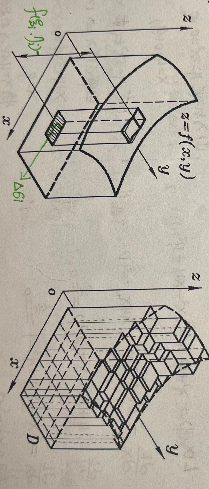

该文为学习笔记，仅作学习参考，如有错误，望指正！

<!--more-->

笔记说明：

红色：表示重点，口诀，结论；

黄色：表示注意点；

绿色：表示解题思路，或方案；

粉色：真题考试时间；

##	七.	二重积分

###	1.	二重积分概念

####	1.	定义

$\iint\limits_{D}f(x,y)d_{\sigma}=\lim\limits_{\lambda \to 0}\sum\limits_{i=1}^nf(\xi_i,\eta_i)\Delta\sigma_i（\lambda=max \Delta \sigma_i）$

【例1】（2010-1/2）$\lim\limits_{n \to \infty}\sum\limits_{i=1}^{n}\sum\limits_{j=1}^{n}\frac{n}{(n+i)(n^2+j^2)}=$（		）

A.	$\int_{0}^{1}dx\int_{0}^{x}\frac{1}{(1+x)(1+y^2)}dy$

B.	$\int_{0}^{1}dx\int_{0}^{x}\frac{1}{(1+x)(1+y)}dy$

C.	$\int_{0}^{1}dx\int_{0}^{1}\frac{1}{(1+x)(1+y)}dy$

D.	$\int_{0}^{1}\int_{0}^{1}\frac{1}{(1+x)(1+y^2)}dy$

解析：

1. $I=\lim\limits_{n \to \infty}\sum\limits_{i=1}^{n}\sum\limits_{j=1}^{n}\frac{n}{(n+i)(n^2+j^2)}\frac{1}{n}\frac{1}{n}=\int_{0}^{1}[\int_{0}^{1}\frac{1}{(1+x)(1+y^2)}dy]dx=\int_{0}^{1}\frac{1}{1+x}dx\int_{0}^{1}\frac{1}{1+y^2}dy=ln2 \cdot \frac{\pi}{4}$
2. $I=\lim\limits_{n \to \infty}\sum\limits_{i=1}^{n}\frac{1}{n+i}\sum\limits_{j=1}^{n}\frac{n}{n^2+j^2}=\lim\limits_{n \to \infty}\sum\limits_{i=1}^{n}\frac{1}{1+\frac{i}{n}}\frac{1}{n} \sum\limits_{j=1}^{n}\frac{1}{1+(\frac{i}{n})^2}\frac{1}{n}=\int_{0}^{1}\frac{1}{1+x}dx\int_{0}^{1}\frac{1}{1+y^2}dy=\int_{0}^{1}dx\int_{0}^{1}\frac{1}{(1+x)(1+y^2)}dy$

####	2.	几何意义

【注】：

$\iint\limits_{D}[\alpha f(x,y)+\beta g(x,y)]d_{\sigma}=\alpha \iint\limits_{D}f(x,y)d_{\sigma}+\beta \iint\limits_{D}g(x,y)d_{\sigma}$

$\iint\limits_{D}f(x,y)d_{\sigma}=\iint\limits_{D_1}f(x,y)d_{\sigma}+\iint\limits_{D_2}f(x,y)d_{\sigma}（D=D_1+D_2）$

$f(x,y)=1$，则 $\iint\limits_{D}1d_{\sigma}=\iint\limits_{D}d_{\sigma}=A$

$f(x,y) \leq g(x,y)$，则 $\iint\limits_{D}f(x,y)d_{\sigma} \leq \iint\limits_{D}g(x,y)d_{\sigma}$，特别的 $|\iint\limits_{D}f(x,y)d_{\sigma}| \leq \iint\limits_{D}|f(x,y)|d_{\sigma}$ （积分比较定理）

$m \leq f(x,y) \leq M$，则 $mA \leq \iint\limits_{D}f(x,y)d_{\sigma} \leq MA（没出过）$

$\iint\limits_{D}f(x,y)d_{\sigma}=f(\xi,\eta) \cdot A，（\xi,\eta）\in D，（二重积分中值定理：考不到）$

【例2】设 $D=\{(x,y)|x\geq0,0 \leq y \leq \sqrt{1-x^2}\}$，则 $\iint\limits_{D}\sqrt{1-x^2-y^2}dxdy=$?

解：令 $z=\sqrt{1-x^2-y^2} \Rightarrow x^2+y^2+z^2=1$

$V=\frac{1}{8}\frac{4}{3}\pi 1^3=\frac{1}{8}\frac{4}{3}\pi R^3=\frac{\pi}{6}$

####	3.	对称性

1. 若 D 关于 x 轴对称，则 $\iint\limits_{D}f(x,y)dxdy=\begin{cases} 0, & f(x,-y)=-f(x,y) \\ 2\iint\limits_{D_1}f(x,y)dxdy, & f(x,-y)=f(x,y)\end{cases}$，看 y；

2. 若 D 关于 y 轴对称，则 $\iint\limits_{D}f(x,y)dxdy=\begin{cases} 0, & f(-x,y)=-f(x,y) \\ 2\iint\limits_{D_1}f(x,y)dxdy, & f(-x,y)=f(x,y)\end{cases}$，看 x；

   

3. 若 D 关于 原点 对称，则 $\iint\limits_{D}f(x,y)dxdy=\begin{cases} 0, & f(-x,-y)=-f(x,y) （奇） \\ 2\int\limits_{D_1}f(x,y)dxdy, & f(-x,-y)=f(x,y)（偶）\end{cases}$

4. 若 D 关于 y=x轴 对称，则 

   $\iint\limits_{D_1}f(x,y)dxdy=\iint\limits_{D_2}f(y,x)dxdy$ 轮换对称性；

   $\iint\limits_{D}f(x,y)dxdy=\iint\limits_{D}f(y,x)dxdy$

   

【例3】（2009-1）如图，正方形 $\{(x,y)|\ |x| \leq 1，|y| \leq 1\}$ 被其对角线划分为四个区域 $D_{k}(k=1,2,3,4)$，$I_{k}=\iint\limits_{D_{k}}ycosxdxdy$，则 $\max\limits_{1 \leq k \leq 4}\{I_{k}\}=$（	A	）

A.	$I_{1}$

B.	$I_{2}$

C.	$I_{3}$

D.	$I_{4}$

解析：$I_{2}=I_{4}=0$

【例4】（2016-3）设 $J_{i}=\iint\limits_{D_{i}}\sqrt[3]{x-y}dxdy（i=1,2,3）$，其中 $D_{1}=\{(x,y) | 0 \leq x \leq 1，0 \leq y \leq 1\}$，$D_{2}=\{(x,y) | 0 \leq x \leq1，0 \leq y \leq \sqrt{x}\}$，$D_{3}=\{(x,y)|0 \leq x \leq 1，x^{2} \leq y \leq 1\}$，则 （	B	）

A.	$J_{1}<J_{2}<J_{3}$

B.	$J_{3}<J_{1}<J_{2}$

C.	$J_2<J_3<J_1$

D.	$J_2<J_1<J_3$

解析：

$J_{1}=\iint\limits_{D_{1}}\sqrt[3]{x-y}dxdy=\iint\limits_{D}\sqrt[3]{y-x}dydx =（反折）\frac{1}{2}\iint\limits_{D}dydx=0$

###	2.	二重积分计算

####	1.	直角坐标系

$A(x)=\int_{\varphi_{1}(x)}^{\varphi_2(x)}f(x,y)dy$

$V=\int_{a}^{b}A(x)dx=\int_{a}^{b}[\int_{\varphi_{1}(x)}^{\varphi_{2}(x)}f(x,y)dy]dx=\int_{a}^{b}dx\int_{\varphi_{1}(x)}^{\varphi_{2}(x)}f(x,y)dy$

【结记】：后积先定限（常数限），限内画条线，先交下限写，后交上限见；

1. 先 y 后 x：$\iint\limits_{D}f(x,y)d_{\sigma}=\int_{a}^{b}dx\int_{\varphi_{1}(x)}^{\varphi_{2}(x)}f(x,y)dy$

   

2. 先 x 后 y：$\iint\limits_{D}f(x,y)d_{\sigma}=\int_{c}^{d}dy\int_{\psi_1(y)}^{\psi_{2}(y)}f(x,y)dx$

   

【例5】交换二次积分的积分次序：$\int_{0}^{\pi}dx\int_{sinx}^{1}f(x,y)dy=$？

解：$\int_{0}^{\pi}dx\int_{sinx}^{1}f(x,y)dy=\iint\limits_{D_1}+\iint\limits_{D_2}=\int_{0}^{1}dy\int_{0}^{arcsiny}f(x,y)dx+\int_{0}^{1}dy\int_{\pi-arcsiny}^{\pi}f(x,y)dx$

【例6】（2015-2/3）计算二重积分 $\iint\limits_{D}x(x+y)dxdy$，其中 $D=\{(x,y)|x^2+y^2 \leq 2，y \geq x^2\}$

解：

$\begin{aligned}I&=2\iint\limits_{D_{1}}x^2dxdy \\ &=2\int_{0}^{1}x^{2}dx\int_{x^{2}}^{\sqrt{2-x^{2}}}dy \\ &=2\int_{0}^{1}x^{2}(\sqrt{2-x^2}-x^2)dx \\ &=2\int_{0}^{1}x^2\sqrt{2-x^2}dx-2\int_{0}^{1}x^{4}dx \\ &=\frac{2}{5}\end{aligned}$

$\begin{aligned}2\int_{0}^{1}x^2\sqrt{2-x^2}dx-\frac{2}{5} &=（令x=\sqrt{2}sint）2\int_{0}^{\frac{\pi}{4}}2sin^2t \cdot \sqrt{2}cost \cdot \sqrt{2}costdt-\frac{2}{5} \\ &=8\int_{0}^{\frac{\pi}{4}}sin^2t \cdot cos^2tdt-\frac{2}{5} \\ &=2\int_{0}^{\frac{\pi}{4}}sin^{2}2tdt-\frac{2}{5} \\ &=\int_{0}^{\frac{\pi}{4}}sin^{2}2td_{2t}-\frac{2}{5} \\ &=\int_{0}^{\frac{\pi}{2}}sin^{2}udu-\frac{2}{5} \\ &=\frac{1}{2}\frac{\pi}{2}-\frac{2}{5} \\ &=\frac{\pi}{4}-\frac{2}{5} \end{aligned}$

####	2.	极坐标系

1. 

2. $\iint\limits_{D}f(rcos\theta,rsin\theta)rd_{r}d_{\theta}=\int_{\alpha}^{\beta}d_{\theta}\int_{0}^{\varphi(\theta)}f(rcos\theta,rsin\theta)rd_{r}$

   

3. $\iint\limits_{D}f(rcos\theta,rsin\theta)rd_{r}d_{\theta}=\int_{\alpha}^{\beta}d_{\theta}\int_{\varphi_{1}(\theta)}^{\varphi_2(\theta)}f(rcos\theta,rsin\theta)rd_{r}$

   

【例7】$\int_{-\sqrt{2}}^{0}dx\int_{-x}^{\sqrt{4-x^{2}}}(x^{2}+y^{2})^{\frac{1}{2}}dy+\int_{0}^{2}dx\int_{\sqrt{2x-x^{2}}}^{\sqrt{4-x^{2}}}(x^{2}+y^{2})^{\frac{1}{2}}dy=$？

解：$I=\iint\limits_{D_1}+\iint\limits_{D_2}=\int_{0}^{\frac{\pi}{2}}d_{\sigma}\int_{2cos\theta}^{2}r \cdot rd_{r}+\int_{\frac{\pi}{2}}^{\frac{3}{4}\pi}d_{\sigma}\int_{0}^{2}r \cdot rd_{r}=2\pi \cdot \frac{16}{p}$

【例8】（没考过）$I=\int_{arctan\frac{1}{4}}^{\frac{\pi}{4}}d_{\theta}\int_{\frac{1}{\sqrt{sin\theta cos\theta}}}^{\frac{2}{cos\theta}}f(rcos\theta,rsin\theta)rd_{r}$ 在直角坐标下的二次积分为？

解：$I=\int_{1}^{2}dx\int_{\frac{1}{x}}^{x}f(x,y)dy$

【例9】计算 $\int_{0}^{+\infty}dx\int_{0}^{x}\frac{1}{(1+x^2+y^2)^2}dy$

解：

$\begin{aligned}I&=\int_{0}^{\frac{\pi}{4}}d_{\theta}\int_{0}^{+\infty}\frac{1}{(1+r^2)^2}rdr \\ &=\int_{0}^{\frac{\pi}{4}}d_{\theta}\int_{0}^{+\infty}\frac{1}{(1+r^2)^2}d_{r^2+1} \\ &=\frac{\pi}{4} \cdot \frac{1}{2} \int_{0}^{+\infty}\frac{1}{(1+r^2)^2}d_{r^2+1} \\ &=\frac{\pi}{8} \cdot (-\frac{1}{1+r^2})|_{0}^{+\infty} \\ &=\frac{\pi}{8} \end{aligned}$

【例10】（2016-1）已知平面区域 $D=\{(r,0)|2\leq r\leq 2(1+cos\theta，-\frac{\pi}{2} \leq \theta \leq \frac{\pi}{2}\}$，计算二重积分 $\iint\limits_{D}sdxdy$。

解：

$\begin{aligned} \iint\limits_{D}xdxdy&=2\iint\limits_{D_1}xdxdy \\ &=2\int_{0}^{\frac{\pi}{2}}d_{\theta}\int_{2}^{2(1+cos\theta)}rcos\theta rd_{r} \\ &=2\int_{0}^{\frac{\pi}{2}}\frac{r^3}{3}|_{2}^{2(1+cos\theta)}cos\theta d_{\theta} \\ &=\frac{16}{3}\int_{0}^{\frac{\pi}{2}}(cos^4\theta+3cos^3\theta+3cos^2\theta)d_{\theta} \\ &=\frac{16}{3}(\frac{3}{4}\frac{1}{2}\frac{\pi}{2}+3\frac{2}{3}1+3\frac{1}{2}\frac{\pi}{2}) \\ &=\frac{32}{3}+5\pi \end{aligned}$

解析：$(1+cos\theta)^3=1+3cos\theta+3cos^2\theta+cos^3\theta$

【例11】（2011-1/2）已知函数 $f(x,y)$ 具有二阶连续偏导数，且 $f(1,y)=0$，$f(x,1)=0$，$\iint\limits_{D}f(x,y)dxdy=a$，其中 $D=\{(x,y)|0\leq x \leq 1,0\leq y\leq 1\}$，计算二重积分 $I=\iint\limits_{D}xyf_{xy}''(x,y)dxdy$

解：$I=\int_{0}^{1}dx\int_{0}^{1}xyf_{xy}''(x,y)dy=\int_{0}^{1}x[yf_x'(x,y)|_{0}^{1}-\int_{0}^{1}f_x'(x,y)dy]$

由 $f(1,y)=0，f(x,1)=0 \Rightarrow f_x'(x,1)=0$

$\begin{aligned} I&=-\int_{0}^{1}xdx\int_{0}^{1}f_x'(x,y)dy \\ &=-\int_{0}^{1}dy\int_{0}^{1}xf_x'(x,y)dx（交换积分次序）\\ &=-\int_{0}^{1}[xf(x,y)|_{0}^{1}-\int_{0}^{1}f(x,y)dx]dy \\ &=\int_{0}^{1}\int_{0}^{1}f(x,y)dxdy \\ &=\iint\limits_{D}f(x,y)dxdy \\ &=a \end{aligned}$

【自练】设函数 $f(x,y)$ 具有 2 阶连续偏导数，且满足 $\frac{\partial ^2f}{\partial x^2}-\frac{\partial ^2 f}{\partial y^2}=0$，$f(x,2x)=x$，$f_x'(x,2x)=x^2$，求 $f_{xx}''(x,2x)$、$f_{xy}''(x,y)$、$f_{yy}''(x,2x)$

解：$\because f(x,2x)=x$，求 $x$ 的导数

$\Rightarrow f_x'(x,2x) \cdot 1+f_y'(x,2x) \cdot 22=1$

$\Rightarrow f_y'(x,2x)=\frac{1-x^2}{2}$

$1 \cdot f_{yx}''+2 \cdot f_{yy}''=-x$

$1 \cdot f_{xx}''+2 \cdot f_{xy}''=2x$

$f_{xx}''=f_{yy}''$

$f_{xx}''(x,2x)=f_{22}''(x.2x)=-\frac{4}{3}x$

$f_{xy}''(x,2x)=f_{yx}''(x,2x)=\frac{5}{3}x$

【自练】计算二重积分 $I=\iint\limits_{D}r^2sin\theta\sqrt{1-r^2cos2\theta}d_{r}d_{\theta}$，其中 $D=\{(r,\theta)|0\leq r \leq sec\theta，0 \leq \theta \leq \frac{\pi}{4}\}$

解：极 -> 直

$\begin{aligned}I&=\iint\limits_{D}rsin\theta\sqrt{1-r^2(cos^2\theta-sin^2\theta)}rd_{r}d_{\theta} \\ &=\iint\limits_{D}y\sqrt{1-x^2+y^2}dxdy \\ &=\int_{0}^{1}dx\int_{0}^{x}\sqrt{1-x^2+y^2}d_{(1-x^2+y^2)} \\ &=\int_{0}^{1}\frac{1}{3}(1-x^2+y^2)^{\frac{3}{2}}|_{0}^{x} \\ &=\frac{1}{3}\int_{0}^{1}[1-(1-x^2)^{\frac{3}{2}}]dx \\ &=（令x=sint）\frac{1}{3}\int_{0}^{\frac{\pi}{2}}1-\sqrt[3]{1-sin^2t}\cdot costdt+\frac{1}{3} \\ &=\frac{1}{3} \cdot \frac{\pi}{16} \end{aligned}$

###	3.	二重积分应用（数一）

1. 曲面的面积：$A=\iint\limits_{D_{xy}}\sqrt{1+(\frac{\partial z}{\partial x})^2+(\frac{\partial z}{\partial y})^2}dxdy$
2. 质心：$\overline{\text{x}}=\frac{1}{A}\iint\limits_{D}xd_{\sigma}，\overline{\text{y}}=\frac{1}{A}\iint\limits_{D}yd_{\sigma}$
3. 转动惯量：$I_x=\iint\limits_{D}y^2\mu(x,y)d_{\sigma}，I_y=\iint\limits_{D}x^2\mu(x,y)d_{\sigma}$
