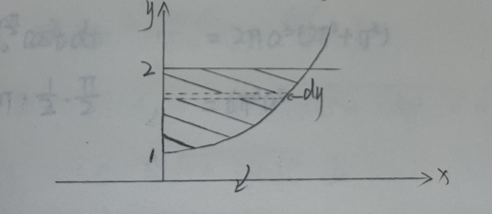

该文为学习笔记，仅作学习参考，如有错误，望指正！

<!--more-->

笔记说明：

红色：表示重点，口诀，结论；

黄色：表示注意点；

绿色：表示解题思路，或方案；

粉色：真题考试时间；

##	三.	一元函数积分学讲义：重中之重

###	0.	不定积分

1. 定义：$\forall x \in I，F'(x)（爸爸）=f(x)（儿子）$，则称 $F(x)$ 为 $f(x)$ 在 $I$ 上的原函数；

   $f(x)$ 的全体原函数称为 $f(x)$ 在 $I$ （区间）上的不定积分，记作 $\int f(x)dx=F(x)+C$（爸爸要加 C）。

2. 原函数存在定理：（基础阶段：只看不用记）

   1. 区间上的连续函数必有原函数；
   2. 区间上含第一类间断点，或无穷间断点的函数必没有原函数；（震荡间断点目前不用探究）。

3. 不定积分的基本公式（不定积分是求导的逆过程）

| $\int kdx=kx+C（k 是常数）$                               | $\int x^u dx=\frac{x^{u+1}}{u+1}+C（u \neq -1）$             |
| --------------------------------------------------------- | ------------------------------------------------------------ |
| $\int a^xdx=\frac{a^x}{lna}+C$                            | $\int e^x dx=e^x+C$                                          |
|                                                           | $\int \frac{1}{x}dx=ln\left|x\right|+C，遇到 ln 就加 \left|\right|$ |
| $\int sinx dx=-cosx+C$                                    | $\int cosx dx=sinx + C$                                      |
| $\int tanx dx=-ln|cosx|+C=-\int \frac{1}{cosx}dcosx$      | $\int cotx dx=ln|sinx|+C$                                    |
| $\int secx dx=ln|secx+tanx|+C$                            | $\int cscx dx=ln|cscx-cotx|+C$                               |
| $\int sec^2x dx=tanx+C$                                   | $\int csc^2xdx=-cotx+C$                                      |
| $\int secx \cdot tanx dx=secx+C$                          | $\int cscx \cdot cotx=-cscx+C$                               |
| $\int \frac{1}{a^2+x^2}dx=\frac{1}{a}arctan\frac{x}{a}+C$ | $\int \frac{1}{x^2-a^2}dx=\frac{1}{2a}ln|\frac{x-a}{x+a}|+C$ |
| $\int \frac{1}{\sqrt{a^2-x^2}}dx=arcsin\frac{x}{a}+C$     | $\int \frac{1}{\sqrt{a^2+x^2}}dx=ln(x+\sqrt{a^2+x^2})+C$     |
| $\int \frac{1}{\sqrt{x^2-a^2}}dx=ln|x+\sqrt{x^2-a^2}|+C$  | /                                                            |

###	1.	不定积分计算

####	1.	第一类换元法（凑微分）

若 $\int f(u)du=F(u)+C$，且函数 $\varphi(x)$ 可导，则$\int f[\varphi(x)]\varphi'(x)dx=\int f[\varphi(x)]d\varphi(x)=\int f(u)du=F(u)+C=F[\varphi(x)]+C$

$\varphi'(x)$  情愿把所有都放弃，都要狂奔向 d 里，因为进入 d 就能做到表里如一，最终就能依偎在积分公式里。

【例1】求不定积分 $\int \frac{sinx + cosx}{\sqrt[3]{sinx - cosx}}dx$

解：$I=\int \frac{1}{\sqrt[3]{sinx-cosx}}d_{sinx - cosx}=\int (sinx-cosx)^{-\frac{1}{3}}d_{sinx-cosx}=\frac{1}{1+(-\frac{1}{3})}(sinx-cosx)^{-\frac{1}{3}}d_{sinx-cosx}=\frac{3}{2}(sinx-cosx)^{\frac{2}{3}}+C$

结论：复杂求导简单倍，简单变复放 d 内。

【例2】求不定积分 $\int \frac{arctan\sqrt{x}}{\sqrt{x}(1+x)}dx$

解：$I=2\int arctanxd_{arctan\sqrt{x}}=arctan^2x+C$

分析：$(arctan\sqrt{x})'=\frac{\frac{1}{2}\frac{1}{\sqrt{x}}}{1+\sqrt{x}^2}=\frac{1}{2}\frac{1}{(1+x)\sqrt{x}}$

####	2.	第二类换元法

若 $\varphi(t)$ 可导且 $\varphi'(t)\neq0$，若 $\int f[\varphi(t)]\varphi'(t)dt=F(t)+C$，则 $\int f(x)dx=\int f[\varphi(t)]\varphi'(t)dt=F(t)+C=F[\varphi^{-1}(x)]（反函数）+C$，其中 $t=\varphi^{-1}(x)$ 是 $x=\varphi(t)$ 的反函数。

X 情愿把自己变成单调可导的函数 $\varphi(t)$ 也要挣脱出 d，因为出了 d 就能变得积分容易，最终也能沉醉在积分公式里。

【例3】求不定积分 $\int \frac{1}{x\sqrt{4x^2-1}}dx$

解：令 $2x=sect，\sqrt{sec^2t-1}=tan（当前为 >0，目前不必深究）$

$I=\int \frac{1}{\frac{1}{2}sect \cdot tanx}\cdot(\frac{1}{2}sect \cdot tanx)dt=t+C=arccos\frac{1}{2x}+C$

【例4】求不定积分 $\int \frac{1}{\sqrt{e^x-1}}dx$

解：令 $t=\sqrt{e^x-1}$

$\therefore e^x-1=t^2 \Rightarrow e^x=t^2-1 \Rightarrow x=ln(t^2+1)$

$\int \frac{1}{t}d_{ln(t^2+1)}=\int \frac{1}{t^2}\frac{2t}{t^2+1}dt=2arctanx+C=2arctan(\sqrt{e^x-1})+C$

见到根心我狂笑，开不出来一把就干掉，令 $\sqrt{ }$=t。

【自练】求不定积分 $\int \frac{1}{(2x^2+1)\sqrt{x^2+1}}dx$

解：令 $\sqrt{x^2+1}=t，x^2+1=t^2，x^2=t^2-1，x=\sqrt{t^2-1}，dx=\frac{1}{2}\frac{1}{\sqrt{t^2-1}}2tdt$

$I=\int \frac{1}{(2(t^2-1)+1) \cdot t}\frac{t}{\sqrt{t^2-1}}dt=\int \frac{1}{(2t^2-1) \cdot \sqrt{t^2-1}}dt$

####	3.	部分积分法

若函数 $u(x)，v(x)$ 均可导，则 $\int udv=uv-\int vdu$。

注：$(uv)'=u'v+uv' \Rightarrow d(uv)=vdu+udv \Rightarrow \int udv=uv-\int vdu$

注：部分积分适用于被积函数为两个不同类型函数的乘积，关键是选取适当的 u，v。选择 u，v 的总原则是：求导变简选作 u，积分容易选作 dv。

用刻骨铭心的三段爱情故事揭开分步积分 "男丁女甲" 现象。

潜规则：男上女下，上导下积，正负交错，斜线乘积，剧情结束，竖线相积（积分）。

#####	1.	无法终老型

$\begin{cases} \int P_n(x)e^{kx}dx \\ \int P_n(x)sinax dx \\ \int P_n(x)cosaxdx \end{cases}$

【例5】求不定积分

1. $\int (3x^2+x-1)e^{2x}dx$
2. $\int (x^3+2x+1)sin2xdx$

解：

1. $I=(3x^2+x-1) \cdot \frac{1}{2}e^{2x}-(6x+1)\frac{1}{4}e^{2x}+\frac{6}{8}e^{2x}+C$

   

2. $I=-\frac{1}{2}cos2x \cdot (3x^2+2x+1)+\frac{1}{4}sin2x \cdot (3x^2+2)-\frac{1}{8}cos2x \cdot 6x-\frac{6}{16}sin2x$

   

#####	2.	回心转意型：直到男人回家

$\begin{cases} \int e^{kx}sinax dx \\ \int e^{kx}cosax dx \end{cases}$

猪 = 狗 - 猪；狗 = 2猪；"还猪格格"

【例6】（2009-2）求不定积分 $\int e^{-x}sinnx dx$

解：

则：$I=-sinnx \cdot e^{-x}-n \cdot cosnx \cdot e^{-x} - \int e^{-x}n^2sinnxdx=-e^{-x}(sinnx+ncosnx) - \int e^{-x}n^2sinnxdx$

等式变形：

$(n^2+1)\int e^{-x}sinnxdx=-e^{-x}(sinnx+ncosnx)$

$\therefore \int e^{-x}sinnxdx=-\frac{e^{-x}(sinnx+ncosnx)}{n^2+1}+C$

【例7】（捉妖记——客串肚子里有青春）求不定积分 $\int cos(lnx)dx$

解：令 $lnx=t，x=e^t，dx=e^tdt，\int cos(lnx)dx=\int cost \cdot e^tdt$

#####	3.	心惊肉跳型：yuchun一导变男生，男生一见被吓尿

$\begin{cases} \int P_n(x)lnxdx \\ \int P_n(x)arcsinxdx \\ \int P_n(x)arctanxdx \end{cases}$

【例8】求不定积分 $\int x^2lnxdx$

解：

$I=\frac{1}{3}x^3lnx-\int \frac{1}{3}x^2dx=\frac{1}{3}x^3lnx-\frac{1}{9}x^3+C$

【例9】求不定积分 $\int \frac{arctanx}{x^3}dx$

解：

$\begin{aligned}I&=-\frac{1}{2}x^{-2}arctanx-\int \frac{-\frac{1}{2}x^{-2}}{1+x^2}dx \\ &=-\frac{1}{2}x^{-2}arctanx+\frac{1}{2}\int \frac{1}{x^2}\frac{1}{1+x^2} \\ &=-\frac{1}{2}x^{-2}arctanx+\frac{1}{2}\int \frac{1}{x^2}-\frac{1}{1+x^2}dx \\ &=-\frac{1}{2}x^{-2}arctanx - \frac{1}{2x} - \frac{1}{2}arctanx+C \end{aligned}$

####	4.	有理函数积分：求谁，挡谁，代谁

【例10】若不定积分 $\int \frac{x^2+ax+2}{(x+1)(x^2+1)}dx$ 的结果中不含反正切函数，且 a = ?

解：$I=\int \frac{A}{x+1}+\frac{Bx+C}{x^2+1}dx=\int \frac{A(x^2+1)+Bx(x+1)}{(x+1)(x^2+1)}dx=$

$\Rightarrow (A+B)x^2+Bx+A=x^2+ax+2$

$\Rightarrow A=2，A + B = 1，\therefore a = B = -1$

【小结】：

1. 不定积分属于基础计算，也属于智力游戏；
2. 复习积分的四种方法：凑 + 换元 + 部分积分 + 有理函数积分；

###	2.	定积分

####	1.	定积分定义

$\int_{a}^{b}f(x)dx=\lim\limits_{\lambda \to 0}\sum\limits_{i=1}^{n}f(\xi_i)\Delta x_i（\lambda=max{\Delta x_i}）$

$\int_{a}^{b}f(x)dx=\lim\limits_{n \to \infty} \sum\limits_{i=1}^{n}f(a+\frac{b-a}{n}i) \cdot \frac{b-a}{n}$

非常重要：$\int_{0}^{1}f(x)dx=\lim\limits_{n \to \infty} \sum\limits_{i=1}^{n}f(\frac{1}{n}i) \cdot \frac{1}{n}$

【结论】：

和式极限划不了 $\Rightarrow$ 定积分定义

$\begin{cases} 1. 提 \frac{1}{n} \\ 2. 凑成 \frac{1}{n}的函数式 \\ 3. 换成x \end{cases}$

【例11】求极限 $\lim\limits_{n \to \infty}(\frac{1}{n+1}+\frac{1}{n+2}+...+\frac{1}{n+n})$

解：$I=\lim\limits_{n \to \infty}\sum\limits_{i=1}^{n}\frac{1}{n+i}=\lim\limits_{n \to \infty}\sum\limits_{i=1}^{n}\frac{1}{1+\frac{i}{n}}\cdot \frac{1}{n}（\lim\limits_{n \to \infty}\sum\limits_{i=1}^{n}f(\frac{1}{n}i)\frac{1}{n}）=\int_{0}^{1}\frac{1}{1+x}dx=ln|1+x||_{0}^{1}=ln2$

【自练】（2012-2）求极限 $\lim\limits_{n \to \infty}n(\frac{1}{1^2+n^2}+\frac{1}{2^2+n^2}+...+\frac{1}{n^2+n^2})$

解：$I=\lim\limits_{n \to \infty}\sum\limits_{i=1}^{n}n\frac{1}{i^2+n^2}=\lim\limits_{n \to \infty}\frac{1}{(\frac{i}{n})^2+1}\cdot \frac{1}{n}=\int_{0}^{1}\frac{1}{1+x^2}dx=arctanx|_{0}^{1}=\frac{\pi}{4}$

####	2.	几何意义

定积分 $\int_{a}^{b}f(x)dx$ 表示由 $y=f(x)，x=a，x=b$ 所围成曲边梯形面积代数和，它仅仅表示一个数。

【小结】：

| 当 $a = b$ 时                                                | $\int_{a}^{b}f(x)dx=0$                                       |
| ------------------------------------------------------------ | ------------------------------------------------------------ |
| 当 $a > b$ 时                                                | $\int_{a}^{b}f(x)dx=-\int_{b}^{a}f(x)dx$                     |
| $f(x) \equiv 1$                                              | 则 $\int_{a}^{b}f(x)dx=b-a$                                  |
| $f(x) \geq 0$                                                | 则 $\int_{a}^{b}f(x)dx \geq 0$                               |
| $\int_{a}^{b}[f(x) \pm g(x)]dx=\int_{a}^{b}f(x)dx \pm \int_{a}^{b}g(x)dx$ |                                                              |
| $a<c<b$                                                      | 则 $\int_{a}^{b}f(x)dx=\int_{a}^{c}f(x)dx+\int_{c}^{b}f(x)dx$ |
| $\int_{a}^{b}kf(x)dx=k\int_{a}^{b}f(x)dx$（k 为常数）        |                                                              |
| $f(x) \leq g(x)$                                             | 则 $\int_{a}^{b}f(x)dx= \leq \int_{a}^{b}g(x)dx（a<b）$      |
| $|\int_{a}^{b}f(x)dx|  \leq \int_{a}^{b}|f(x)|dx（a<b）\Rightarrow$ | $\int_{a}^{b}-|f(x)|dx \leq \int_{a}^{b}f(x)dx \leq \int_{a}^{b}|f(x)|dx$ |

积分估值定理：$m \leq f(x) \leq M，则 m(b-a) \leq \int_{a}^{b}f(x)dx \leq M(b-a)（a<b）$

【例12】（2008-2/3）如图，曲线段的方程为 $y=f(x)$，函数 $f(x)$ 在区间 $[0,a]$ 上有连续的导数，则定积分 $\int_{0}^{a}xf'(x)dx$ 等于（	C	）

（A）曲边梯形ABOD的面积

（B）梯形ABOD的面积

（C）曲边三角形ACD的面积

（D）三角形ACD的面积

解：

$I=(xf(x)-\int f(x)dx)|_{0}^{a}=af(a)-\int_{0}^{a}f(x)dx=S_{ACOD}-S_{ADOB}=S_{ACD}$

【例13】已知 $f'(x) \cdot \int_{0}^{2}f(x)dx=8，且 f(0)=0，求 \int_{0}^{2}f(x)dx及f(x)$

解：$f'(x)=\frac{8}{\int_{0}^{2}f(x)dx}，\Rightarrow f(x)=\frac{8}{\int_{0}^{2}f(x)dx}x+C，\because f(0)=0，\therefore f(x)=\frac{8}{\int_{0}^{2}f(x)dx}x$

$\int_{0}^{2}f(x)dx=\frac{8}{\int_{0}^{2}f(x)dx}\int_{0}^{2}xdx=\frac{16}{\int_{0}^{2}f(x)dx} \Rightarrow (\int_{0}^{2}f(x)dx)^2=16，\int_{0}^{2}f(x)dx=\pm 4，f(x)=\frac{8}{\int_{0}^{2}f(x)dx}=\pm 2$

【例14】求定积分 $\int_{0}^{2}x\sqrt{2x-x^2}dx$

解：

1. 解法一：

   令 $x-1=t，x=t+1，dx=dt$

   $I=\int_{-1}^{1}(t+1)\sqrt{1-t^2}dt=\int_{-1}^{1}t\sqrt{1-t^2}+\sqrt{1-t^2}dt=0+\int_{-1}^{1}\sqrt{1-t^2}dx=\frac{\pi}{2}$

2. 解法二：

   令 $x-1=sint$

   $\int_{-\frac{\pi}{2}}^{\frac{\pi}{2}}(sint+1)|cosx|cosxdt=\int_{-\frac{\pi}{2}}^{\frac{\pi}{2}}sint \cdot cos^2t+cos^2tdt=\int_{-\frac{\pi}{2}}^{\frac{\pi}{2}}cos^2xdx=\frac{\pi}{2}$

解析：$sintcos^2t$ 为奇函数

疑问：结果存在疑问。

【例15】设 $I_1=\int_{0}^{\frac{\pi}{4}}\frac{tanx}{x}dx，I_2=\int_{0}^{\frac{\pi}{4}}\frac{x}{tanx}dx$，试比较 $I_1、I_2$ 与 1 的大小关系。

解：$1 = \int_{0}^{\frac{\pi}{4}}\frac{4}{\pi}xdx$

1. $\frac{tanx}{x}$，$\frac{4}{\pi}$

   $tanx<\frac{4}{\pi}x（x\in(0,\frac{\pi}{4})），则 I_1<1$

2. $\frac{x}{tanx}$，$\frac{4}{\pi}$

   $tanx>\frac{\pi}{4}x，则 I_2>1$

疑问：目前仍未搞清他们之间的关系

####	3.	定积分存在（可积）条件

1. 充分条件：
   1. $f(x) 在 [a,b]连续，则 f(x) 在 [a,b]可积。$
   2. $f(x) 在 [a,b]上有界，且只有有限个间断点，则 f(x) 在 [a,b] 可积。$
2. 必要条件：$f(x) 在 [a,b] 可积，则 f(x) 在 [a,b] 有界。$

###	3.	定积分计算

$f(x) 二阶可导 \Rightarrow 一阶导数连续$；

$N-L$公式：如果函数 $F(x)$ 是连续函数 $f(x)$ 在区间 $[a,b]$ 上的一个原函数，则 $\int_{a}^{b}f(x)dx=F(b)-F(a)$。至今未考，今后也不会考。

注意：

1. 整形——完美脸部整形，葫芦瞬间变蛇精。

2. 将次——凑奇不凑偶，同次用倍角。

   $sinx \cdot cosx=\frac{1}{2}sin2x$

   $sinx+cosx=\sqrt{2}sin(x+\frac{\pi}{4})=\sqrt{2}cos(x-\frac{\pi}{4})$

   $1+cosx=2cos^2\frac{x}{2}$

   $1-sinx=2sin^2\frac{x}{2}$

【例16】求定积分 $\int_{1}^{\sqrt{3}}\frac{1}{x(1+x^2)^2}dx$

解：

1. 解法一：

   $\begin{aligned}令x=tant，I&=\int_{\frac{\pi}{4}}^{\frac{\pi}{3}}\frac{1}{tant(1+tan^2t)^2}sec^2tdt \\ &=\int_{\frac{\pi}{4}}^{\frac{\pi}{3}}\frac{1}{tant \cdot sec^2t}dt \\ &=\int_{\frac{\pi}{4}}^{\frac{\pi}{3}}\frac{cos^3t}{sint}dt \\ &=\int_{\frac{\pi}{4}}^{\frac{\pi}{3}}\frac{1-sin^2x}{sinx}d_{sinx} \\ &=(ln|sinx|-\frac{1}{2}sin^2x)|_{\frac{\pi}{4}}^{\frac{\pi}{3}} \\ &=ln\frac{\sqrt{3}}{2}-\frac{1}{2}\frac{3}{4}-ln\frac{\sqrt{2}}{2}+\frac{1}{2}\frac{1}{2} \\ &=ln(\frac{\sqrt{3}}{2})-\frac{1}{8} \\ &=\frac{1}{2}ln\frac{3}{2}-\frac{1}{8} \end{aligned}$

2. 解法二：

   $I=\int_{1}^{\sqrt{3}}\frac{x}{x^2(1+x^2)^2}dx=\int_{1}^{\sqrt{3}}\frac{1}{2}\frac{1}{x^2(1+x^2)^2}d_{x^2}=\frac{1}{2}\int_{1}^{3}\frac{1}{t(1+t)^2}dt=\frac{1}{2}\int_{1}^{3}\frac{1}{t}-\frac{1}{1+t}-\frac{1}{(1+t)^2}dt=$

【例17】如图，曲线 C 的方程为 $y=f(x)，点(3,2)$是它的一个拐点，直线 $l_1与l_2$分别是曲线 C 在点 (0,0)与(3,2)处的切线，其交点为(2,4)。设函数 $f(x)$ 具有三阶连续导数，计算定积分 $\int_{0}^{3}(x^2+x)f'''(x)dx$。

解：

看图可知：$f''(3)=0，f'(3)=-2，f'(0)=2$

$I=[(x^2+x)f''(x)-(2x+1)f'(x)+2f(x)]|_{0}^{3}=12f''(3)-7f'(3)+2f(3)+f'(0)-2f(0)=0-7 \cdot (-2)+2 \cdot 2+2-2 \cdot 0=20$

####	1.	分段函数的定积分：分段函数分段求

【例18】求定积分 $\int_{0}^{1}x|x-a|dx$

解：

1. 若 $a \leq 0，\int_0^1 x(x-a)dx=\int_0^1 x^2-axdx=\frac{1}{3}x^3-\frac{a}{2}x^2|_0^1=\frac{2-3a}{6}$
2. 若 $0<a<1，\int_0^ax(a-x)dx+\int_a^1x(x-a)dx=(\frac{a}{2}x^2-\frac{1}{3}x^3)|_0^a+(\frac{1}{3}x^3-\frac{a}{2}x^2)|_a^1=\frac{1}{3}a^3+\frac{1}{3}-\frac{a}{2}$
3. 若 $a \geq 1，\int_0^1 x(a-x)dx=\int_0^1ax-x^2dx=(\frac{a}{2}x^2-\frac{1}{3}x^3)|_0^1=\frac{3a-2}{6}$

【例19】求定积分 $\int_{-1}^2 max\{1,x^2\}dx$

解：$max\{1,x^2\}$ 图形如下

$I=\int_{-1}^{1}1dx+\int_{1}^{2}x^2dx=x|_{-1}^{1}+\frac{1}{3}x^3|_{1}^{2}=\frac{13}{3}$ 

####	2.	对称区间奇偶函数的定积分

若 $f(x)$ 在 $[-a,a]$ 上连续且为偶函数，则 $\int_{-a}^{a}f(x)dx=2\int_{0}^{a}f(x)dx$

若 $f(x)$ 在 $[-a,a]$ 上连续且为奇函数，则 $\int_{-a}^{a}f(x)dx=0$

【例20】求定积分 $\int_{-1}^{1}(|x|e^{-x}+sinx^3+\sqrt{1-x^2})dx$

解：

$\begin{aligned}I&=\int_{-1}^{1}|x|e^{-x}+\int_{-1}^{1}sinx^3+\int_{-1}^{1}\sqrt{1-x^2}dx \\ &=\int_{-1}^{0}(-x)e^{-x}dx+\int_{0}^{1}xe^{-x}dx+\int_{-1}^{1}\sqrt{1-x^2} \\ &=(xe^{-x}+e^{-x})|_{-1}^{0}+(-xe^{-x}-e^{-x})|_{0}^{1}+\frac{\pi}{2} \\ &=2+2e^{-1}+\frac{\pi}{2} \end{aligned}$

解析：$\int_{-1}^{1}\sqrt{1-x^2}dx=\frac{\pi}{2}$

【例21】求定积分 $\int_{1}^{3}f(x-2)dx$，其中 $f(x)=\begin{cases} x(arctanx+e^x),&x<0 \\ xe^{-x},&x \geq 0 \end{cases}$

解：$令x-2=t$

$\begin{aligned}I&=\int_{-1}^{1}f(t)dt \\ &=\int_{-1}^{0}t(arctant+e^t)dt+\int_{0}^{1}te^{-t}dt \\ &=\int_{-1}^{0}t \cdot arctantdt+\int_{-1}^{0}te^tdx+\int_{0}^{1}te^{-t}dt \\ &=\int_{-1}^{0}t \cdot arctantdt+\int_{-1}^{1}te^{|t|}dt \\ &=\frac{1}{2}t^2arctant|_{-1}^{0}-\frac{1}{2}\int_{-1}^{0}\frac{t^2}{1+t^2}dt \\ &=-\frac{1}{2} \cdot (-\frac{\pi}{4})-\frac{1}{2}\int_{-1}^{0}1-\frac{1}{1+t^2}dt \\ &=\frac{\pi}{8}-\frac{1}{2}(t-arctant)|_{-1}^{0} \\ &=\frac{\pi}{8}-\frac{1}{2}(1-\frac{\pi}{4})=\frac{\pi}{4}-\frac{1}{2} \end{aligned}$

解析：$\int_{-1}^{1}te^{|t|}dt=0$，奇函数（完美脸部整形）

####	3.	周期函数的定积分

设 $f(x)$ 是连续的周期函数，周期为 T，则

1. $\int_{a}^{a+T}f(x)dx=\int_{0}^{T}f(x)dx=\int_{-\frac{\pi}{2}}^{\frac{\pi}{2}}f(x)dx$
2. $\int_{a}^{a+T}f(x)dx=n\int_{0}^{T}f(x)dx=n\int_{-\frac{\pi}{2}}^{\frac{\pi}{2}}f(x)dx，（n\in N）$

【例22】设 $f(x)$ 是周期为2的连续函数

1. 证明：对任意的实数 t，有 $\int_{t}^{t+2}f(x)dx=\int_{0}^{2}f(x)dx$；
2. 证明：$G(x)=\int_{0}^{x}[2f(t)-\int_t^{t+2}f(s)ds]dt$ 是周期为2的周期函数；

解：

1. 证明：

   1. 应考法：$\int_{t}^{t+2}f(x)dx=\int_{t}^{0}f(x)dx+\int_{0}^{2}f(x)dx+\int_{2}^{t+2}f(x)dx\Rightarrow \int_{t}^{t+2}f(x)dx=\int_{0}^{1}f(x)dx$

   2. 实做法：

      $\begin{aligned}\int_{t}^{t+2}f(x)dx &=\int_{t}^{0}f(x)dx+\int_{0}^{2}f(x)dx+\int_{2}^{t+2}f(x)dx \\ &=\int_{t}^{0}f(x)dx+\int_{0}^{2}f(x)dx+\int_{0}^{t}f(u+2)du \\ &=\int_{t}^{0}f(x)dx+\int_{0}^{2}f(x)dx-\int_{t}^{0}f(u+2)du \\ &=\int_{0}^{2}f(x)dx \end{aligned}$

2. 证明：

   $\begin{aligned}G(x+2)-G(x) &=\int_{0}^{x+2}[2f(t)-\int_t^{t+2}f(s)ds]dt-\int_{0}^{x}[2f(t)-\int_t^{t+2}f(s)ds]dt \\ &=2\int_{x}^{x+2}f(t)dt-2\int_{0}^{2}f(s)ds \\ &=2\int_{0}^{2}f(x)dx-2\int_{0}^{2}f(s)ds \end{aligned}$

【例23】求定积分 $\int_{0}^{n\pi}\sqrt{1+sin2x}dx$

解：

$\begin{aligned}I &=\int_{0}^{n\pi}\sqrt{sin^2x+cos^2x+2sinxcosx}dx \\ &=n\int_{0}^{\pi}\sqrt{(sinx+cosx)^2}dx \\ &=n\int_{0}^{\pi}|sinx+cosx|dx \\ &=n\int_{0}^{\pi}|\sqrt{2}sin(x+\frac{\pi}{4})|dx \\&=\sqrt{2}n\int_{\frac{\pi}{4}}^{\frac{5\pi}{4}}|sint|dt \\ &=\sqrt{2}n\int_{0}^{\pi}sintdt \\ &=2\sqrt{2}n \end{aligned}$

解析：$\int_{0}^{\pi}sinxdx=2，sin2x=2sinxcosx$

【例24】求定积分 $\int_{2017}^{2017+\pi}(sin2x+cos2x)sin^2xdx$

解：

$\begin{aligned}I &=\int_{2018}^{2018+\pi}(sin2x+cos2x)sin^2xdx \\ &=\int_{-\frac{\pi}{2}}^{\frac{\pi}{2}}cos2xsin^2xdx \\ &=2\int_{0}^{\frac{\pi}{2}}(1-2sin^2x)sin^2xdx \\ &=2\int_{0}^{\frac{\pi}{2}}sin^2xdx-4\int_{0}^{\frac{\pi}{2}}sin^4xdx \\ &=2 \cdot \frac{1}{2} \cdot \frac{\pi}{2}-4 \cdot \frac{3}{4} \cdot \frac{1}{2} \cdot \frac{\pi}{2} \\ &=-\frac{\pi}{4} \end{aligned}$

解析：火箭公式

$\int_{0}^{\frac{\pi}{2}}sin^7xdx=\frac{6}{7} \cdot \frac{4}{5} \cdot \frac{2}{3} \cdot 1$

$\int_{0}^{\frac{\pi}{2}}sin^6x=\frac{5}{6} \cdot \frac{3}{4} \cdot \frac{1}{2} \cdot \frac{\pi}{2}$

####	4.	R-T：反折变换

反折变换：$\int_{-L}^{L}f(x)dx=\int_{-L}^{L}f(-x)dx=\frac{1}{2}\int_{-L}^{l}f(x)+f(-x)dx$

【例25】求定积分 $\int_{-\frac{\pi}{2}}^{\frac{\pi}{2}}sin^2x \cdot arctane^xdx$

解：

$\begin{aligned} I &=\frac{1}{2}\int_{-\pi}^{\pi}sin^2x \cdot arctane^xdx \\ &=\frac{1}{2}\int_{-\pi}^{\pi}sin^2x \cdot arctane^x+sin^2x \cdot arctane^{-x}dx \\ &=\frac{1}{2}\int_{-\pi}^{\pi}sin^2x(arctane^x+arctane^{-x})dx \\ &=\frac{1}{2} \cdot \frac{\pi}{2} \cdot \int_{-\pi}^{\pi}sin^2xdx \\ &=\frac{\pi}{4} \cdot 4 \cdot \int_{0}^{\frac{\pi}{2}}sin^2xdx \\ &=\pi \cdot \frac{1}{2} \cdot \frac{\pi}{2} \\ &=\frac{\pi^2}{4} \end{aligned}$

解析：$arctane^x+arctane^{-x}=\frac{\pi}{2}，arctanx+arctan\frac{1}{x}=\frac{\pi}{2}（x>0），arctanx+arctan\frac{1}{x}=-\frac{\pi}{2}（x\leq 0）$

【例26】若 $f(x)$ 在 $[0,1]$ 上连续，证明

1. $\int_{0}^{\frac{\pi}{2}}f(sinx)dx=\int_{0}^{\frac{\pi}{2}}f(cosx)dx$；
2. $\int_{0}^{\pi}xf(sinx)dx=\frac{\pi}{2}\int_{0}^{\pi}f(sinx)dx$；并计算 $\int_{0}^{\pi}\frac{xsinx}{1+cos^2x}dx$

解：

1. $I=\int_{0}^{\frac{\pi}{2}}f(sinx)dx=\int_{0}^{\frac{\pi}{2}}f(sin(\frac{\pi}{2}-x))dx=\int_{0}^{\frac{\pi}{2}}f(cosx)dx$

2. $I=\int_{0}^{\pi}xf(sinx)dx=\int_{0}^{\pi}(xf(sinx))+(\pi-x)sin(\pi -x)dx \cdot \frac{1}{2}=\int_{0}^{\pi}(xf(sinx)+\pi f(sinx)-xf(sinx))dx \cdot \frac{1}{2}=\frac{\pi}{2}\int_{0}^{\pi}f(sinx)dx$

   $\int_{0}^{\pi}\frac{xsinx}{1+cos^2x}dx=\frac{\pi}{2}\int_{0}^{\pi}\frac{sinx}{1+cos^2x}dx=-\frac{\pi}{2}\int_{0}^{\pi}\frac{1}{1+cos^2x}d_{cosx}=-\frac{\pi}{2}arctan(cosx)|_{0}^{\pi}=-\frac{\pi}{2} \cdot (-\frac{\pi}{4}-\frac{\pi}{4})=\frac{\pi^2}{4}$

【例27】已知 $f(x)$ 在 $[0,2]$ 上连续，且其图形关于点 $(1,0)$ 对称，即 $f(x)=-f(2-x)$，计算 $\int_0^\pi f(1+cosx)dx$

解：$I=\frac{1}{2}\int_0^\pi f(1+cosx)+f(1+cos(\pi -x))dx=\frac{1}{2}\int_{0}^{\pi}f(1+cosx)+f(1-cosx)dx=\frac{1}{2}\int_{0}^{\pi}f(1+cosx)+f[2-(1-cosx)]dx=0$

解析：$cos(\pi -x)=-cosx$

【例28】（1977）对于定积分 $I_1=\int_{0}^{\frac{\pi}{2}}sin(sinx)dx，I_2=\int_{0}^{\frac{\pi}{2}}sin(cosx)dx，I_3=\int_{0}^{\frac{\pi}{2}}cos(sinx)dx$ 有（		）

（A）$I_1<I_2$

（B）$I_1<I_3$

（C）$I_3<I2$

（D）$I_3<1$

解析：画出图形比较后可得，$I_3=I_4>1>I_1=I_2，\int_{0}^{\frac{\pi}{2}}sinxdx=1$

###	4.	变限积分：必考

####	1.	变限积分函数

【小结】：

1. 原函数存在定理：若 $f(x)$ 在 [a,b] 上连续，则变限积分 $F(x)$ 是 $f(x)$ 在 $[a,b]$ 上的一个原函数，它属于定积分的范畴；

2. 微积分基本定理：

   1. 若 $f(x)$ 连续，则 $F(x)$ 可导（2008-1证明，不会考了）；

      证明：$F'(x)=\lim\limits_{\Delta x \to 0}\frac{F(x+\Delta x)-F(x)}{\Delta x}=\lim\limits_{\Delta x \to 0}\frac{\int_{0}^{x+\Delta x}f(t)dt-\int_{0}^{x}f(t)dt}{\Delta x}=\lim\limits_{\Delta x \to 0}\frac{\int_{x}^{x+\Delta x}f(t)dt}{\Delta x}=\lim\limits_{\Delta x \to 0}\frac{f(\xi) \Delta x}{\Delta x}（\xi \in(x,x+\Delta x)）=f(x)$

   2. 若 $f(x)$ 可积，则 $F(x)$ 连续（至今未考，考前应看）;

      证明：

      连续 $\Leftrightarrow \lim\limits_{\Delta x \to 0}[F(x+\Delta x)-F(x)]=0 \Leftrightarrow \lim\limits_{\Delta x \to 0}|F(x+\Delta x)-F(x)|=0$

      $\lim\limits_{\Delta x \to 0}|\int_{x}^{x+\Delta x}f(t)dt|=0$

      $0\leq|\int_{x}^{x+\Delta x}f(t)dt|\leq\int_{x}^{x+\Delta x}|f(t)|dt\leq|M\Delta x|\leq M\Delta x$

      由夹逼定理，则 $F(x)$ 连续

【例29】（2017-1/2/3）如图，连续函数 $y=f(x)$ 在区间 $[-3,-2]，[2,3]$ 上的图形分别是直径为 1 的上、下半圆周，在区间 $[-2,0]，[0,2]$ 上的图形分别是直径为 2 的下、上半圆周，设 $F(x)=\int_{0}^{x}f(t)dt$，则下列结论正确的是（	C	）

（A）$F(3)=-\frac{3}{4}F(-2)$

（B）$F(3)=\frac{5}{4}F(2)$

（C）$F(-3)=\frac{3}{4}F(2)$

（D）$F(-3)=-\frac{4}{5}F(-2)$

解析：

$F(3)=\int_{0}^{3}f(t)dt=S_2-S_1=\frac{1}{2}(\pi -\pi(\frac{1}{2})^2)=\frac{3}{8}\pi$

$F(2)=\int_{0}^{2}f(t)dt=S_2=\frac{1}{2}\pi$

$F(-2)=\int_{0}^{-2}f(t)dt=-\int_{-2}^{0}f(t)dt=-(-\frac{1}{2}\pi)=\frac{1}{2}\pi$

$F(-3)=\int_{0}^{-3}f(t)dt=-\int_{-3}^{0}f(t)dt=-(\frac{1}{2}\pi(\frac{1}{2})^2-\frac{1}{2}\pi)=-(\frac{1}{8}\pi-\frac{1}{2}\pi)=\frac{3}{8}\pi$

$\therefore F(3)=\frac{3}{4}F(-2)，f(3)=\frac{3}{4}\pi，F(-3)=\frac{3}{4}\pi，F(-3)=\frac{3}{4}\pi$

【例30】（2009-1/2/3）设函数 $y=f(x)$ 在区间 $[-1,3]$ 上的图形如图所示，则 $F(x)=\int_{0}^{x}f(t)dt$ 的图形为（	D	）

【例31】设 $g(x)=\int_{0}^{x}f(u)du$，其中 $f(x)=\begin{cases} \frac{1}{2}(x^2+1),&0\leq x<1 \\ \frac{1}{3}(x-1),&1\leq x \leq 2 \end{cases}$ 则 $g(x)$ 在区间 $(0,2)$ 内（		）

（A）无界

（B）递减

（C）不连续

（D）连续但不可导

（E）连续可导

解析：$g(x)=\int_{0}^{x}f(u)du$

$当 0\leq x<1 时，g(x)=\int_{0}^{x}\frac{1}{2}(u^2+1)du=\frac{1}{6}u^3+\frac{1}{2}u$

$当 1\leq x<2 时，g(x)=\int_{0}^{1}\frac{1}{2}(u^2+1)du+\int_{1}^{x}\frac{1}{3}(u-1)du=(\frac{1}{6}u^3+\frac{1}{2}u)|_{0}^{1}+(\frac{1}{6}u^2-\frac{1}{3}u)|_{1}^{x}=\frac{1}{6}u^2-\frac{1}{3}u+\frac{5}{6}$

$\therefore g(x)=\begin{cases} \frac{1}{6}u^3+\frac{1}{2}u, &x\in(0,1] \\\frac{1}{6}u^2-\frac{1}{3}u+\frac{5}{6}, &x\in(1,2) \end{cases}$

$\therefore \lim\limits_{x \to 1^-}g(x)=\frac{2}{3}=\lim\limits_{x \to 1^+}g(x)=\frac{2}{3} \Rightarrow$ 连续

$\therefore g_{-}'(1)=\frac{1}{4}\neq g_{+}'(1)=0 \Rightarrow$ 不可导

####	2.	变限积分计算：必考

求导公式：

1. $[\int_{a}^{\varphi(x)}f(t)dt]'|_{x}=f[\varphi(x)]\varphi'(x)$（考的较多）；

   上限带入积分变量里，外乘上限导；

2. $[\int_{\varphi_{1}(x)}^{\varphi_{2}(x)}f(t)dt]'=f[\varphi_{2}(x)]\varphi_{2}'(x)-f[\varphi_{1}(x)]\varphi_{1}'x$

3. $[\int_{a}^{\varphi(x)}g(x)f(t)dt]'=[g(x)\int_{a}^{\varphi(x)}f(t)dt]'=g'(x)\int_{a}^{\varphi(x)}f(t)dt+g(x)f[\varphi(x)]\varphi'(x)$

【例32】计算 $\frac{d}{dx}[\int_{x^2}^{x}xsintdt]$

解：$I=[x\int_{x^2}^{x}sintdt]'=\int_{x^2}^{x}sintdt+x[sinx-sin(x^2) \cdot 2x]=cosx^2-cosx+xsinx-ax^2sinx^2$

【例33】设 $f(x)$ 连续，计算 $\frac{d}{dx}[\int_{0}^{x}tf(x^2-t^2)dt]$

解：$I=[\int_{x^2}^{0}f(u) \cdot \sqrt{x^2-u} \cdot \frac{1}{2} \cdot \frac{1}{\sqrt{x^2-u}} \cdot (-1)du]'=[\int_{x^2}^{0}f(u) \cdot (-\frac{1}{2})du]'=[\frac{1}{2}\int_{0}^{x^2}f(u)du]'=\frac{1}{2}f(x^2)2x=xf(x^2)$

解析：换元的原因，偏导数连续才可以直接换

【总结】：含参变量积分

$F(x)=\int_{\alpha(x)}^{\beta(x)}F(x,t)dt，F'(x)=f(x_1,\beta(x)) \cdot \beta'(x)-f(x,\alpha(x)) \cdot \alpha'(x)+\int_{\alpha(x)}^{\beta(x)}f_{x}^{'}(x,t)dt$

示例：$f(x)=\int_{1}^{x^3}(asinx+bt^2+y)dt，f'(x)=(asinx+bx^3+y) \cdot 3x^2+\int_{1}^{x^3}acosxdt$

###	5.	反常积分

####	1.	定义

定义：$\int_{a}^{+\infty}f(x)dx$ （无限区间）；$\int_{a}^{b}f(x)dx$ （无界函数）

【例34】设 $f(x)$ 是 $(-\infty,+\infty)$ 上连续的奇函数，则（	C	）

（A）$\int_{-\infty}^{+\infty}f(x)dx$ 收敛

（B）$\int_{-\infty}^{+\infty}f(x)dx$ 发散

（C）$\int_{-\infty}^{+\infty}f(x)dx$ 收敛时，其值必为 0

（D）$\int_{-\infty}^{+\infty}f(x)dx$ 收敛时，其值不为 0

####	2.	反常积分判敛

#####	1.	计算判敛

【总结】：

1. $\int_{a}^{+\infty}f(x)dx=F(x)|_{a}^{+\infty}=\begin{cases} 存在 \Rightarrow 收敛 \\ 不存在 \Rightarrow 发散 \end{cases}$
2. $\int_{a}^{b}f(x)dx=F(x)|_{a^+}^{b}=\begin{cases} 存在 \Rightarrow 收敛 \\ 不存在 \Rightarrow 发散 \end{cases}$ "a" 为瑕点（无穷间断点）奇点：瑕点、$\infty$

【例35】反常积分 $\int_{-\infty}^{0}\frac{1}{x^2}e^{\frac{1}{x}}dx，\int_{0}^{+\infty}\frac{1}{x^2}e^{\frac{1}{x}}dx$ 的敛散性为（	B	）

（A）收敛，收敛

（B）收敛，发散

（C）发散，收敛

（D）发散，发散

解析：

1. $\int_{-\infty}^{0}\frac{1}{x^2}e^{\frac{1}{x}}dx=\int_{-\infty}^{0^-}e^{\frac{1}{x}}d_{\frac{1}{x}}=-e^{\frac{1}{x}}|_{-\infty}^{0^-}=-(0-1)=1，\Rightarrow $收敛
2. $\int_{0}^{+\infty}\frac{1}{x^2}e^{\frac{1}{x}}dx=-e^{\frac{1}{x}}|_{0^+}^{+\infty}=-(1-\infty)=+\infty，\Rightarrow$ 发散

【例36】计算 $\int_{1}^{+\infty}\frac{lnx}{(1+x)^2}dx$

解：$\int_{1}^{+\infty}\frac{lnx}{(1+x)^2}dx=-\frac{lnx}{1+x}|_{1}^{+\infty}+\int_{1}^{+\infty}\frac{1}{x}\frac{1}{1+x}dx=\int_{1}^{+\infty}\frac{1}{x}-\frac{1}{1+x}dx=\int_{1}^{+\infty}\frac{1}{x}dx-\int_{1}^{+\infty}\frac{1}{1+x}dx=ln{\frac{x}{1+x}}|_{1}^{+\infty}=ln2$

【自练】计算 $\int_{1}^{+\infty}\frac{1}{x^3}arccos\frac{1}{x}dx$

解：

$\begin{aligned}\int_{1}^{+\infty}\frac{1}{x^3}arccos\frac{1}{x}dx&=\int_{1}^{+\infty}-\frac{1}{x}arccos\frac{1}{x}d_{\frac{1}{x}} \\ &=(\frac{1}{x}=t)\int_{1}^{0}-t \cdot arctantdt \\ &=\int_{0}^{1}t \cdot arctantdt \\ &=\frac{1}{2}t^2arccost|_{0}^{1}+\frac{1}{2}\int_{0}^{1}\frac{t^2}{\sqrt{1-t^2}}dt \\ &=\frac{1}{2}\int_{0}^{1}\frac{t^2}{\sqrt{1-t^2}}dt \\ &=(t=sinx)\frac{1}{2}\int_{0}^{\frac{\pi}{2}}\frac{sin^2x}{cosx} \cdot cosxd_{sinx} \\ &=\frac{1}{2}\int_{0}^{\frac{\pi}{2}}sin^2xd_{x} \\ &=\frac{\pi}{8} \end{aligned}$

解析：$\int_{0}^{\frac{\pi}{2}}sin^2xdx=\frac{1}{2} \cdot \frac{\pi}{2}$

疑问：$\frac{1}{x}=t$ 替换

【自练】设 $I=\int_{-\infty}^{+\infty}(ax+|x|)e^{-x}dx$，讨论其敛散性，若收敛，求其值。

解：

$\begin{aligned}\int_{-\infty}^{+\infty}(ax+|x|)e^{-x}dx&=\int_{-\infty}^{0}(ax-x)e^{-x}dx+\int_{0}^{+\infty}(ax+x)e^{-x}dx \\ &=\int_{-\infty}^{0}x(a-1)e^{-x}dx+\int_{0}^{+\infty}x(a+1)e^{-x}dx \\ &=(a-1)\int_{-\infty}^{0}xe^{-x}dx+(a+1)\int_{0}^{+\infty}xe^{-x}dx \\ &=(a-1)[(-xe^{-x}-e^{-x})|_{-\infty}^{0}]+(a+1)[(-xe^{-x}-e^{-x})|_{0}^{+\infty}] \\ &= \end{aligned}$

$I=\begin{cases} (a-1)[(-xe^{-x}-e^{-x})|_{-\infty}^{0}]\Rightarrow (-xe^{-x}-e^{-x})|_{-\infty}^{0}发散 \\ (a+1)[(-xe^{-x}-e^{-x})|_{0}^{+\infty}] \Rightarrow (-xe^{-x}-e^{-x})|_{0}^{+\infty}=1 \end{cases}$

$\therefore \begin{cases} a=1，I=0+2=2 \\ a\neq 1,I=发散 \end{cases}$

【自练】已知 $\lim\limits_{x \to \infty}(\frac{x-a}{x+a})^x=\int_{a}^{+\infty}4x^2e^{-2x}dx$，则 a=？

解：$\lim\limits_{x \to \infty}(\frac{x-a}{x+a})^x=\lim\limits_{x \to \infty}(\frac{x+a-2a}{x+a})^x=\lim\limits_{x \to \infty}(1+\frac{-2a}{x+a})^x=\lim\limits_{x \to \infty}e^{\frac{-2ax}{x+a}}=e^{-2a}$

$\int_{a}^{+\infty}4x^2e^{-2x}dx=(-2x^2e^{-2x}-2xe^{-2x}-e^{-2x})|_{a}^{+\infty}=e^{-2a}(2a^2+2a+1)$

$\therefore 2a^2+2a+1=1 \Rightarrow a=0,-1$

#####	2.	比较判敛

$\int_{1}^{+\infty}\frac{1}{x^P}dx\begin{cases} p>1 \Rightarrow 收敛 \\ p\leq 1 \Rightarrow 发散 \end{cases}；\int_{0}^{1}\frac{1}{x^P}dx\begin{cases} p<1 \Rightarrow 收敛 \\p\geq 1 \Rightarrow 发散 \end{cases}$

【例37】若反常积分 $\int_{0}^{+\infty}\frac{1}{x^a(1+x)^b}dx$ 收敛，则（		）

（A）$a<1且b>1$

（B）$a>1且b>1$

（C）$a<1且a+b>1$

（D）$a>1且a+b>1$

【自练】使 $\int_{0}^{+\infty}\frac{arctan\alpha x}{x^{\beta}}dx$ 收敛的充要条件是 $\beta$ 满足（		）其中 $\alpha 、\beta$ 为常数，且 $a\neq0$。

解：$\int_{0}^{+\infty}\frac{arctan\alpha x}{x^{\beta}}dx=\int_{1}^{+\infty}\frac{arctan\alpha x}{x^{\beta}}dx+\int_{0}^{1}\frac{arctan\alpha x}{x^{\beta}}dx$

$\lim\limits_{x \to 0^+}\frac{arctan\alpha x}{x^{\beta}}=\lim\limits_{x \to 0^+}\frac{\alpha}{x^{\beta -1}} \Rightarrow \beta -1<1 \therefore \beta<2$

$\lim\limits_{x \to +\infty}\frac{arctan \alpha x}{x^{\beta}} \Rightarrow \beta >1$

$\therefore 1<\beta <2$

###	6.	定积分应用

####	1.	几何应用——平面图形面积、旋转体体积、函数平均值、平面曲线弧长、旋转体侧面积已知平行截面面积的立体体积

#####	1.	平面图形面积

1. 直角坐标系下：$S=\int_{a}^{b}|f_{1}(x)-f_{2}(x)|dx$
2. 参数方程下：$S=\int_{a}^{b}|y|dx=\int_{\alpha}^{\beta}|\psi(t)|\phi'(t)dt（其中，\begin{cases} x=\phi(t) \\ y=\psi(t) \end{cases}，（\alpha \leq t \leq \beta））$
3. 极坐标系下：$S=\int_{\alpha}^{\beta}\frac{1}{2}|r_1^2(\theta)-r_2^2(\theta)|d\theta$

【例38】过点 $(p,sinp)$ 作曲线 $y=sinx$ 的切线，设该曲线与切线及 $y$ 轴所围成的面积为 $S_1$，曲线与直线 $x=p$ 及 x 轴所围成的面积为 $S_2$，则（	D	）

（A）$\lim\limits_{p \to 0^+}\frac{S_2}{S_1+S_2}=\frac{1}{3}$

（B）$\lim\limits_{p \to 0^+}\frac{S_2}{S_1+S_2}=\frac{1}{2}$

（C）$\lim\limits_{p \to 0^+}\frac{S_2}{S_1+S_2}=\frac{2}{3}$

（D）$\lim\limits_{p \to 0^+}\frac{S_2}{S_1+S_2}=1$

解析：切线 $Y=cos(x-p)+sinp$

$S_2=\int_{0}^{p}sinxdx==-cosx|_{0}^{p}=1-cosp$

$S_1+S_2=\frac{1}{2}[sinp+(-pcosp+sinp)]p=-\frac{p^2}{2}cosp+psinp$

$\lim\limits_{p \to 0^+}\frac{1-cosp}{p-\frac{1}{2}p^2cosp}=\lim\limits_{p \to 0^+}\frac{\frac{1}{2}p^2}{p^2-\frac{1}{2}p^2}=1$

【例39】如图，求椭圆 $\frac{x^2}{a^2}+\frac{y^2}{b^2}=1（a>b>0）$ 中阴影部分的面积。

解：$S=S_1+S_2=\frac{1}{2}\pi ab+S_2$

其中 $S_2=2\int_{0}^{\frac{b}{2}}a\sqrt{1-\frac{Y^2}{b^2}}dy=2\int_{0}^{\frac{b}{2}}\frac{a}{b}\sqrt{b^2-Y^2}dy$

令 $Y=bsint，S_2=2\frac{a}{b}\int_{0}^{\frac{\pi}{6}}|cost \cdot b \cdot cost|dt=2ab\int_{0}^{\frac{\pi}{6}}cos^2tdt=2ab\int_{0}^{\frac{\pi}{2}}\frac{1+cos2t}{2}dt=ab(\frac{\pi}{6}+\frac{\sqrt{3}}{4})$

$\Rightarrow S=\frac{1}{2}\pi ab+ab(\frac{\pi}{6}+\frac{\sqrt{3}}{4})$

【例40】设封闭曲线L的极坐标方程为 $r=cos3\theta（-\frac{\pi}{6}\leq \theta \leq \frac{\pi}{6}）$，则L所围成平面图形的面积是？

解：画出方程图形如下

$S=\frac{1}{2}\int_{-\frac{\pi}{6}}^{\frac{\pi}{6}}cos^23\theta d\theta=\int_{0}^{\frac{\pi}{6}}cos^23\theta d\theta=\int_{0}^{\frac{\pi}{6}}\frac{1+cos6\theta}{2}d\theta=\frac{\pi}{12}+\frac{1}{2}\int_{0}^{\frac{\pi}{6}}cos6\theta d\theta=\frac{\pi}{12}$

#####	2.	旋转体体积（2013、2016考过）

1. 绕 x 轴旋转：$V_x=\int_{a}^{b}\pi f^2(x)dx$

   薄片法：

   $dv=\pi f^2(x)dv$

   $V_x=\int_{a}^{b}\pi f^2(x)dx$

   

2. 绕 y 轴旋转：$V_y=2\pi \int_{a}^{b}x|f(x)|dx$

   柱壳法：

   $dv=2\pi xf(x)dx$

   $V_y=\int_{a}^{b}2\pi x|f(x)|dx$

   

【例41】曲线 $x=\sqrt{y^2-1}$，直线 $y=2$ 及 y 轴所围的平面图形绕 x 轴旋转一周所成的旋转体体积为？

解：$x=\sqrt{y^2-1}，x^2-y^2=-1$

 

$d_v=2\pi yf(y)dy$

则 $V_y=\int_{1}^{2}2\pi y \sqrt{y^2-1}dy=2\pi\int_{1}^{2}y\sqrt{y^2-1}dy=\pi\int_{1}^{2}\sqrt{y^2-1}d_{y^2}=\pi \frac{2}{3}(y^2-1)^{\frac{3}{2}}|_{1}^{2}=2\sqrt{3}\pi$

【例42】求摆线 $\begin{cases} x=a(t-sint) \\ y=a(1-cost) \end{cases}（0\leq t\leq2\pi）$ 与 x 轴围成的图形。

1. 绕 x 轴旋转形成的旋转体体积；
2. 绕 y 轴旋转形成的旋转体体积；
3. 绕 $y=2a$ 旋转形成的旋转体体积（1998年考过一次）；

解：画出方程图形如下

1. 解：

   $\begin{aligned}V_x&=\int_{0}^{2\pi a}\pi f^2(x)dx \\&=\pi\int_{0}^{2\pi a}f^2(x)dx \\ &=a^3\pi\int_{0}^{2\pi}(1-cost)^3dt \\ &=a^3\pi\int_{0}^{2\pi}(1-3cost+3cos^2t-cos^3t)dt \\ &=a^3\pi\int_{0}^{2\pi}(1+3cos^2t)dt \\ &=2a^3\pi^{2}+3a^3\pi\int_{0}^{2\pi}cos^2tdt \\ &=2a^3\pi^2+12a^3\pi\int_{0}^{\frac{\pi}{2}}cos^2tdt \\ &= 2a^3\pi^2+12a^3\pi \frac{1}{2}\frac{\pi}{2} \\ &=5a^3\pi^2 \end{aligned}$

2. 解：

   $\begin{aligned}V_y&=2\pi\int_{0}^{2\pi a}x|f(x)|dx \\ &=2\pi\int_{0}^{2\pi}a^3(t-sint)(1-cost)^2dt \\ &=2a^3\pi\int_{0}^{2\pi}(t-sint)(1-cost)^2dt \\ &=2\pi a^3 \cdot \int_{0}^{2\pi}(t-2tcost+tcos^2t-sint+2sintcost-sintcos^2t)dt \\ &=2\pi a^3(2\pi^2+\pi^2) \\ &=6\pi^3a^3 \end{aligned}$

3. 解：

   $dv=\pi(2a-y)^2dx$

   $\begin{aligned}V'&=\pi(2a)^2\cdot 2\pi a-\int_{0}^{2\pi a}\pi(2a-y)^2dy \\ &=8a^3\pi^2-\int_{0}^{2\pi a}\pi y(4a-y)dx \\ &=8a^3\pi^2-\int_{0}^{2\pi}\pi a(1-cost)(4a-a+acost)\cdot a \cdot (1-cost)dt \\ &=8a^3\pi^2-(6\pi^2a^3+4\pi a^3\int_{0}^{\frac{\pi}{2}}cos^2tdt) \\ &=8a^3\pi^2-(6\pi^2a^3+\pi^2a^3) \\ &=\pi^2a^3 \end{aligned}$

【注】：三角函数族正交性；

1. $\int_{-\pi}^{\pi}sinnx \cdot sinmxdx=\int_{0}^{2\pi}sinnx \cdot sinmxdx=\begin{cases} \pi，m=n \\ 0，m\neq n \end{cases}$
2. $\int_{-\pi}^{\pi}cosnx \cdot cosmxdx=\int_{0}^{2\pi}cosnx \cdot cosmxdx=\begin{cases} \pi，m=n \\ 0，m\neq n \end{cases}$
3. $\int_{-\pi}^{\pi}sinnx \cdot cosmxdx=\int_{0}^{2\pi}sinnx \cdot cosmxdx=0$

【例43】求心形线 $r=4(1+cos\theta)$ 与射线 $\theta=0，\theta=\frac{\pi}{2}$ 围成的图形绕极轴旋转形成的旋转体体积。

解：极 --> 参，画出方程图形如下

$x=rcos\theta=4(1+cos\theta)cos\theta$

$y=rsin\theta=4(1+cos\theta)sin\theta$

$V_x=\pi\int_{0}^{8}f^2(x)dx=16\pi\int_{\frac{\pi}{2}}^{0}(1+cos\theta)^2sin^2\theta d_{sin\theta(1+2cos\theta)cos\theta}=16\pi\int_{\frac{\pi}{2}}^{0}(1+cos\theta)^2sin^2\theta d_{sin\theta(1+2cos\theta)cos\theta}d_{\theta}=160\pi$

#####	3.	函数平均值

$\overline{\text{y}}=\frac{1}{b-a}\int_{a}^{b}f(x)dx$

【例44】设 $f(x)$ 是 $(-\infty,+\infty)$ 上的连续非负函数，且 $f(x) \cdot \int_{0}^{x}f(x-t)dt=sin^4x$，求 f(x) 在区间 $[0,\pi]$ 上的平均值。

解：令 $x-t=u$

$\int_{0}^{x}f(x-t)dt=\int_{-x}^{0}-f(u)du=\int_{0}^{x}f(u)du \Rightarrow \int_{0}^{x}f(t)dt \Rightarrow (\int_{0}^{x}f(t)dt=f(x))$

$\therefore \frac{1}{2}F^2(x)|_{0}^{\pi}=\int_{0}^{\pi}sin^4xdx=2\frac{3}{4}\frac{1}{2}\frac{\pi}{2}=\frac{3}{8}\pi，\Rightarrow \frac{1}{2}F^2(x)=\frac{3}{8}\pi \Rightarrow F(x)=\frac{\sqrt{3\pi}}{2}$

$\overline{\text{f}}=\frac{\int_{0}^{\pi}f(x)dx}{\pi -0}=\frac{\frac{\sqrt{3\pi}}{2}}{\pi-0}=\frac{\sqrt{3\pi}}{2\pi}$

解析：

$(y^2)'=2y\cdot y'$

$2F'(x)F(x)=(F^2(x))'$

$\int F'(x)F(x)dx=\frac{1}{2}F^2(x)$

#####	4.	平面曲线弧长（数一、数二）

$ds=\sqrt{(dx)^2+(dy)^2}=\sqrt{1+(\frac{dy}{dx})^2}dx=\sqrt{[\varphi'(t)]^2+[\varphi'(t)]^2}dt$

1. 直角坐标系下：$S=\int_{a}^{b}\sqrt{1+[f'(x)]^2}dx$
2. 极坐标系下：$S=\int_{\alpha}^{\beta}\sqrt{r^2(\theta)+[r'(\theta)]^2}dx$
3. 参数方程下：$S=\int_{\alpha}^{\beta}\sqrt{[\phi'(t)]^2+[\varphi'(t)]^2}dt，（其中\begin{cases} x=\phi(t) \\ y=\varphi(t) \end{cases}，（\alpha \leq t \leq \beta））$

【例45】曲线 $y=\int_{0}^{x}tantdt （0\leq x\leq\frac{\pi}{4}）$的弧长 S=？

解：$S=\int_{0}^{\frac{\pi}{4}}\sqrt{1+y'^2}dx=\int_{0}^{\frac{\pi}{4}}\sqrt{1+tan^2x}dx=\int_{0}^{\frac{\pi}{4}}secxdx=ln|secx+tant||_{0}^{\frac{\pi}{4}}=ln(1+\sqrt2)$

【例46】当 $0\leq\theta\leq\pi$ 时，对数螺线 $r=e^{\theta}$ 的弧长为？

解：$S=\int_{0}^{\pi}\sqrt{(e^{\theta})^2+([(e^{\theta})']^2)}d\theta=\sqrt2\int_{0}^{\pi}e^{\theta}d\theta=\sqrt{2}(e^{\pi}-1)$

#####	5.	旋转体侧面积（数一、数二）

$S=\int_{a}^{b}2\pi f(x)\sqrt{1+[f'(x)]^2}dx$

【例47】设 D 是曲线 $y=\sqrt{1-x^2} （0\leq x\leq 1）与 \begin{cases} x=cos^3t \\ y=sin^3t \end{cases} （0\leq t \leq \frac{\pi}{2}）$ 围成的平面区域，求 D 绕 x 轴转一周所得旋转体的体积和表面积。

解：画出方程图形如下：

$V_{球}=\frac{1}{2}\cdot\frac{4}{3}\pi \cdot 1^3=\frac{2}{3}\pi$

$\begin{aligned}V&=V_{球}-V_{星} \\ &=\frac{2}{3}\pi -\int_{0}^{1}\pi y^2dx \\ &=\frac{2}{3}\pi-\int_{\frac{\pi}{2}}^{0}sin^6t\cdot 3cos^2t\cdot (-sint)dt \\ &=\frac{2}{3}\pi-3\pi[\int_{0}^{\frac{\pi}{2}}sin^7t \cdot cos^2tdt] \\ &=\frac{2}{3}\pi-3\pi[\int_{0}^{\frac{\pi}{2}}sin^7tdt-\int_{0}^{\frac{\pi}{2}}sin^9tdt] \\ &=\frac{2}{3}\pi-3\pi(\frac{6}{7}\frac{4}{5}\frac{2}{3}1-\frac{8}{9}\frac{6}{7}\frac{4}{5}\frac{2}{3}1) \\ &=\frac{18}{35}\pi \end{aligned}$

#####	6.	已知平行截面面积的立体体积（数一、数二）

$V=\int_{a}^{b}S(x)dx$

####	2.	物理应用（数一、数二）——变力做功、液体测压力、引力

1. 变力做功：$W=\int_{a}^{b}F(x)dx$
2. 液体测压力：$F=PS=\rho gh \cdot S$
3. 引力：$F=k\frac{m_1m_2}{r^2}$