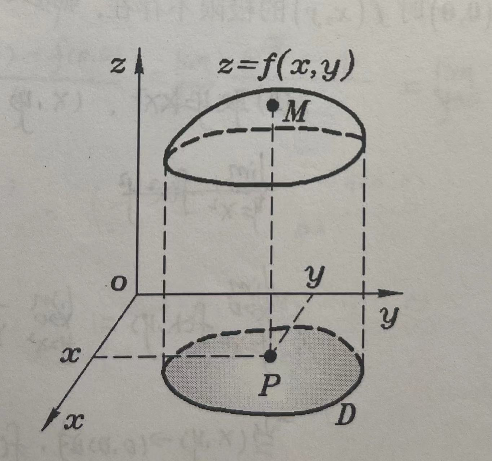
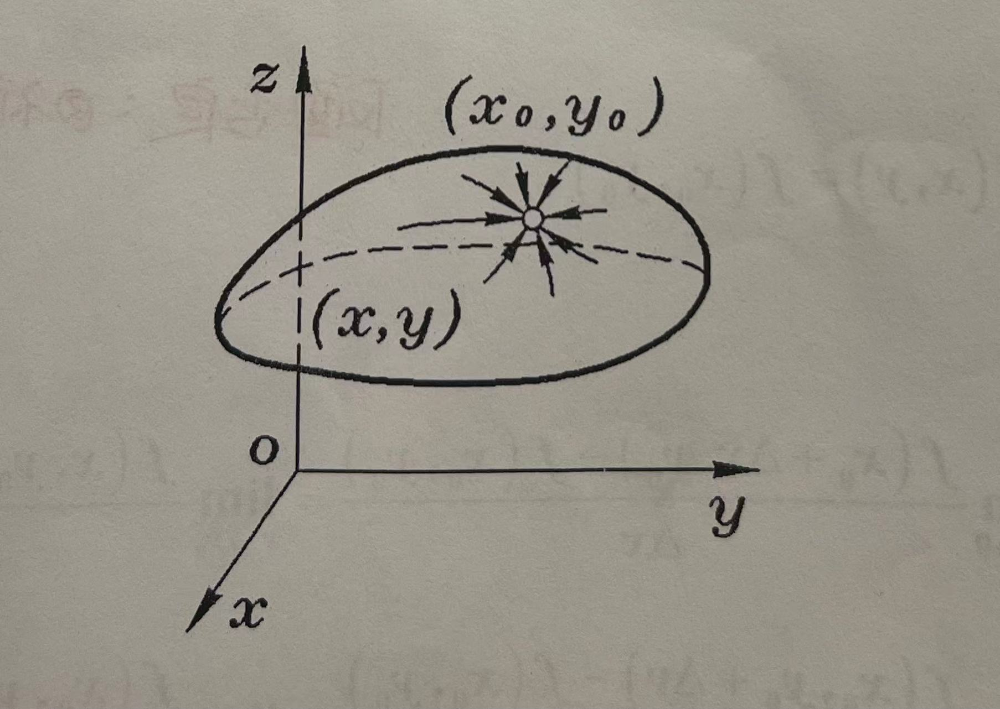
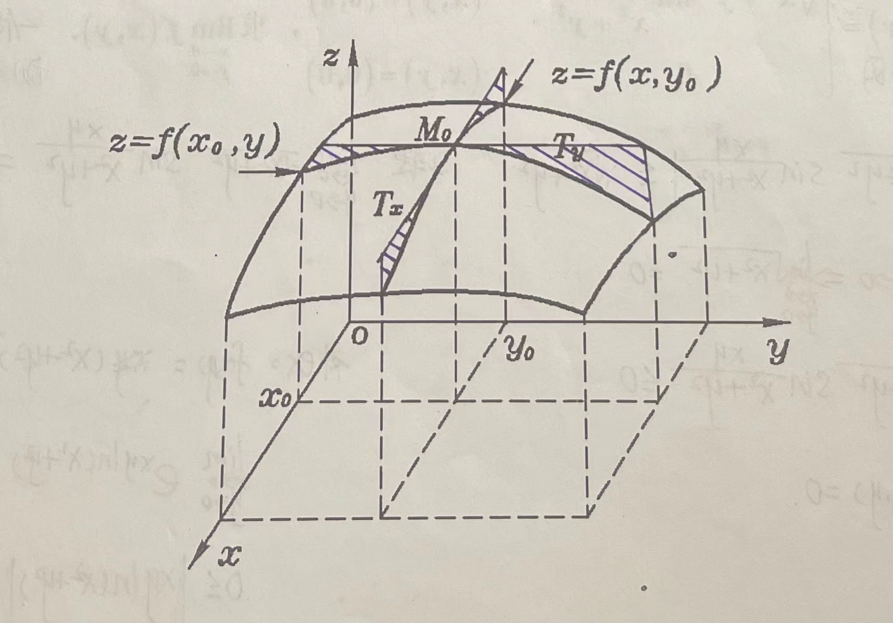
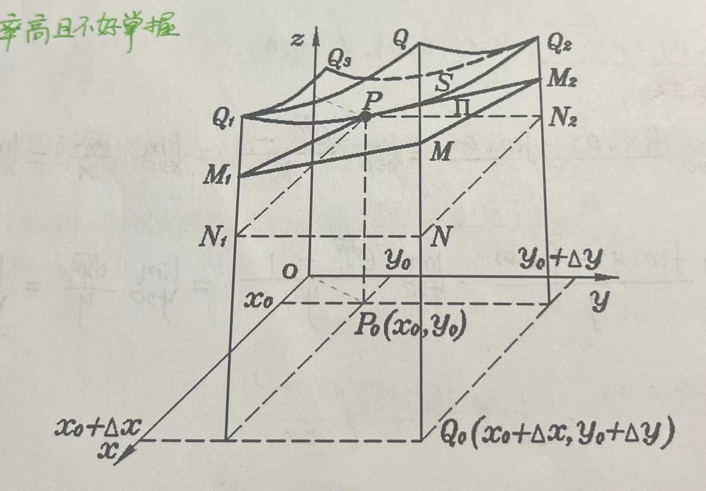

该文为学习笔记，仅作学习参考，如有错误，望指正！

<!--more-->

笔记说明：

红色：表示重点，口诀，结论；

黄色：表示注意点；

绿色：表示解题思路，或方案；

粉色：真题考试时间；

##	六.	多元函数微分学：一填一选一大题

###	1.	多元函数概念

####	1.	定义

$z=f(x,y)，(x,y) \in D，D$ 是 $R^2$ 的一个非空子集，点集 $D$ 称为该函数的定义域，$x，y$ 称为自变量，$z$ 称为因变量。

####	2.	多元函数极限：定义理解就好

$\lim\limits_{\substack{x\to x_0 \\ y\to y_0}}$$f(x,y)=A \Rightarrow \forall \varepsilon >0，\exist \delta >0$，当 $0<\sqrt{(x-x_0)^2+(y-y_0)^2}<\delta$ 时，恒有 $|f(x,y)-A|<\varepsilon$

【例1】（很有可能考趋于0的）设 $f(x,y)=\begin{cases} \sqrt{x^2+y^2}sin\frac{xy}{x^2+y^2},&（x,y）\neq （0,0）\\ 0,&（x,y）=(0,0) \end{cases}$，求 $\lim\limits_{\substack{x \to 0\\y \to 0}}$$f(x,y)$

【总结】：一估二转三就否定掉；放大缩小；

1. 1 估：

   解：$0 \leq |\sqrt{x^2+y^2}sin\frac{xy}{x^2+y^2}| \leq \sqrt{x^2+y^2}$

   当 $x \to 0，y \to 0 \Rightarrow$$\lim\limits_{\substack{x \to 0 \\ y \to 0}}$$\sqrt{x^2+y^2}=0$

   $0 \leq \sqrt{x^2+y^2}sin\frac{xy}{x^2+y^2} \leq 0 \underset {夹逼定理}{\Rightarrow}$ 故 $\lim\limits_{\substack{x \to 0 \\ y \to 0}}$$f(x,y)=0$

2. 2 转

   解：$\lim\limits_{\substack{x \to 0 \\ y \to 0}}$$\sqrt{x^2+y^2}sin\frac{xy}{x^2+y^2}=0$

【自练】$f(x,y)=(x^2+y^2)^{xy}$

解：$\lim\limits_{\substack{x \to 0 \\ y \to 0}}$$e^{xy\ln(x^2+y^2)}$

$0 \leq |xy\ln(x^2+y^2)| \leq \frac{1}{2}(x^2+y^2)\ln(x^2+y^2)=0$

则 $I=e^0=1$

【例2】设 $f(x,y)=\frac{x^2y}{x^4+y^2}$

1. 当 $(x,y)$ 沿过原点的任一直线趋向于 $(0,0)$ 时，求 $f(x,y)$ 极限；
2. 证明：$(x,y) \rightarrow (0,0)$ 时 $f(x,y)$ 的极限不存在；

解：

1. 沿 $x$ 轴走，$y \to 0，x \to 0$

   $I=$$\lim\limits_{\substack{x \to 0 \\ y \to 0}}$$\frac{x^2y}{x^4+y^2}=0$

   沿 $y$ 轴走，$x=0，y=0$

   $I=$$\lim\limits_{\substack{x \to 0 \\ y \to 0}}$$\frac{x^2y}{x^4+y^2}=0$

   沿 $y=kx（k \neq 0）$ 走

   $I=$$\lim\limits_{\substack{x \to 0 \\ y = kx}}$$\frac{x^2 \cdot kx}{x^4+(kx)^2}=0$

   则 $(x,y)$ 沿过原点任一直线趋向于 $(0,0)$ 时，$\lim\limits_{\substack{x \to 0 \\ y \to 0}}$$f(x,y)=0$

2. 取 $y=x^2，(x,y) \rightarrow (0,0)$

   $\lim\limits_{\substack{x \to 0 \\ y = x^2}}$$f(x,y)=$$\lim\limits_{\substack{x \to 0 \\ y = x^2}}$$\frac{x^4}{x^4+x^4}=\frac{1}{2} \neq 0$

   当 $(x,y) \rightarrow (0,0)$ 时，$f(x,y)$ 不 $\exists$

【结论】：多元函数极限计算；

正面肯定 $\begin{cases}1. 估计（夹逼定理）\\ 2. 转化为一元函数求极限（无穷小 \cdot 有界=无穷小，等价无穷小替换） \end{cases}$;

反面否定：3. 不同路径；

####	3.	多元函数连续性

$\lim\limits_{\substack{x \to x_0 \\ y \to y_0}}$$f(x,y)=f(x_0,y_0)$

####	4.	偏导数

$\frac{\partial f}{\partial x}|_{(x_0,y_0)}=f_{x}'(x_0,y_0)=\lim\limits_{\Delta x \to 0}\frac{f(x_0+\Delta x,y_0)-f(x_0,y_0)}{\Delta x}=\lim\limits_{x \to x_0}\frac{f(x,y_0)-f(x_0,y_0)}{x-x_0}$

$\frac{\partial f}{\partial y}|_{(x_0,y_0)}=f_{y}'(x_0,y_0)=\lim\limits_{\Delta y \to 0}\frac{f(x_0,y_0+\Delta y)-f(x_0,y_0)}{\Delta y}=\lim\limits_{y \to y_0}\frac{f(x_0,y)-f(x_0,y_0)}{y-y_0}$

【例3】（2008-3）已知 $f(x,y)=e^{\sqrt{x^2+y^4}}$，求 $f_{x}'(0,0)，f_{y}'(0,0)$

解：

$f_{x}'(0,0)=\lim\limits_{x \to 0}\frac{f(x,0)-f(0,0)}{x-0}=\lim\limits_{x \to 0}\frac{e^{\sqrt{x^2}}-1}{x}=\lim\limits_{x \to 0}\frac{\sqrt{x^2}}{x}=\lim\limits_{x \to 0}\frac{|x|}{x}=\begin{cases}1 \\ -1 \end{cases}，\Rightarrow f_{x}'(0,0)$ 不存在

$f_{y}'(0,0)=\lim\limits_{y \to 0}\frac{f(0,y)-f(0,0)}{y-0}=\lim\limits_{y \to 0}\frac{e^{\sqrt{y^4}}-1}{y}=\lim\limits_{y \to 0}\frac{y^2}{y}=0 \Rightarrow f_{y}'(0,0)$ 存在

【例4】设函数 $f(u)$ 具有 2 阶连续导数，$z=f(e^xcosy)$ 满足 $\frac{\partial^2z}{\partial x^2}+\frac{\partial^2z}{\partial y^2}=(4z+e^xcosy)e^{2x}$，若 $f(0)=0，f'(0)=0$，求 $f(u)$ 的表达式。

解：$\frac{\partial z}{\partial x}=f'(e^xcosy) \cdot e^{x}cosy$

$\frac{\partial^2z}{\partial x^2}=\frac{\partial}{\partial x}(\frac{\partial z}{\partial x})=f''(e^xcosy) \cdot (e^{x}cosy)^2+f'(e^xcosy)e^xcosy$

$\frac{\partial z}{\partial y}=f'(e^{x}cosy) \cdot e^{x} \cdot (-siny)$

$\frac{\partial^2z}{\partial y^2}=f''(e^xcosy) \cdot e^{2x} \cdot (siny)^2 - f'(e^xcosy) \cdot e^x \cdot cosy$

$\because \frac{\partial^2z}{\partial x^2}+\frac{\partial^2z}{\partial y^2}=f''(e^{x}cosy)e^{2x}=[4f(e^xcosy)+e^{x}cosy]e^{2x}$

令 $e^{x}cosy=u \Rightarrow f''(u)=4f(u)+u$

$[拆析：y''-4y=x，\lambda^2-4=0，\lambda=\pm2，y=C_1e^{2x}+C_2e^{-2x}；y^*=\frac{1}{D^2-4}x=-\frac{1}{4}\frac{1}{1-(\frac{D}{2})^2}x=-\frac{1}{4}x]$

$\therefore f(u)=C_1e^{2u}+C_2e^{-2u}-\frac{1}{4}u，f'(u)=2C_1e^{2u}-2C_2e^{-2u}-\frac{1}{4}$

$f(0)=C_1+C_2=0，f'(0)=2C_1-2C-2-\frac{1}{4}=0$

联立 $C_1=1，C_2=-1$

$\therefore f(u)=e^{2u}-e^{-2u}-\frac{1}{4}u$

####	5.	全微分：考的频率高且补好掌握

【重要】：

若全增量

$\Delta z（实增）=f(x_0+\Delta x,y_0+\Delta y)-f(x_0,y_0)=A\Delta x+B\Delta y + O(\rho)=A\Delta x+B\Delta y + \sqrt{(\Delta x)^2+(\Delta y)^2}$

即 $\lim\limits_{\substack{\Delta x \to 0 \\ \Delta y \to 0}}$$\frac{\Delta z-(A\Delta x+B\Delta y)}{\sqrt{(\Delta x)^2+(\Delta y)^2}}=0 \Rightarrow f(x,y)$ 在 $(x_0,y_0)$ 处可微；

其中：$A=f_{x}'(x_0,y_0)，B=f_{y}'(x_0,y_0)，\rho=\sqrt{(\Delta x)^2+(\Delta y)^2}$，（证明过程考不到，考前可看）；

全微分 $dz|_{(x_0,y_0)}=f_{x}'(x_0,y_0)dx+f_{y}'(x_0,y_0)dy=A\Delta x + B\Delta y$

【例5】（2012-3）设连续函数 $z=f(x,y)$ 满足 $\lim\limits_{\substack{x \to 0 \\ y \to 1}}$ $\frac{f(x,y)-2x+y-2}{\sqrt{x^2+(y-1)^2}}=0$，求 $f_{x}'(0,1)，f_{y}'(0,1)，dz|_{(0,1)}$

解："$\lim\frac{A}{B}=\exists，B \to 0 \Rightarrow A \to 0$" 简易判别法

$\lim\limits_{\substack{x \to 0 \\ y \to 1}}$$[f(x,y)-2x+y-2]=0 \Rightarrow$$\lim\limits_{\substack{x \to 0 \\ y \to 1}}$$f(x,y)=1 \Rightarrow$$f(0,1)=1$

$f(x,y)-2x+y-2=0+O(\sqrt{x^2+(y-1)^2})$

$f(x,y)-f(0,1)=2(x-0)-(y-1)+O(\sqrt{x^2+(y-1)^2})$

$\Rightarrow A=2,B=-1$

$\Rightarrow f_{x}'(0,1)=2，f_{y}'(0,1)=-1，dz|_{(0,1)}=2dx-1dy$

###	2.	多元函数计算

####	1.	多元复合函数的求导法则

1. 一元函数与多元函数：$u=\varphi(t)$ 及 $v=\psi(t)$ 可导，$z=f(u,v)$ 具有连续偏导数，则 $z=f[\varphi(t),\psi(t)]$ 可导，且 $\frac{dz}{dt}=\frac{\partial z}{\partial u}\frac{du}{dt}+\frac{\partial z}{\partial v}\frac{dv}{dt}$

   【例6】（2006-1）设 $f(x,y,z)$ 为 $k$ 次齐次函数，即 $f(tx,ty,tz)=t^{k}f(x,y,z)$，计算 $x\frac{\partial f}{\partial x}+y\frac{\partial f}{\partial y}+z\frac{\partial f}{\partial z}$

   解：$f(tx,ty,tz)=f(u,v,w)=t^{k}f(x,y,z)$

   两边对 $t$ 求导：$\frac{\partial f}{\partial u}x+\frac{\partial f}{\partial v}y+\frac{\partial f}{\partial w}z=kt^{k-1}f(x,y,z)$

   $\frac{\partial f}{\partial u}tx+\frac{\partial f}{\partial v}ty+\frac{\partial f}{\partial w}tz=kt^{k}f(x,y,z)$

   $\frac{\partial f}{\partial u}u+\frac{\partial f}{\partial v}v+\frac{\partial f}{\partial w}w=kf(u,v,w)$

   $\frac{\partial f}{\partial x}x+\frac{\partial f}{\partial y}y+\frac{\partial f}{\partial z}z=kf(x,y,z)$

2. 多元函数与多元函数：$u=\varphi(x,y)$ 及 $v=\psi(x,y)$ 具有对 $x$ 及对 $y$ 的偏导数，$z=f(u,v)$ 具有连续的偏导数，则 $z=f[\varphi(x,y),\psi(x,y)]$ 的两个偏导数存在，且 $\frac{\partial z}{\partial x}=\frac{\partial z}{\partial u}\frac{\partial u}{\partial x}+\frac{\partial z}{\partial v}\frac{\partial v}{\partial x}，\frac{\partial z}{\partial y}=\frac{\partial z}{\partial u}\frac{\partial u}{\partial y}+\frac{\partial z}{\partial v}\frac{\partial v}{\partial y}$

   【例7】（2011-1/2）设函数 $z=f(xy,yg(x))$ ，其中函数 $f$ 具有二阶连续偏导数，函数 $g(x)$ 可导，且在 $x=1$ 处取得极值 $g(1)=1$，求 $\frac{\partial^2 z}{\partial x \partial y}|_{\substack{x=1 \\ y=1}}$

   解法一：

   $\frac{\partial z}{\partial x}=f_1'(xy,yg(x))y+f_2'(xy,yg(x)) \cdot yg'(x)$

   $\frac{\partial ^2 x}{\partial x \partial y}=\frac{\partial}{\partial y}(\frac{\partial z}{\partial x})=f_1'+y[f_{11}''x+f_{12}''g(x)]+g'(x)f_2'+yg'(x)[f_{21}''x+f_{22}''g(x)]$

   $\because g(1)=1，g'(1)=0$

   $\therefore \frac{\partial ^2 z}{\partial x \partial y}|_{\substack{x=1\\y=1}}=f_{1}'(1,1)+f_{11}''(1,1)+f_{12}''(1,1)$

   解法二：

   $\frac{\partial z}{\partial x}=f_{1}'(xy,yg(x)) \cdot y+f_{2}'(xy,yg(x)) \cdot yg'(x)$

   $\frac{\partial z}{\partial x}|_{x=1}=f_{1}'(y,yg(1)) \cdot y+f_{2}'(y,yg(1))yg'(1)=0$

   $\frac{\partial ^2 z}{\partial x \partial y}|_{\substack{x=1\\y=1}}=[f_{11}''(y,y) \cdot 1 +f_{12}''(y,y) \cdot y+f_{1}'(y,y)]|_{y=1}=f_{11}''(1,1)+f_{12}''(1,1)+f_{1}'(1,1)$

   偏导数结构：

   1. 偏导数项数 = 中间变量个数
   2. 求高阶偏导时，$\frac{\partial z}{\partial x}，\frac{\partial z}{\partial y}$ 仍是以 $x，y$ 为自变量，$u，v$ 为中间变量的函数
   3. 求高阶偏导时，中间变量通常用 1，2，3 比较方便
   4. 当 $f_{12}''，f_{21}''$ 连续时 $\Rightarrow f_{12}''=f_{21}''$  （可合并）[二阶导连续时] 

3. 其他情况【容易出现乌龙】：$u=\varphi(x,y)$ 及 $v=\psi(x,y)$ 具有对 $x$ 及对 $y$ 的偏导数，$z=f(x,u,v)$ 具有连续偏导数，则 $z=f[x,\varphi(x,y),\psi(x,y)]$ 的两个偏导数存在，且 $\frac{\partial z}{\partial x}=\frac{\partial f}{\partial x}+\frac{\partial z}{\partial u}\frac{\partial u}{\partial x}+\frac{\partial z}{\partial v}\frac{\partial v}{\partial x}$，$\frac{\partial z}{\partial y}=\frac{\partial z}{\partial u}\frac{\partial u}{\partial y}+\frac{\partial z}{\partial v}\frac{\partial v}{\partial y}$

   【注】：$\frac{\partial z}{\partial x}，\frac{\partial f}{\partial x}$ 含义不同，$\frac{\partial z}{\partial x}$ 是把 $z=f[x,\varphi(x,y),\psi(x,y)]$ 中的 $y$ 看做不变对 $x$ 的偏导数，$\frac{\partial f}{\partial x}$ 是把 $z=f(x,u,v)$ 中的 $u，v$ 看做不变对 $x$ 的偏导数。

   【例8】设函数 $z=f(x,y)$ 在点 $(1,1)$ 处可微，且 $f(1,1)=1$，$\frac{\partial f}{\partial x}|_{(1,1)}=2$，$\frac{\partial f}{\partial y}|_{(1,1)}=3$，$\varphi(x)=f(x,f(x,x))$，求$\frac{d}{dx}\varphi^3(x)|_{x=1}$

   解：

   $\begin{aligned}\frac{d}{dx}\varphi^3(x)|_{x=1} &= 3\varphi^2(x) \cdot \varphi'(x)|_{x=1} \\ &= 3\varphi^2(1)\{[f_{1}'(x,f(x,x))+f_{2}'(x,f(x,x))[f_{21}'(x,x) \cdot 1+f_{22}'(x,x) \cdot 1]\} \\ &=3\{f_{1}'(1,1)+f_{2}'(1,1)[f_{1}'(1,1)+f_{2}'(1,1)]\} \\ &=3[2+3 \cdot (1+3)] \\ &=51 \end{aligned}$

####	2.	全微分形式不变性 (时光近迁，初习不变).

$z=f(u,v)、u=\varphi(x,y)、v=\psi(x,y)$ 具有连续偏导数，则

$\begin{aligned}dz &=\frac{\partial z}{\partial x}dx+\frac{\partial z}{\partial y}dy \\ &=(\frac{\partial z}{\partial u}\frac{\partial u}{\partial x}+\frac{\partial z}{\partial v}\frac{\partial v}{\partial x})dx+(\frac{\partial z}{\partial u}\frac{\partial u}{\partial y}+\frac{\partial z}{\partial v}\frac{\partial v}{\partial y})dy \\ &=\frac{\partial z}{\partial u}(\frac{\partial u}{\partial x}dx+\frac{\partial u}{\partial y}dy)+\frac{\partial z}{\partial v}(\frac{\partial v}{\partial x}dx+\frac{\partial v}{\partial y}dy) \\ &=\frac{\partial z}{\partial u}du+\frac{\partial z}{\partial v}dv \end{aligned}$

####	3.	隐函数求导公式

1. $F(x,y)$ 具有连续偏导数，$F(x_0,y_0)=0，F_y'(x_0,y_0)\neq0$，则 $F(x,y)=0$ 能唯一确定一个连续且具有连续导数的函数 $y=f(x)$，它满足条件 $y_0=f(x_0)$，且 $\frac{dy}{dx}=-\frac{F_x'}{F_y'}$。

   【例9】（2007-2）已知函数 $f(u)$ 具有二阶导数，且 $f'(0)=1$，函数 $y=y(x)$ 由方程 $y-xe^{y-1}=1$ 所确定，设 $z=f(lny-sinx)$，求 $\frac{dz}{dx}|_{x=0}$，$\frac{d^2z}{dx^2}|_{x=0}$。

   解：$\frac{dz}{dx}|_{x=0}=f'(lny-sinx) \cdot (\frac{y'}{y}-cosx)|_{x=0}=f'(0) \cdot (\frac{y'}{y}-1)=1 \cdot (\frac{1}{1}-1)=0$

   $(y-xe^{y-1}=1 \Rightarrow y'-e^{y-1}-xe^{y-1}y'=0，x=0，y=1，y'=1)$

   $\begin{aligned}\frac{d^2z}{dx^2}|_{x=0} &=\frac{d}{dx}[f'(lny-sinx)(\frac{y'}{y}-cosx)]|_{x=0} \\ &=f''(lny-sinx)(\frac{y'}{y}-cosx)^2+f'(lny-sinx) \cdot (\frac{y''y-(y')^2}{y^2}+sinx)\end{aligned}$

   $x=0，y=1，y'=1$ 代入 $y''-e^{y-1} \cdot y'-e^{y-1} \cdot y'-xe^{y-1}(y')^2-xe^{y-1}y''=0 \Rightarrow y''=2$

   $\therefore \frac{d^2z}{dx^2}|_{x=0}=1 \cdot (1-0)=1$

   

2. $F(x,y,z)$ 具有连续偏导数，$F(x_0,y_0,z_0)=0，F_z'(x_0,y_0,z_0) \neq 0$，则 $F(x,y,z)=0$ 在点 $(x_0,y_0,z_0)$ 能唯一确定一个连续且具有连续偏导数的函数 $z=f(x,y)$，它满足条件 $z_0=f(x_0,y_0)$，且 $\frac{\partial z}{\partial  x}=-\frac{F_x'}{F_z'}，\frac{\partial z}{\partial y}=-\frac{F_y'}{F_z'}$。

   【例10】（2005-1）设有三元方程 $xy-zlny+e^{xz}=1$，根据隐函数存在定理，存在点 $(0,1,1)$ 的一个邻域，在此邻域内该方程（	D	）

   A.	只能确定一个具有连续偏导数的隐函数 $z=z(x,y)$

   B.	可确定两个具有连续偏导数的隐函数 $y=y(x,z)$ 和 $z=z(x,y)$

   C.	可确定两个具有连续偏导数的隐函数 $x=x(y,z)$ 和 $z=z(x,y)$

   D.	可确定两个具有连续偏导数的隐函数 $x=x(y,z)$ 和 $y=y(x,z)$

   解析：

   $F_x'=(y+ze^{xz})|_{(0,1,1)}=2 \neq 0$

   $F_y'=x-\frac{z}{y}|_{(0,1,1)}=-1 \neq 0$

   $F_z'=-lny+xe^{xz}|_{0,1,1}=0$

   【例11】（2010-1/2）设函数 $z=z(x,y)$，由方程 $F(\frac{y}{x},\frac{z}{x})=0$ 确定，其中 $F$ 为可微函数，且 $F_2' \neq 0$，则 $x\frac{\partial z}{\partial x}+y\frac{\partial z}{\partial y}=$（		）

   A.	x

   B.	z

   C.	-x

   D.	-z

   解析：

   1. $F_1'(-\frac{y}{x^2})+F_2'(-\frac{z}{x^2}+\frac{1}{x}\frac{\partial z}{\partial x})=0$

      $\frac{\partial z}{\partial x}=\frac{yF_1'+zF_2'}{xF_2'}$

      $F_1'(\frac{1}{x})+F_2'(\frac{1}{x}\frac{\partial z}{\partial y})=0$

      $\frac{\partial z}{\partial y}=-\frac{F_1'}{F_2'}$

   2. 微分形式不变性

      $F_1'd(\frac{y}{x})+F_2'd(\frac{z}{x})=0$

      $F_1'\frac{dy \cdot x - ydx}{x^2} + F_2'\frac{dz \cdot x - zdx}{x^2}=0$

      $x \cdot F_2'dz=(yF_1'+zF_2')dx-xF_1'dy$

      $dz=\frac{yF_1'+zF_2'}{xF_2'}dx-\frac{F_1'}{F_2'}dy$

      $\frac{\partial z}{\partial x}=\frac{yF_1'+zF_2'}{xF_2'}，\frac{\partial z}{\partial y}=-\frac{F_1'}{F_2'}$

2. $F(x,y,u,v)，G(x,y,u,v)$ 具有连续偏导数，$F(x_0,y_0,u_0,v_0)=0$，$G(x_0,y_0,u_0,v_0)=0$，$J=\left|\begin{matrix} \frac{\partial F}{\partial u} & \frac{\partial F}{\partial v} \\ \frac{\partial G}{\partial u} & \frac{\partial G}{\partial v} \end{matrix}\right|$ 在点 $(x_0,y_0,u_0,v_0)$ 不等于零，则 $\begin{cases} F(x,y,u,v)=0 \\ G(x,y,u,v)=0 \end{cases}$ 再点 $(x_0,y_0,u_0,v_0)$ 能唯一确定一组连续且具有连续偏导数的函数 $u=u(x,y)，v=v(x,y)$，他们满足条件 $u_0=u(x_0,y_0)$，$v_0=v(x_0,y_0)$ 且 $\frac{\partial u}{\partial x}=-\frac{\left|\begin{matrix} F_x' & F_v' \\ G_x' & G_v'\end{matrix}\right|}{\left|\begin{matrix}F_u' &F_v' \\ G_u' & G_v'\end{matrix}\right|}$，$\frac{\partial v}{\partial x}=-\frac{\left|\begin{matrix}F_u' & F_x' \\ G_u' & G_x'\end{matrix}\right|}{\left|\begin{matrix}F_u' & F_v' \\ G_u' & G_v'\end{matrix}\right|}$，$\frac{\partial u}{\partial y}=-\frac{\left|\begin{matrix}F_y'&F_v'\\G_y'&G_v'\end{matrix}\right|}{\left|\begin{matrix}F_u'&F_v'\\G_u'&G_v'\end{matrix}\right|}$，$\frac{\partial v}{\partial y}=-\frac{\left|\begin{matrix}F_u'&F_y'\\G_u'&G_y'\end{matrix}\right|}{\left|\begin{matrix}F_u'&F_v'\\G_u'&G_v'\end{matrix}\right|}$

【例12】设 $y=g(x,z)$，且 $z=z(x,y)$ 由方程 $f(z-x,y)=0$ 确定，求 $\frac{dy}{dx}$

解：两边同时微分

1. $dy=g_1'dx+g_2'dz$
2. $f_1'd_{(z-x)}+f_2'd_{y}=0 \Rightarrow f_1'(dz-dx)+f_2'dy=0$

上式联立：

$dz=-\frac{g_1'd_{x}-d_{y}}{g_2'}$

$f_1'(-\frac{g_{1}'d_{x}-d_{y}}{g_{2}'}-dx)+f_2'd_{y}=0$

$\frac{d_{y}}{d_{x}}=\frac{g_{1}'+g_{2}'}{f_{1}'+f_{2}' \cdot g_{2}'}\cdot f_{1}'$

###	3.	多元函数应用

####	1.	多元函数极值 （无条件极值：主考二元的）.

1. （小题考概念）$z=f(x,z)$ 在 $U(p_0)$ 内有定义，$\forall P\in U(P_0)$

   $f(x,y)>f(x_0,y_0) \Rightarrow f(x_0,y_0)$ 为极小值；

   $f(x,y)<f(x_0,y_0) \Rightarrow f(x_0,y_0)$ 为极大值；

2. 充分条件：$z=f(x,y)$ 在点 $(x_0,y_0)$ 的某邻域内连续且有一阶及二阶连续偏导数，且 $f_{x}'(x_0,y_0)=0，f_{y}'(x_0,y_0)=0$，令 $f_{xx}''(x_0,y_0)=A$，$f_{xy}''(x_0,y_0)=B$，$f_{yy}''(x_0,y_0)=C$

   若 $AC-B^2>0$：$A<0 \Rightarrow f(x_0,y_0)$ 为极大值；$A>0 \Rightarrow f(x_0,y_0)$ 为极小值；

   若 $AC-B^2<0$：$\Rightarrow f(x_0,y_0)$ 为非极值；

   若 $AC-B^2=0$：$\Rightarrow f(x_0,y_0)$ 为可移极值，需另做讨论。转定义；

   补充：

   $f(x,y)=f(0,0)+f_x'(0,0)x+f_y'(0,0)y+(f_{xy}''f_{xx}''f_{yy}'')x^2（二次型）$

   【注】：

   当 $AC-B^2=0$ 时，$f(x_0,y_0)$ 不一定极值；

   设 $f_1(x,y)=x^3+y^3$，记 $(x_0,y_0)=(0,0)$

   则 $f_x'(x_0,y_0)=f_y'(x_0,y_0)=0，AC-B^2=f_x'' \cdot f_y''-(f_{xy}'')^2=0$ 则不是

   设 $f_2(x,y)=x^4+y^4$，记 $(x_0,y_0)=(0,0)$

   则 $f_x'(x_0,y_0)=f_y'(x_0,y_0)=0，AC-B^2=0$，此时 $f(x_0,y_0)$ 为 $f_2(x,y)$ 极小值

3. 必要条件：$f(x,y)$ 在点 $(x_0,y_0)$ 具有偏导数，且 $f(x_0,y_0)$ 为极值 $\Rightarrow f_x'(x_0,y_0)=f_y'(x_0,y_0)=0$

   "$f(x,y)$ 在点 $(x_0,y_0)$ 具有偏导数" 若是没给出或 $f_x'(x_0,y_0)，f_y'(x_0,y_0)$ 不 $\exists$，则 $f(x_0,y_0)$ 不一定为极值。

   【例13】（2009，2012，2013-1/2）求函数 $f(x,y)=(y+\frac{x^3}{3})e^{x+y}$ 的极值

   解：

   $\begin{cases}f_x'(x,y)=(y+\frac{x^3}{3}+x^2)e^{x+y} \\ f_y'(x,y)=(y+\frac{x^3}{3}+1)e^{x+y}\end{cases}$ $\Rightarrow (x_0,y_0)$

   令 $f_x'=0，f_y'=0$ 并联立，解得 $x=-1，1；y=-\frac{2}{3}，-\frac{4}{3}$

   验证 $(x_0,y_0)$：$\begin{cases} f_x''=(y+\frac{x^3}{3}+2x^2+2x)e^{x+y}=A \\ f_y''=(y+\frac{x^3}{3}+2)e^{x+y}=C \\ f_{xy}''=(y+\frac{x^3}{3}+x^2+x+1)e^{x+y}=B \end{cases}$

   $AC-B^2$ 判定：$\begin{cases} A_{(-1,-\frac{2}{3})}=-e^{-\frac{5}{3}}，B_{(-1,-\frac{2}{3})}=e^{-\frac{5}{3}}，C_{(-1,-\frac{2}{3})}=e^{-\frac{5}{3}} \\ AC-B^2<0 故 (-1,-\frac{2}{3}) 不是极值 \\ 同理：AC-B^2=2e^{-\frac{2}{3}}>0，A>0 \end{cases}$

   结论：故 $(1,-\frac{4}{3})$ 是 $f(x,y)$ 极小值点，极小值 $f(1,-\frac{4}{3})=-e^{-\frac{1}{3}}$

   【例14】若 $\int_{-\pi}^{\pi}(x-a_{1}cosx-b_{1}sinx)^2dx=min_{(a,b \in R)}\{\int_{-\pi}^{\pi}(x-acosx-bsinx)^2dx\}$，则 $a_{1}cosx+b_{1}sinx=$（	A	）

   A.	$2sinx$

   B.	$2cosx$

   C.	$2 \pi sinx$

   D.	$2 \pi cosx$

   解析：

   $\int_{-\pi}^{\pi}(x-acosx-bsinx)^2dx=f(a,b)$

   $\frac{\partial f(a,b)}{\partial a}=-\int_{-\pi}^{\pi}2(x-acosx-bsinx)cosxdx=2a\int_{-\pi}^{\pi}cos^2xdx=2a\pi=0 \Rightarrow a=0$

   $\frac{\partial f(a,b)}{\partial b}=-\int_{-\pi}^{\pi}2(x-acosx-bsinx)sinxdx=2b\int_{-\pi}^{\pi}sin^2xdx-2\int_{-\pi}^{\pi}xsinxdx=2b\pi-4\pi=0 \Rightarrow b=2$

####	2.	条件极值 本质为求最值.

$z=f(x,y)$ 在条件 $\varphi(x,y)=0$ 下的可能极值点，令 $L(x,y)=f(x,y)+\lambda \varphi(x,y)$（即目标+条件：目标条件参数连），求得驻点 $L_x'(x,y)=L_y'(x,y)=L_{\lambda}'(x,y)=0$（求出偏导找驻点，$L_{\lambda}'=0 \Leftrightarrow \varphi(x,y)=0$ ），即得可能极值点。走一走，瞧一瞧，看一看，选一选，比较大小终决断。

【例15】设 $f(x,y)$ 与 $\varphi(x,y)$ 均为可微函数，且 $\varphi_y'(x,y) \neq 0$，已知 $(x_0,y_0)$ 是 $f(x,y)$ 在约束条件 $\varphi(x,y)=0$ 下得一个极值点，下列选项正确的都是（	D	）

A.	若 $f_x'(x_0,y_0)=0$，则 $f_y'(x_0,y_0)=0$

B.	若 $f_x'(x_0,y_0)=0$，则 $f_y'(x_0,y_0) \neq 0$

C.	若 $f_x'(x_0,y_0) \neq 0$，则 $f_y'(x_0,y_0)=0$

D.	若 $f_x'(x_0,y_0) \neq 0$，则 $f_y'(x_0,y_0) \neq 0$

解析：

$F(x,y)=f(x,y)+\lambda \varphi(x,y)$

令 $F_x'=f_x'(x,y)+\lambda \varphi_x'(x,y)=0$

令 $F_y'=f_y'(x,y)+\lambda \varphi_y'(x,y)=0$

【例16】（2013-2）求曲线 $x^3-xy+y^3=1（x \geq 0，y \geq 0）$ 上的点到坐标原点的最长距离和最短距离。

解：目标 $d=\sqrt{x^2+y^2}$

$L_{(x,y)}=x^2+y^2+\lambda(x^3-xy+y^3-1)$

$\frac{\partial L}{\partial x}=2x+3 \lambda x^2-\lambda yx=0$

$\frac{\partial L}{\partial y}=2y+\lambda(-x+3y^2)=0$

$\frac{\partial L}{\partial \lambda}=x^3-xy+y^3-1=0$

草纸：$\begin{cases} \lambda=-\frac{2x}{3x^2-y} \\ \lambda=-\frac{2y}{3y^2-x} \end{cases}$

1. $\lambda=0 \Rightarrow x=y=0$ （舍：不合题意）

2. $\lambda \neq 0$

   1. 若 $y-3x^2=0$ 或 $x-3y^2=0 \Rightarrow x=y=0$ （舍）

   2. 若 $y-3x^2 \neq 0$ 或 $x-3y^2 \neq 0$

      由联立消入 $\Rightarrow (x-y)(x+y+3xy)=0$

      $x+y+3xy=0（x>0，y>0）$ （舍）

      $x=y$

      将 $x=y$ 代入约束条件中 $2x^3-x^2-1=0$

      $\Rightarrow (x-1)(2x^2+x+1)=0$

      $x=y=1$

      $d=\sqrt{x^2+y^2}=\sqrt2$

      又 $x=0，y=1，d=1；x=1，y=0，d=1;$

      $\therefore$ 最长距离为 $\sqrt2$，最小距离为 $1$

####	3.	最值 只需算无需判.

最大值：$max$ （区域内可能极值，边界上最值）

最小值：$min$ （区域内可能极值，边界上最值）

【例17】（2014）设函数 $u(x,y)$ 在有界闭区域 $D$ 上连续，在 $D$ 的内部具有 2 阶连续偏导数，且满足 $\frac{\partial ^2u}{\partial x \partial y} \neq 0$ 及 $\frac{\partial ^2u}{\partial x^2}+\frac{\partial ^2u}{\partial y^2}=0$，则 （	A	）

A.	$u(x,y)$ 的最大值和最小值都在 $D$ 的边界上取得

B.	$u(x,y)$ 的最大值和最小值都在 $D$ 的内部取得

C.	$u(x,y)$ 的最大值在 $D$ 的内部取得，最小值在 $D$ 的边界上取得

D.	$u(x,y)$ 的最小值在 $D$ 的内部取得，最大值在 $D$ 的边界上取得
